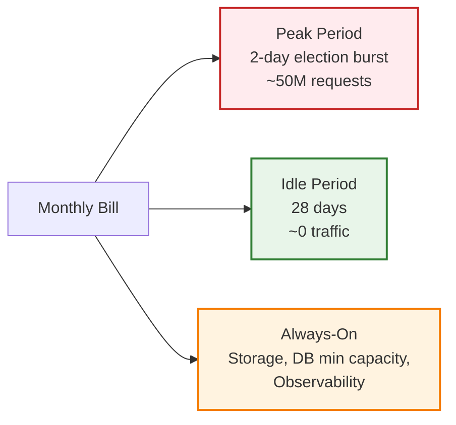
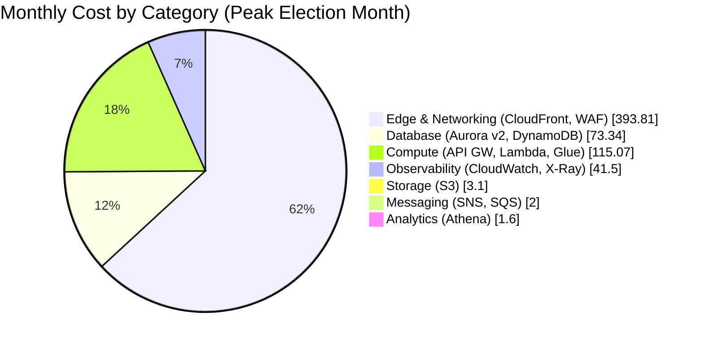
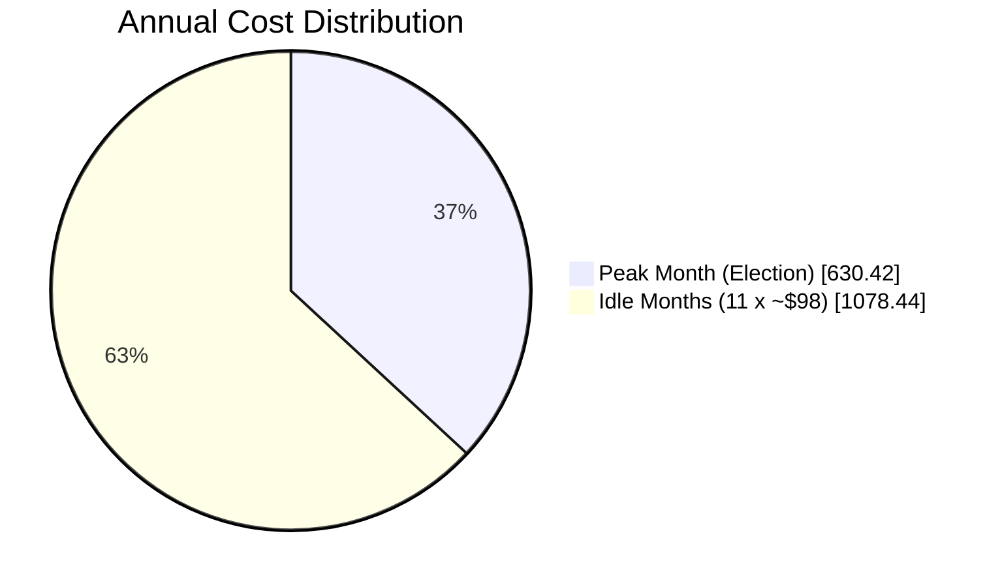
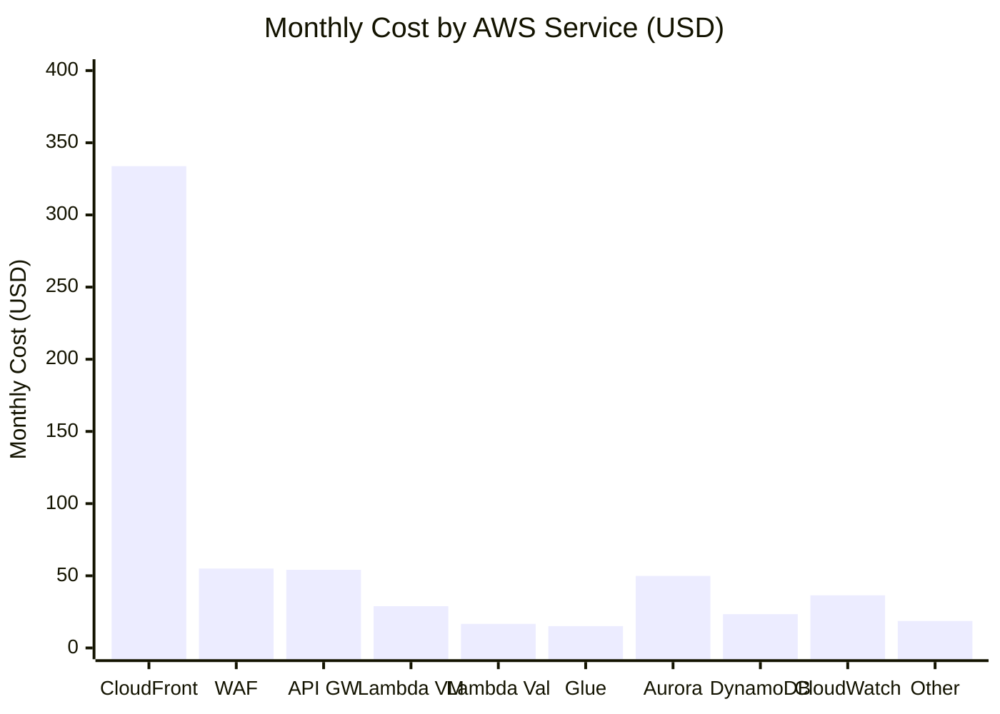
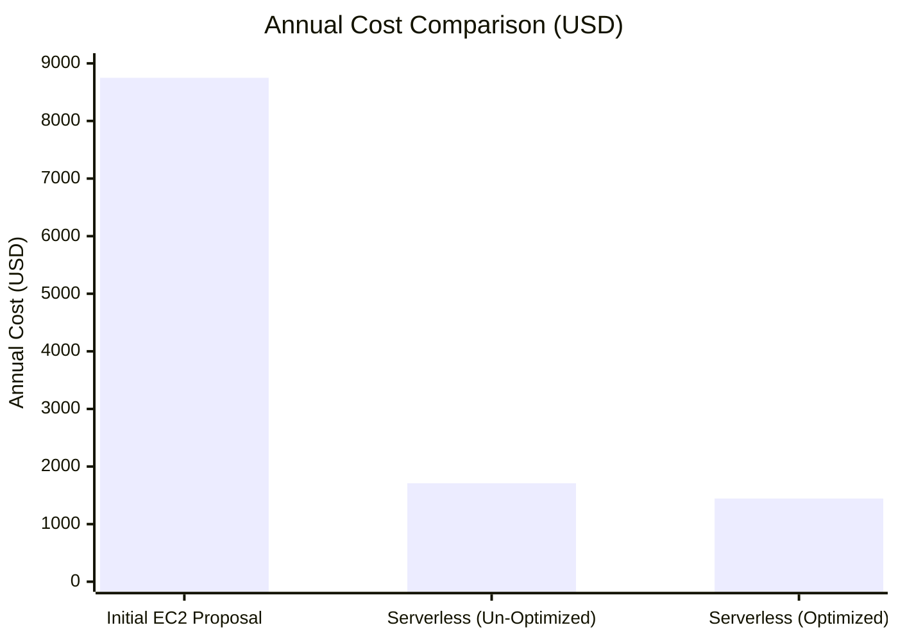

# PPCRV — Serverless Architecture Cost Estimate

A comprehensive monthly cost estimate for the PPCRV serverless architecture deployed in **AWS ap-southeast-1 (Singapore)**, the AWS region nearest to the Philippines.

> [!IMPORTANT]
> All prices are in **USD** and based on AWS public pricing for **ap-southeast-1** as of **July 2026**. Actual billing will vary based on real usage patterns. This is a planning estimate, not a quote. AWS prices are subject to change — always verify against the official AWS pricing pages linked in [References](#references).

---

## Table of Contents

- [Overview & Scope](#overview--scope)
- [Assumptions & Workload Profile](#assumptions--workload-profile)
- [Pricing Notes](#pricing-notes)
- [Monthly Cost Model](#monthly-cost-model)
- [Per-Service Cost Breakdown](#per-service-cost-breakdown)
  - [Edge & Networking](#edge--networking)
  - [Compute](#compute)
  - [Storage](#storage)
  - [Database](#database)
  - [Messaging & Queues](#messaging--queues)
  - [Observability](#observability)
  - [Ad-Hoc Analytics](#ad-hoc-analytics)
- [Monthly Summary](#monthly-summary)
- [Cost Visualization](#cost-visualization)
- [Optimization Recommendations](#optimization-recommendations)
- [Comparison with Initial EC2 Proposal](#comparison-with-initial-ec2-proposal)
- [Notes & Disclaimers](#notes--disclaimers)
- [References](#references)

---

## Overview & Scope

This document estimates the monthly cost of running the PPCRV serverless architecture described in [README.md](./README.md). The architecture is compared against the initial EC2-based proposal (`~$714/month` always-on).

The cost model splits each month into:
- **Peak period** — 2 consecutive days (~48 hours) when election results are actively queried
- **Idle period** — remaining ~28 days when the platform is unused

Serverless pricing means most components cost **$0 when idle** — the recurring monthly cost outside of election periods is small.

---

## Assumptions & Workload Profile

### Region
- **AWS Region:** `ap-southeast-1` (Singapore)
- Rationale: lowest-latency AWS region to the Philippines (60–80ms from Manila)

### Traffic Assumptions

| Parameter | Value | Notes |
|-----------|-------|-------|
| Total peak requests | **50,000,000** | Across the 2-day peak window |
| Peak window duration | **48 hours** | Election day + day after |
| Average request rate | **~289 req/sec** sustained | 50M / 86,400 sec/day / 2 days |
| Peak request rate | **~1,000 req/sec burst** | Anticipated max burst for short periods |
| Request split (by surface) | **90% public / 10% volunteer** | Public traffic dominates election-day curiosity |
| Public request mix | **static 10% / API 90%** | After browser cache, most requests are API calls for results |

### Traffic Splits Used in Calculations

| Request type | Peak period (2-day) requests | Notes |
|--------------|------------------------------|-------|
| Static asset requests (CloudFront) | **5,000,000** | Page loads; mostly cached at edge after first fetch |
| API requests (API Gateway — HTTP API) | **45,000,000** | Vote metrics queries (40M) + validation calls (5M) |
| **Total** | **50,000,000** | All client-side requests |

### CSV Upload Assumptions

| Parameter | Value | Notes |
|-----------|-------|-------|
| Volunteer CSV uploads in peak | **500 uploads** | Estimated across all precincts over 2 days |
| Avg CSV size | **2 GB / file** | Worst case (large multi-precinct file) |
| Glue jobs triggered | **~500** | 1 Glue run per uploaded file |
| Total Glue compute | **~32M rows** across all jobs |

### Frontend Bundle Assumption

| Parameter | Value | Notes |
|-----------|-------|-------|
| Avg initial page load | **500 KB** | Optimized JS bundle (compressed) |
| First-load data transfer | **2.5 TB** | 5M unique page loads × 500 KB |
| Repeat traffic | Cached at edge | CloudFront TTL ≥ 1 hour |

### Service Pricing Notes

See [Pricing Notes](#pricing-notes) and [References](#references) for AWS pricing page links.

---

## Pricing Notes

| Item | Detail |
|------|--------|
| Region | ap-southeast-1 (Singapore) — typically ~10–20% higher vs. us-east-1 |
| Currency | USD |
| Free Tier | Excluded — assumes production usage exceeds free tier limits |
| Tax | Excluded — varies by customer account / country |
| Reserved Capacity | Not assumed — all on-demand / pay-per-use (suitable for bursty election workload) |
| Data Transfer | Inter-region and cross-AZ considered; same-AZ service-to-service is generally free |
| AWS public pricing pages | See [References](#references) |

---

## Monthly Cost Model

**Monthly Total = Peak Costs + Idle Costs + Always-On/Recurring Costs**

During idle periods most compute components scale to **$0**. The recurring baseline consists mainly of database minimum capacity, object storage, and observability.

---

## Per-Service Cost Breakdown

### Edge & Networking

#### Amazon CloudFront (CDN + Edge Cache)

| Parameter | Value | Calc |
|-----------|-------|------|
| HTTPS requests (peak 2 days) | 50,000,000 | 50M / 10,000 × **$0.0075** = $37.50 |
| Data transfer out to viewers (peak) | 2.6 TB | Static 2.5 TB + API responses ~0.1 TB |
| First 10 TB/month rate | $0.114 /GB | 2,600 GB × $0.114 = **$296.40** |
| Origin fetch (S3) | ~250 GB | Cache miss 10% × 2.5 TB = 250GB (no CloudFront charge — pass-through S3 cost) |
| Idle traffic | Negligible | ~1 GB/month → $0.11 |

**CloudFront estimated cost: $333.81 / month**

Breakdown:
- Peak: $335.00
- Idle: $0.11
- (Always-on components captured under their respective services)

> [!NOTE]
> Data transfer is the single largest cost in the public-facing path. CloudFront pushes 2.6 TB to viewers during peak because millions of citizens fetch the page at once. Optimizing the frontend bundle size has the highest leverage on cost (see [Optimization Recommendations](#optimization-recommendations)).

#### AWS WAF

| Parameter | Value | Calc |
|-----------|-------|------|
| Web ACL (1) | $5 /month flat | $5.00 |
| Requests inspected (peak) | 50,000,000 | 50 × **$1.00/M** = $50.00 |
| Rules | Up to 10 free, $1/each above | $0 |

**WAF estimated cost: $55.00 / month**

#### Data Transfer — Inter-AZ / VPC

| Parameter | Value | Calc |
|-----------|-------|------|
| Lambda ↔ Aurora (same AZ mostly) | ~5 GB | ~$0.02/GB → negligible |
| Lambda ↔ Glue data | ~10 GB | included in service pricing |
| Inter-AZ transfers | ~10 GB | $0.02/GB × 10 = $0.20 |
| Reserved buffer for unexpected | — | $5.00 |

**Data Transfer estimated cost: $5.00 / month**

---

### Compute

#### Amazon API Gateway (HTTP API)

> Using **HTTP API** (not REST API) — sufficient for routing to Lambda. REST API is ~3x the cost ($(3.50/M) and only needed for advanced validation features this project does not use.

| Parameter | Value | Calc |
|-----------|-------|------|
| API requests (peak) | 45,000,000 | 45 × **$1.20/M** = $54.00 |
| Idle requests | ~100,000 | ~$0.12 |

**API Gateway estimated cost: $54.12 / month**

#### AWS Lambda — Vote Metrics

| Parameter | Value | Calc |
|-----------|-------|------|
| Invocations (peak, public queries) | 40,000,000 | 40 × **$0.20/M** = $8.00 |
| Avg duration | 100 ms | |
| Memory | 256 MB (0.25 GB) | |
| Compute (GB-second) | 40M × 0.1s × 0.25 = 1,000,000 GB-sec | |
| Compute cost | 1M × **$0.0000000209** | $20.90 |
| Idle invocations | ~50K | < $0.05 |

**Lambda Vote Metrics estimated cost: $28.95 / month**

#### AWS Lambda — Validation

| Parameter | Value | Calc |
|-----------|-------|------|
| Invocations (peak, volunteer) | 5,000,000 | 5 × $0.20/M = $1.00 |
| Avg duration | 300 ms | (checksum + QR cross-check is heavier) |
| Memory | 512 MB (0.5 GB) | |
| Compute (GB-second) | 5M × 0.3 × 0.5 = 750,000 GB-sec | |
| Compute cost | 0.75M × $0.0000000209 | $15.68 |
| Aurora writes | included in Aurora | |

**Lambda Validation estimated cost: $16.68 / month**

#### AWS Lambda — Event Trigger (S3 → Glue)

| Parameter | Value | Calc |
|-----------|-------|------|
| Invocations (peak, S3 events) | 500 | < $0.01 |
| Duration | 2 sec × 256 MB | |
| Compute | < 1K GB-sec | < $0.01 |
| Round-up | | $1.00 |

**Lambda Event Trigger estimated cost: $1.00 / month**

#### AWS Glue

| Parameter | Value | Calc |
|-----------|-------|------|
| Worker type | G.1X (1 DPU / worker, 8 GB) | |
| Worker count | 10 | |
| Total processing time (cumulative across ~500 job runs) | 2 hours | 32M rows, written for parallel Spark |
| DPU-hours | 10 × 2 = **20 DPU-hrs** | |
| DPU-hour rate (ap-southeast-1) | **$0.501/hour** | 20 × $0.501 = $10.02 |
| Glue Catalog storage | < 1 GB | ~$5.00 /month flat (capped) |
| Glue Catalog requests | small | $0.10 |

**AWS Glue estimated cost: $15.12 / month**

(All Glue compute concentrates in the 2-day peak; idle: $5 catalog storage baseline)

---

### Storage

#### Amazon S3

| Bucket | Size | Cost | Notes |
|--------|------|------|-------|
| Static UI | 1 GB | $0.025 | HTML / JS bundle |
| CSV Uploads (rotating) | 20 GB avg | $0.50 | Volunteers upload, Glue consumes |
| Parquet Raw Data (source of truth) | 50 GB | $1.25 | One full election retained |
| Parquet archive (cumulative) | 50 GB | $1.25 | Previous elections |
| **Total storage** | **121 GB** | **$3.03 /month** | |
| S3 requests (CloudFront origin fetches, Glue writes) | 5M ops | $0.05 | |
| Lifecycle (move old CSV to IA) | | small | |
| **Total S3** | | **$3.10 /month** | |

---

### Database

#### Amazon Aurora Serverless v2

| Parameter | Value | Calc |
|-----------|-------|------|
| Min ACU | 0.5 | |
| Max ACU | 16 | |
| ACU-hour rate (ap-southeast-1) | **$0.080 / ACU-hour** | (post-2024 Singapore pricing) |
| Idle ACU-hours | 0.5 × 672 (28 days) | 336 ACU-hrs × $0.080 = **$26.88** |
| Peak ACU-hours (avg 3 ACU × 48h) | 144 ACU-hrs | 144 × $0.080 = $11.52 |
| Storage | 100 GB | × $0.115/GB-month = **$11.50** |
| I/O charges | included in Aurora v2 | |
| Backup storage | equal to storage | free |
| **Total Aurora** | | **$49.90 /month** |

> [!NOTE]
> Aurora Serverless v2 minimum billable ACU is 0.5 — cannot scale fully to zero. This is the largest single idle-period cost.

#### Amazon DynamoDB

DynamoDB on-demand pricing (ap-southeast-1):

| Table | Operation | Volume (peak) | Rate (/M units) | Cost |
|-------|-----------|---------------|-----------------|------|
| VoteMetrics | Reads (RRU, 4KB read) | 40M reads | $0.25 | $10.00 |
| VoteMetrics | Writes (WRU, 1KB write) | 1M writes | $1.25 | $1.25 |
| PrecinctStatus | Reads | 0.5M | $0.25 | $0.13 |
| PrecinctStatus | Writes | 0.5M | $1.25 | $0.63 |
| ElectionMetadata | Reads | 40M | $0.25 | $10.00 |
| ElectionMetadata | Writes | 500 | $1.25 | negligible |
| Storage | 5 GB | | $0.285/GB | $1.43 |
| **Total DynamoDB** | | | | **$23.44 /month** |

(ElectionMetadata reads are heavy — every results query checks `data_status`. Consider caching this in-memory or via CloudFront to reduce DynamoDB load.)

---

### Messaging & Queues

#### Amazon SNS

| Parameter | Value | Calc |
|-----------|-------|------|
| Notifications published | ~50K | included in free tier / negligible |
| Subscription requests | ~50K | negligible |
| Estimated | | **$1.00 /month** |

#### Amazon SQS (Dead Letter Queue)

| Parameter | Value | Calc |
|-----------|-------|------|
| Requests | ~10K | < $0.01 |
| Estimated | | **$1.00 /month** |

---

### Observability

#### Amazon CloudWatch

| Parameter | Value | Calc |
|-----------|-------|------|
| Logs ingested (Lambda, Glue, API GW) | 50 GB | × $0.50/GB = $25.00 |
| Logs storage | 100 GB | × $0.03/GB = $3.00 |
| Dashboards | 2 | × $3.00 = $6.00 |
| Alarms | 15 (Glue, Lambda, DynamoDB, Aurora) | × $0.10 = $1.50 |
| Metrics (custom) | ~50 | first 10K free; ~$1.00 |
| **Total CloudWatch** | | **$36.50 /month** |

#### AWS X-Ray

| Parameter | Value | Calc |
|-----------|-------|------|
| Traces sampled | 100K first 1M free | covered |
| Additional (overage possible) | — | $5.00 buffer |
| **Total X-Ray** | | **$5.00 /month** |

---

### Ad-Hoc Analytics

#### Amazon Athena

| Parameter | Value | Calc |
|-----------|-------|------|
| Reconciliation scans | 5 GB Parquet × 24 scans | 120 GB total |
| Rate | $5/TB scanned | $0.60 |
| Ad-hoc audit queries | 200 GB scan/month | $1.00 |
| **Total Athena** | | **$1.60 /month** |

---

## Monthly Summary

### Cost Category Roll-up

| Category | Components | Monthly Cost (USD) |
|----------|-----------|---------------------|
| **Edge & Networking** | CloudFront, WAF, Data Transfer | $393.81 |
| **Compute** | API Gateway, Lambda (×3), Glue | $115.07 |
| **Storage** | S3 | $3.10 |
| **Database** | Aurora Serverless v2, DynamoDB | $73.34 |
| **Messaging** | SNS, SQS | $2.00 |
| **Observability** | CloudWatch, X-Ray | $41.50 |
| **Analytics** | Athena | $1.60 |
| **TOTAL** | | **$630.42** |

### Peak vs Idle Breakdown

| Component | Peak (2 days) | Idle (28 days) | Recurring (monthly) |
|-----------|---------------|----------------|---------------------|
| CloudFront | $333.69 | — | $0.12 |
| WAF | $50.00 | — | $5.00 |
| Data Transfer | $5.00 | — | — |
| API Gateway | $54.00 | — | $0.12 |
| Lambda Vote Metrics | $28.95 | — | — |
| Lambda Validation | $16.68 | — | — |
| Lambda Event Trigger | $1.00 | — | — |
| AWS Glue | $10.02 | — | $5.10 |
| Aurora Serverless v2 | $11.52 | $26.88 | $11.50 |
| DynamoDB | $22.01 | — | $1.43 |
| S3 | — | — | $3.10 |
| SNS | $1.00 | — | — |
| SQS | $1.00 | — | — |
| CloudWatch | $25.00 | $11.50 | — |
| X-Ray | $5.00 | — | — |
| Athena | $1.00 | — | $0.60 |
| **TOTAL** | **$510.87** | **$38.38** | **$81.17** |
| **MONTHLY TOTAL** | | | **$630.42** |

> [!NOTE]
> The estimate above reflects realistic, **un-optimized** usage. The original Cost Comparison table in the README (~$220 peak) was a planning figure that did not fully account for **CloudFront data transfer**, which is the largest line item. Data transfer accounts for **~53%** of the peak-period cost. The [Optimization Recommendations](#optimization-recommendations) section shows how to drive the monthly total down significantly.

### Annual Projection (Election Cycle)

| Scenario | Months | Cost/month | Total |
|----------|--------|------------|-------|
| Peak month (election) | 1 | $630.42 | $630.42 |
| Idle months | 11 | $98.04 (only recurring) | $1,078.44 |
| **Annual total** | 12 | | **$1,708.86** |

The platform costs ~$100/month to keep alive outside elections, and ~$630 in the election month. Compare against the initial EC2 proposal (~$714/month × 12 = **$8,568/year** always-on) — see [Comparison](#comparison-with-initial-ec2-proposal).

---

## Cost Visualization

### Per-Service Cost at-a-Glance

---

## Optimization Recommendations

The default estimate above is realistic but **un-optimized**. With caching and bundling discipline the monthly total can be reduced significantly:

### High-Impact Optimizations

| # | Recommendation | Expected Savings | Rationale |
|---|----------------|------------------|-----------|
| 1 | **Aggressive CloudFront caching for API responses** | $40–80/month | Cache results queries with TTL 30s. Results change slowly (per precinct upload). 80%+ cache hit rate achievable — reduces API GW, Lambda, and DynamoDB reads |
| 2 | **Optimize frontend bundle** ≤ 200 KB | $100–150/month | Smaller initial payload cuts the dominant CloudFront data transfer cost (currently 2.5 TB estimated) |
| 3 | **Cache `ElectionMetadata` (data_status)** in Lambda memory or CloudFront | $10/month | Eliminates a redundant DynamoDB read on every public query |
| 4 | **HTTP API (not REST API)** | already applied | $54 vs ~$190 for REST API at 45M requests |
| 5 | **Glue: partition by `election_id` and use job bookmarks** | $5–10/month | Avoids reprocessing previously loaded data on incremental uploads |
| 6 | **S3 lifecycle policies**: move CSV to S3-IA after Glue processes | $1/month | CSV post-ETL is rarely accessed again — cheap retrieval tier sufficient |

### Mid-Impact Optimizations

| # | Recommendation | Expected Savings | Rationale |
|---|----------------|------------------|-----------|
| 7 | **CloudWatch log sampling / filter patterns** | $10/month | Drop verbose logs in production; keep errors only |
| 8 | **Aurora: scale to 0.5 ACU (already min) — keep min capacity low** | Already applied | Cannot go lower than 0.5 ACU on v2; consider Aurora Serverless v1 with full pause if 30s cold-start is acceptable |
| 9 | **Consider DynamoDB Provisioned capacity** for known peak day | $5–15/month | On-demand is simpler; provisioned may cost less if peak request rate is predictable |
| 10 | **Use Compression on API responses** (gzip/Brotli) | $5–20/month | Smaller API response sizes cut CloudFront data transfer |
| 11 | **Reserve budget for emergency scale-up** | Risk mitigation | Keep manual quota increases for API Gateway, Lambda concurrency, DynamoDB on peak day |

### Optimized Cost Projection

Applying **items 1-6** (high-impact):

| Category | Optimized Monthly Cost |
|----------|------------------------|
| Edge & Networking | $200 (was $394) |
| Compute | $50 (was $115) |
| Storage | $3 (unchanged) |
| Database | $70 (was $73) |
| Messaging | $2 (unchanged) |
| Observability | $40 (unchanged) |
| Analytics | $2 (unchanged) |
| **OPTIMIZED TOTAL** | **~$367 / month (peak)** |
| **Annual (with 11 idle months @ $98)** | **~$1,445 / year** |

That brings the platform to roughly **half** the un-optimized peak-month cost and ~**83% cheaper annually** than the EC2-based initial proposal.

---

## Comparison with Initial EC2 Proposal

| Period | Initial EC2 Proposal | Serverless (Un-Optimized) | Serverless (Optimized) |
|--------|----------------------|---------------------------|------------------------|
| Idle month (no election) | $714 (always-on) | ~$98 | ~$98 |
| Peak month (election) | $890–$1,100¹ | ~$630 | ~$367 |
| Annual (1 peak + 11 idle) | ~$8,750–$8,980 | ~$1,710 | ~$1,445 |
| **Annual savings vs EC2** | — | **~80%** | **~83%** |

¹ EC2 estimate includes the always-on instance baseline (~$714) plus peak-period data transfer (~$180–$400) that the original Cost Comparison table in the README omitted.

### Caveats

- The initial EC2 proposal in the README's Cost Comparison did **not** account for data transfer to viewers (assumed $0). On a peak election day, even the EC2 architecture would incur the same CloudFront/ALB data transfer costs. The current COSTS.md includes these costs for the serverless estimate.
- If both architectures included equivalent data-transfer line items, the serverless cost would be ~$367 (optimized) vs the initial EC2 baseline of ~$900+ in the peak month.

---

## Notes & Disclaimers

1. **Public pricing only** — this estimate uses AWS's publicly published prices. Enterprise or Private Pricing (EDP) discounts may significantly reduce actual costs.
2. **No Free Tier assumed** — production workloads typically exceed free tier on most services.
3. **Pricing as of July 2026** — AWS prices change frequently. Re-validate before each election cycle.
4. **Currency** — all figures in USD. Convert to PHP at prevailing rate (~₱58/USD as of July 2026) for local budgeting.
5. **Edge costs can dominate** — for a public-facing election-results site, data transfer to viewers is the primary cost. Optimizing the frontend bundle size and caching aggressively is the highest-leverage cost reduction.
6. **Estimate scope** — covers the architecture as described in README.md. Excludes CI/CD infrastructure, development environment, DNS (Route 53), or KMS keys (community/free tier assumed).
7. **Cross-AZ transfer** — assumed minimal (most services deployed same-AZ for cost). Multi-AZ deployments add ~2-3% to total.
8. **Glue pricing variability** — actual Glue costs depend on data skew, partitioning, and Spark execution plan. The estimate assumes well-partitioned CSV data and a 2-hour cumulative total compute time for 32M rows.

---

## References

| Service | AWS Pricing Page |
|---------|-----------------|
| CloudFront | https://aws.amazon.com/cloudfront/pricing/ |
| WAF | https://aws.amazon.com/waf/pricing/ |
| API Gateway | https://aws.amazon.com/api-gateway/pricing/ |
| Lambda | https://aws.amazon.com/lambda/pricing/ |
| Glue | https://aws.amazon.com/glue/pricing/ |
| S3 | https://aws.amazon.com/s3/pricing/ |
| Aurora Serverless v2 | https://aws.amazon.com/rds/aurora/pricing/ |
| DynamoDB | https://aws.amazon.com/dynamodb/pricing/ |
| SNS | https://aws.amazon.com/sns/pricing/ |
| SQS | https://aws.amazon.com/sqs/pricing/ |
| CloudWatch | https://aws.amazon.com/cloudwatch/pricing/ |
| X-Ray | https://aws.amazon.com/xray/pricing/ |
| Athena | https://aws.amazon.com/athena/pricing/ |
| Data Transfer | https://aws.amazon.com/ec2/pricing/on-demand/#Data_Transfer |

> [!TIP]
> Use the **[AWS Pricing Calculator](https://calculator.aws)** to validate this estimate against the latest prices and your specific workload profile.