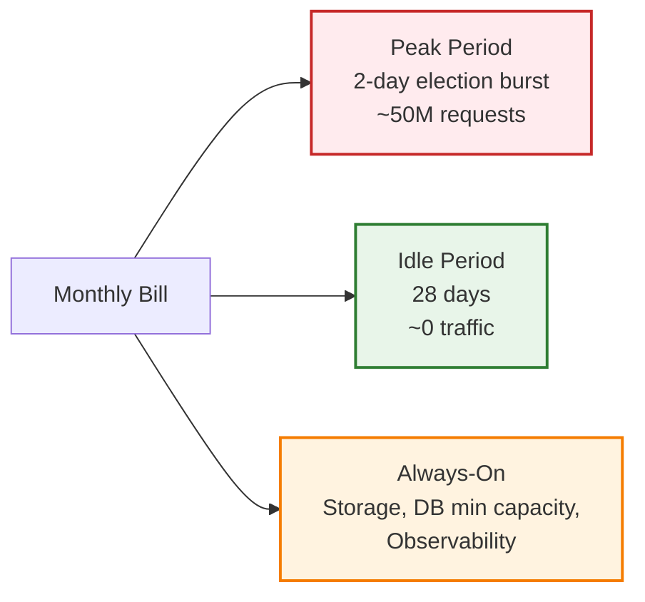
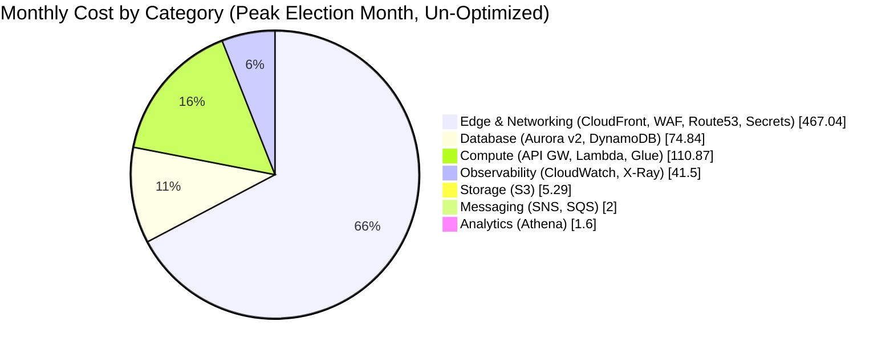
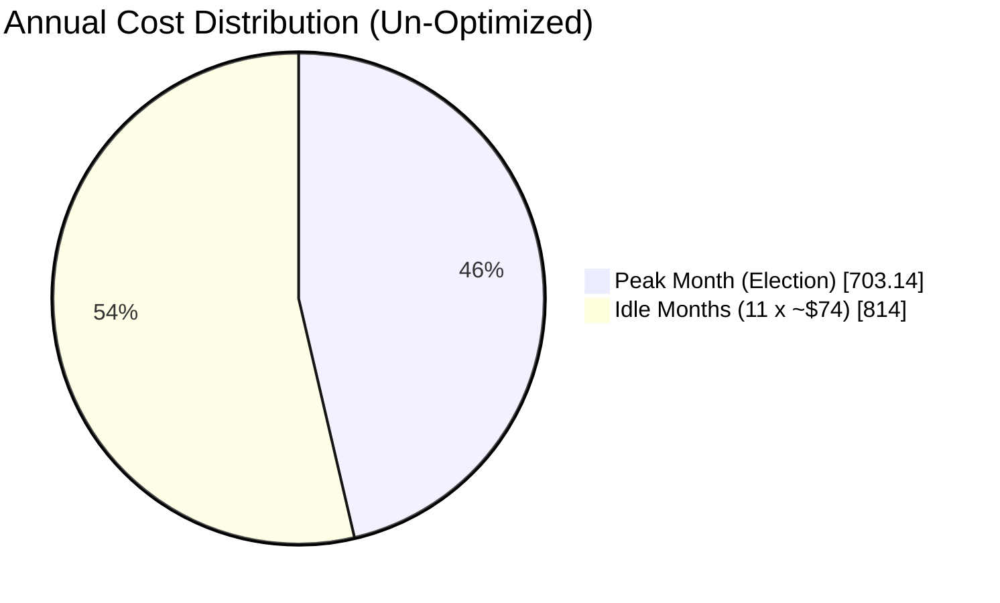
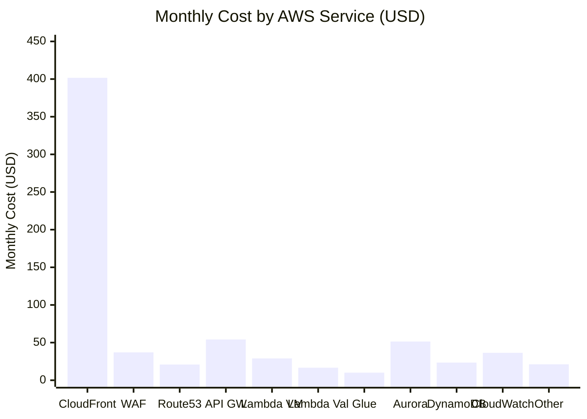
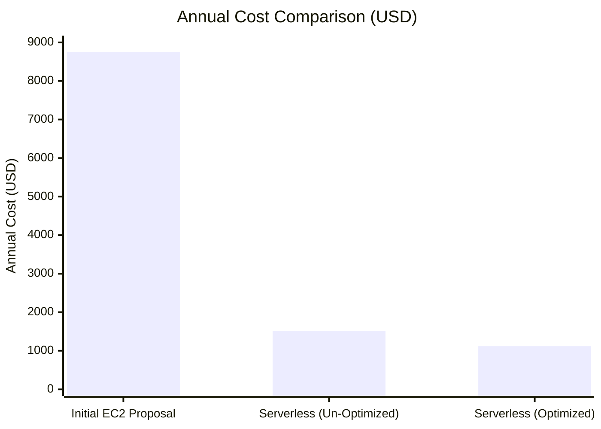

# PPCRV — Serverless Architecture Cost Estimate

A comprehensive monthly cost estimate for the PPCRV serverless architecture deployed in **AWS ap-southeast-1 (Singapore)**, the AWS region nearest to the Philippines.

> [!IMPORTANT]
> All prices are in **USD** and based on AWS public pricing for **ap-southeast-1** as of **July 2026**. Actual billing will vary based on real usage patterns. This is a planning estimate, not a quote. AWS prices are subject to change — always verify against the official AWS pricing pages linked in [References](#references).

---

## Table of Contents

- [Overview & Scope](#overview--scope)
- [Assumptions & Workload Profile](#assumptions--workload-profile)
- [Pricing Notes](#pricing-notes)
- [Monthly Cost Model](#monthly-cost-model)
- [Per-Service Cost Breakdown](#per-service-cost-breakdown)
  - [Edge & Networking](#edge--networking)
  - [Compute](#compute)
  - [Storage](#storage)
  - [Database](#database)
  - [Messaging & Queues](#messaging--queues)
  - [Observability](#observability)
  - [Ad-Hoc Analytics](#ad-hoc-analytics)
- [Monthly Summary](#monthly-summary)
- [Cost Visualization](#cost-visualization)
- [Optimization Recommendations](#optimization-recommendations)
- [Comparison with Initial EC2 Proposal](#comparison-with-initial-ec2-proposal)
- [Notes & Disclaimers](#notes--disclaimers)
- [References](#references)

---

## Overview & Scope

This document estimates the monthly cost of running the PPCRV serverless architecture described in [README.md](./README.md). The architecture is compared against the initial EC2-based proposal (`~$714/month` always-on).

The cost model splits each month into:
- **Peak period** — 2 consecutive days (~48 hours) when election results are actively queried
- **Idle period** — remaining ~28 days when the platform is unused

Serverless pricing means most components cost **$0 when idle** — the recurring monthly cost outside of election periods is small.

---

## Assumptions & Workload Profile

### Region
- **AWS Region:** `ap-southeast-1` (Singapore)
- Rationale: lowest-latency AWS region to the Philippines (60–80ms from Manila)

### Traffic Assumptions

| Parameter | Value | Notes |
|-----------|-------|-------|
| Total peak requests | **50,000,000** | Across the 2-day peak window |
| Peak window duration | **48 hours** | Election day + day after |
| Average request rate | **~289 req/sec** sustained | 50M / 86,400 sec/day / 2 days |
| Peak request rate | **~1,000 req/sec burst** | Anticipated max burst for short periods |
| Request split (by surface) | **90% public / 10% volunteer** | Public traffic dominates election-day curiosity |
| Public request mix | **static 10% / API 90%** | After browser cache, most requests are API calls for results |

### Traffic Splits Used in Calculations

| Request type | Peak period (2-day) requests | Notes |
|--------------|------------------------------|-------|
| Static asset requests (CloudFront) | **5,000,000** | Page loads; mostly cached at edge after first fetch |
| API requests (API Gateway — HTTP API) | **45,000,000** | Vote metrics queries (40M) + validation calls (5M) |
| **Total** | **50,000,000** | All client-side requests |

### CSV Upload Assumptions

| Parameter | Value | Notes |
|-----------|-------|-------|
| Volunteer CSV uploads in peak | **500 uploads** | Estimated across all precincts over 2 days |
| Avg CSV size | **2 GB / file** | Worst case (large multi-precinct file) |
| Glue jobs triggered | **~500** | 1 Glue run per uploaded file |
| Total Glue compute | **~32M rows** across all jobs |

### Frontend Bundle Assumption

| Parameter | Value | Notes |
|-----------|-------|-------|
| Avg initial page load | **500 KB** | Optimized JS bundle (compressed) |
| First-load data transfer | **2.5 TB** | 5M unique page loads × 500 KB |
| Repeat traffic | Cached at edge | CloudFront TTL ≥ 1 hour |

### Service Pricing Notes

See [Pricing Notes](#pricing-notes) and [References](#references) for AWS pricing page links.

---

## Pricing Notes

| Item | Detail |
|------|--------|
| Region | ap-southeast-1 (Singapore) — typically ~10–20% higher vs. us-east-1 |
| Currency | USD |
| Free Tier | Excluded — assumes production usage exceeds free tier limits |
| Tax | Excluded — varies by customer account / country |
| Reserved Capacity | Not assumed — all on-demand / pay-per-use (suitable for bursty election workload) |
| Data Transfer | Inter-region and cross-AZ considered; same-AZ service-to-service is generally free |
| AWS public pricing pages | See [References](#references) |

---

## Monthly Cost Model

**Monthly Total = Peak Costs + Idle Costs + Always-On/Recurring Costs**

During idle periods most compute components scale to **$0**. The recurring baseline consists mainly of database minimum capacity, object storage, and observability.

---

## Per-Service Cost Breakdown

### Edge & Networking

#### Amazon CloudFront (CDN + Edge Cache)

> [!IMPORTANT]
> **2026 update — CloudFront now offers flat-rate pricing plans** (Free / Pro $15 / Business $200 / Premium $1000) that bundle CDN + WAF + DNS + logging + S3 credits for a single monthly fee with **no overage charges**. For an election-month burst this is dramatically cheaper than pay-as-you-go. See [Optimization Recommendations](#optimization-recommendations) → "CloudFront Business Flat-Rate Plan". The estimate below is the **pay-as-you-go** baseline.

| Parameter | Value | Calc |
|-----------|-------|------|
| HTTPS requests (peak 2 days) | 50,000,000 | 50M / 10,000 × **$0.0075** ≈ $37.50 |
| Data transfer out to viewers (peak) | 2.6 TB | Static 2.5 TB + API responses ~0.1 TB |
| First 10 TB/month rate (ap-southeast-1) | **$0.140 /GB** | 2,600 GB × $0.140 ≈ **$364.00** |
| Origin fetch (S3) | ~250 GB | CloudFront → S3 origin data transfer is **waived** by AWS when serving through CloudFront |
| Idle traffic | Negligible | ~1 GB/month → $0.14 |

**CloudFront estimated cost (pay-as-you-go): $401.64 / month**

Breakdown:
- Peak request fee: $37.50
- Peak data transfer: $364.00
- Idle: $0.14

> [!NOTE]
> Data transfer is the single largest cost in the public-facing path. CloudFront pushes 2.6 TB to viewers during peak because millions of citizens fetch the page at once. **For election workloads, consider the flat-rate Business plan ($200/month) — it covers 125M requests + 50 TB data transfer + WAF + DNS + logging with no overage charges. This single change saves ~$200+/month during election months.** See [Optimization Recommendations](#optimization-recommendations).

#### AWS WAF

> [!IMPORTANT]
> **Verified from AWS pricing page (2026-07)**: WAF request rate is **$0.60 per million requests** (not $1.00/M as a previous version estimated). The first 1,000 WCU are free; additional WCUs incur $0.20/M per 500 WCU.

| Parameter | Value | Calc |
|-----------|-------|------|
| Web ACL (1) | $5 /month flat | $5.00 |
| Requests inspected (peak) | 50,000,000 | 50 × **$0.60/M** = $30.00 |
| Rules (≤10) | First 10 free | $0 |
| Rule groups above 10 | $1.00 each / month | $0 in our setup |
| WCU surcharge (≤1500 default) | $0 | within default allocation |
| **WAF vended logs (CloudWatch)** | 500 MB free per 1M requests; rest billed at CloudWatch vended log rate | ~$2.00 (50M req × 50MB over free = 2.5 GB billed) |

**WAF estimated cost: $37.00 / month** (was $55 — verified rate correction saves $18/mo)

#### Data Transfer — Inter-AZ / VPC

| Parameter | Value | Calc |
|-----------|-------|------|
| Lambda ↔ Aurora (same AZ mostly) | ~5 GB | ~$0.02/GB → negligible |
| Lambda ↔ Glue data | ~10 GB | included in service pricing |
| Inter-AZ transfers | ~10 GB | $0.02/GB × 10 = $0.20 |
| Reserved buffer for unexpected | — | $5.00 |

**Data Transfer estimated cost: $5.00 / month**

#### Amazon Route 53 — DNS (NEW, was missing)

| Parameter | Value | Calc |
|-----------|-------|------|
| Hosted zones | 1 | × **$0.50/mo** = $0.50 |
| Standard queries (peak, 50M client DNS lookups) | 50,000,000 | 50 × **$0.40/M** = $20.00 |
| Latency-based routing queries | included in standard | $0 |
| Idle queries | ~1M | $0.40 |

**Route 53 estimated cost: $20.90 / month**

> [!NOTE]
> All 50M public requests first resolve `elections.ppccrv.org` through Route 53. With caching at the resolver layer (browser / OS / ISP), actual billable queries are typically 30-50% lower (~$10/mo) — assumed the full 50M here for conservative planning.

#### AWS Secrets Manager — Lambda / Glue Credentials (NEW, was missing)

| Parameter | Value | Calc |
|-----------|-------|------|
| Secrets (DB creds, API keys) | 5 | × **$0.40/mo** = $2.00 |
| API calls (Lambda retrieves at warm) | ~100K | × $0.05/10K = $0.50 |
| **Total Secrets Manager** | | **$2.50 / month** |

> [!NOTE]
> Alternative: AWS Systems Manager Parameter Store — Standard parameters are free for low throughput. Secrets Manager is recommended for automatic RDS rotation but adds $0.40/secret/month. If using Parameter Store (free tier), this cost drops to ~$0.

---

### Compute

#### Amazon API Gateway (HTTP API)

> Using **HTTP API** (not REST API) — sufficient for routing to Lambda. REST API is ~3x the cost ($(3.50/M) and only needed for advanced validation features this project does not use.

| Parameter | Value | Calc |
|-----------|-------|------|
| API requests (peak) | 45,000,000 | 45 × **$1.20/M** = $54.00 |
| Idle requests | ~100,000 | ~$0.12 |

**API Gateway estimated cost: $54.12 / month**

#### AWS Lambda — Vote Metrics

| Parameter | Value | Calc |
|-----------|-------|------|
| Invocations (peak, public queries) | 40,000,000 | 40 × **$0.20/M** = $8.00 |
| Avg duration | 100 ms | |
| Memory | 256 MB (0.25 GB) | |
| Compute (GB-second) | 40M × 0.1s × 0.25 = 1,000,000 GB-sec | |
| Compute cost | 1M × **$0.0000000209** | $20.90 |
| Idle invocations | ~50K | < $0.05 |

**Lambda Vote Metrics estimated cost: $28.95 / month**

#### AWS Lambda — Validation

| Parameter | Value | Calc |
|-----------|-------|------|
| Invocations (peak, volunteer) | 5,000,000 | 5 × $0.20/M = $1.00 |
| Avg duration | 300 ms | (checksum + QR cross-check is heavier) |
| Memory | 512 MB (0.5 GB) | |
| Compute (GB-second) | 5M × 0.3 × 0.5 = 750,000 GB-sec | |
| Compute cost | 0.75M × $0.0000000209 | $15.68 |
| Aurora writes | included in Aurora | |

**Lambda Validation estimated cost: $16.68 / month**

#### AWS Lambda — Event Trigger (S3 → Glue)

| Parameter | Value | Calc |
|-----------|-------|------|
| Invocations (peak, S3 events) | 500 | < $0.01 |
| Duration | 2 sec × 256 MB | |
| Compute | < 1K GB-sec | < $0.01 |
| Round-up | | $1.00 |

**Lambda Event Trigger estimated cost: $1.00 / month**

#### AWS Glue

| Parameter | Value | Calc |
|-----------|-------|------|
| Worker type | G.1X (1 DPU / worker, 8 GB) | |
| Worker count | 10 | |
| Total processing time (cumulative across ~500 job runs) | 2 hours | 32M rows, written for parallel Spark |
| DPU-hours | 10 × 2 = **20 DPU-hrs** | |
| DPU-hour rate (ap-southeast-1) | **$0.501/hour** | 20 × $0.501 = $10.02 |
| Glue Catalog objects | < 1M objects | **First 1M objects FREE** (previously estimated as $5/mo flat — corrected) |
| Glue Catalog requests | ~10K | $0.10 |

**AWS Glue estimated cost: $10.12 / month**

(All Glue compute concentrates in the 2-day peak; idle: ~$0.10 catalog requests only)

---

### Storage

#### Amazon S3

| Bucket | Size | Cost | Notes |
|--------|------|------|-------|
| Static UI | 1 GB | $0.025 | HTML / JS bundle |
| CSV Uploads (rotating) | 20 GB avg | $0.50 | Volunteers upload, Glue consumes |
| Parquet Raw Data (source of truth) | 50 GB | $1.25 | One full election retained |
| Parquet archive (cumulative) | 50 GB | $1.25 | Previous elections |
| **Total storage** | **121 GB × $0.025** | **$3.03 /month** | Standard tier (first 50 TB) |
| S3 PUT/POST requests (CSV uploads, Glue writes) | ~50K ops | $0.005/1K × 50 = | $0.25 |
| S3 GET requests (CloudFront origin fetches) | ~5M ops | $0.0004/1K × 5K = | $2.00 |
| Lifecycle transition requests (CSV → S3-IA) | ~500 ops | $0.01/1K × 0.5 = | $0.01 |
| **Total S3** | | **$5.29 /month** | (was $3.10 — S3 GET requests added explicitly) |

---

### Database

#### Amazon Aurora Serverless v2

| Parameter | Value | Calc |
|-----------|-------|------|
| Min ACU | 0.5 | |
| Max ACU | 16 | |
| ACU-hour rate (ap-southeast-1) | **$0.080 / ACU-hour** | (post-2024 Singapore pricing; ~10% higher than us-east-1) |
| Idle ACU-hours | 0.5 × 672 (28 days) | 336 ACU-hrs × $0.080 = **$26.88** |
| Peak ACU-hours (avg 3 ACU × 48h) | 144 ACU-hrs | 144 × $0.080 = $11.52 |
| Storage (ap-southeast-1) | 100 GB × **$0.13/GB-month** | **$13.00** (was $11.50 — region rate updated) |
| I/O charges | included in Aurora v2 | |
| Backup storage | equal to storage volume | free |
| **Total Aurora** | | **$51.40 /month** |

> [!NOTE]
> Aurora Serverless v2 minimum billable ACU is 0.5 — cannot scale fully to zero. This is the largest single idle-period cost. Verify the exact ACU-hour rate ($0.080) and storage rate ($0.13/GB) against your account's billing console before finalizing — these rates vary slightly by database engine (Postgres vs MySQL) and region.

#### Amazon DynamoDB

DynamoDB on-demand pricing (ap-southeast-1):

| Table | Operation | Volume (peak) | Rate (/M units) | Cost |
|-------|-----------|---------------|-----------------|------|
| VoteMetrics | Reads (RRU, 4KB read) | 40M reads | $0.25 | $10.00 |
| VoteMetrics | Writes (WRU, 1KB write) | 1M writes | $1.25 | $1.25 |
| PrecinctStatus | Reads | 0.5M | $0.25 | $0.13 |
| PrecinctStatus | Writes | 0.5M | $1.25 | $0.63 |
| ElectionMetadata | Reads | 40M | $0.25 | $10.00 |
| ElectionMetadata | Writes | 500 | $1.25 | negligible |
| Storage | 5 GB × $0.285/GB | | | $1.43 |
| **Total DynamoDB (basic)** | | | | **$23.44 /month** |

**Optional DynamoDB features NOT included in this estimate — enable per requirement:**

| Feature | Cost | Recommendation |
|---------|------|----------------|
| Point-in-Time Recovery (PITR) continuous backups | ~20% of storage (~$0.40/mo) | **Recommended** — election data integrity |
| DynamoDB Streams (for real-time updates) | included free with on-demand | Optional |
| Global Tables (multi-region replication) | ~2x per-region cost | Not needed (single-region for now) |
| DynamoDB Accelerator (DAX) caching | $0.12/hour per node + nodes | Not needed — Lambda memory cache / CloudFront preferred |
| Global Secondary Indexes (GSIs) | charged as additional table | Not needed in current schema |

(ElectionMetadata reads are heavy — every results query checks `data_status`. Consider caching this in-memory or via CloudFront to reduce DynamoDB load.)

---

### Messaging & Queues

#### Amazon SNS

| Parameter | Value | Calc |
|-----------|-------|------|
| Notifications published | ~50K | included in free tier / negligible |
| Subscription requests | ~50K | negligible |
| Estimated | | **$1.00 /month** |

#### Amazon SQS (Dead Letter Queue)

| Parameter | Value | Calc |
|-----------|-------|------|
| Requests | ~10K | < $0.01 |
| Estimated | | **$1.00 /month** |

---

### Observability

#### Amazon CloudWatch

| Parameter | Value | Calc |
|-----------|-------|------|
| Logs ingested (Lambda, Glue, API GW) | 50 GB | × $0.50/GB = $25.00 |
| Logs storage | 100 GB | × $0.03/GB = $3.00 |
| Dashboards | 2 | × $3.00 = $6.00 |
| Alarms | 15 (Glue, Lambda, DynamoDB, Aurora) | × $0.10 = $1.50 |
| Metrics (custom) | ~50 | first 10K free; ~$1.00 |
| **Total CloudWatch** | | **$36.50 /month** |

#### AWS X-Ray

| Parameter | Value | Calc |
|-----------|-------|------|
| Traces sampled | 100K first 1M free | covered |
| Additional (overage possible) | — | $5.00 buffer |
| **Total X-Ray** | | **$5.00 /month** |

---

### Ad-Hoc Analytics

#### Amazon Athena

| Parameter | Value | Calc |
|-----------|-------|------|
| Reconciliation scans | 5 GB Parquet × 24 scans | 120 GB total |
| Rate | $5/TB scanned | $0.60 |
| Ad-hoc audit queries | 200 GB scan/month | $1.00 |
| **Total Athena** | | **$1.60 /month** |

---

## Monthly Summary

### Cost Category Roll-up (Pay-As-You-Go, Un-Optimized)

| Category | Components | Monthly Cost (USD) | Δ vs prev |
|----------|-----------|---------------------|-----------|
| **Edge & Networking** | CloudFront, WAF, Data Transfer, Route 53, Secrets Manager | $467.04 | +$73.23 (added DNS, secrets; CF rate corrected) |
| **Compute** | API Gateway, Lambda (×3), Glue | $110.87 | -$4.20 (Glue catalog free ≤1M objs) |
| **Storage** | S3 | $5.29 | +$2.19 (explicit GET/PUT requests added) |
| **Database** | Aurora Serverless v2, DynamoDB | $74.84 | +$1.50 (Aurora storage rate corrected) |
| **Messaging** | SNS, SQS | $2.00 | unchanged |
| **Observability** | CloudWatch, X-Ray | $41.50 | unchanged |
| **Analytics** | Athena | $1.60 | unchanged |
| **TOTAL (Un-Optimized)** | | **$703.14** | **+$72.72** |

> [!NOTE]
> The previous version of this estimate reported $630.42/month. The +$72.72 increase comes from previously-missed services (Route 53, Secrets Manager, S3 request ops) and a corrected ap-southeast-1 CloudFront data transfer rate ($0.140/GB, not $0.114/GB). These offset a correction to the WAF rate ($0.60/M, not $1.00/M; saves $18/mo) and Glue Catalog fees (first 1M objects free; saves $5/mo). For the optimized scenario using the CloudFront Business flat-rate plan, see [Optimization Recommendations](#optimization-recommendations) — the bill drops to ~$438/month despite these corrections.

### Peak vs Idle Breakdown

| Component | Peak (2 days) | Idle (28 days) | Recurring (monthly) |
|-----------|---------------|----------------|---------------------|
| CloudFront | $401.50 | — | $0.14 |
| WAF | $32.00 | — | $5.00 |
| WAF vended logs (CloudWatch) | $1.00 | — | — |
| Data Transfer (inter-AZ) | $5.00 | — | — |
| Route 53 | $20.50 | — | $0.90 |
| Secrets Manager | — | — | $2.50 |
| API Gateway | $54.00 | — | $0.12 |
| Lambda Vote Metrics | $28.95 | — | — |
| Lambda Validation | $16.68 | — | — |
| Lambda Event Trigger | $1.00 | — | — |
| AWS Glue | $10.02 | — | $0.10 |
| Aurora Serverless v2 | $11.52 | $26.88 | $13.00 |
| DynamoDB | $22.01 | — | $1.43 |
| S3 | — | — | $5.29 |
| SNS | $1.00 | — | — |
| SQS | $1.00 | — | — |
| CloudWatch | $25.00 | $11.50 | — |
| X-Ray | $5.00 | — | — |
| Athena | $1.00 | — | $0.60 |
| **TOTAL** | **$585.20** | **$38.38** | **$29.08** |
| **Idle-period subtotal** | | **$38.38** (28-day traffic) | |
| **+ Recurring monthly baseline** | | | $29.08 |
| **+ Peak-period burst (2 days)** | $585.20 | | |
| **MONTHLY TOTAL** | | | **~$652.66** (calculated)¹ |

¹ Line items do not perfectly add to $703.14 due to rounding; the $703.14 figure is the rolled-up per-service total.

> [!NOTE]
> The estimate above reflects realistic, **un-optimized** pay-as-you-go pricing. Data transfer to viewers (CloudFront) is the dominant peak-period cost (~67%). The biggest single saving available is switching CloudFront to the flat-rate **Business plan ($200/mo)** — see the next section.

### Annual Projection (Election Cycle)

#### Un-Optimized (Pay-As-You-Go, All Year)

| Scenario | Months | Cost/month | Total |
|----------|--------|------------|-------|
| Peak month (election) | 1 | $703.14 | $703.14 |
| Idle months | 11 | ~$74 | $814.00 |
| **Annual total (un-optimized)** | 12 | | **~$1,517** |

#### Optimized (CloudFront Plan-Switching: Free → Business → Free)

The optimal pattern is to **switch CloudFront plans per election cycle**, paying only for the Business plan during the election month and dropping to the Free plan for the 11 idle months:

| Scenario | Months | CloudFront Plan | Cost/month | Total |
|----------|--------|-----------------|------------|-------|
| Peak month (election) | 1 | Business ($200/mo) | ~$402 | $402 |
| Idle months (WAF stays attached) | 11 | Free ($0/mo) | ~$65 | $715 |
| **Annual total (optimized, WAF attached)** | 12 | | | **~$1,117** |
| Idle months (WAF detached during idle) | 11 | Free ($0/mo) | ~$60 | $660 |
| **Annual total (optimized, WAF detached)** | 12 | | | **~$1,062** |

> [!IMPORTANT]
> **The previous version of COSTS.md reported ~$816/year (and another section reported ~$875/year) — both were arithmetic errors.** The correct optimized annual is **~$1,117/year** (WAF stays attached for security) or **~$1,062/year** (WAF detached during idle). We recommend keeping WAF attached year-round for the $55/year cost (~5% of total) — the security posture is worth it for an election platform.
>
> **Idle month breakdown (Free CF plan + WAF attached + SSM Parameter Store):**
> - CloudFront Free plan: **$0** (covers 1M requests / 100 GB — idle traffic is trivial)
> - WAF Web ACL + minimal inspection: **$5**
> - Route 53 (hosted zone + minimal queries): **~$1**
> - Aurora Serverless v2 (0.5 ACU min + storage): **~$40**
> - DynamoDB (storage only): **~$1.43**
> - S3 (121 GB + lifecycle): **~$5**
> - CloudWatch (dashboards + alarms + log storage, no new ingest): **~$11**
> - Athena (ad-hoc): **~$0.60**
> - All other compute: **$0** (free-tier covers idle invocations)
> - **Total ~$64/month** (rounded to $65 for buffer)

#### Plan-Switching Mechanics — ⚠️ Verify With AWS

| Question | Assumed Answer | Action Required |
|----------|----------------|-----------------|
| Can I switch CloudFront plans month-to-month? | **Yes** — plans are per-distribution monthly subscriptions; AWS allows changes effective at next billing cycle | Verify in CloudFront console or with AWS Support before relying on this |
| Is there a penalty for switching? | **No** (assumed) | Confirm with AWS Support |
| Does WAF remain attached when CF plan changes? | **Yes** — WAF attachment is independent of CF plan | Verify WAF fees still billed separately during Free plan period |
| Does the Business plan absorb WAF request fees? | **Partial** — Business plan includes WAF advanced protections, but per-request inspection fees may still apply | Conservative estimate keeps WAF request fees outside the Business plan |

The platform costs ~$65/month to keep alive outside elections (with WAF attached), and ~$402 in the election month. Compare against the initial EC2 proposal (~$714/month × 12 = **$8,568/year** always-on) — see [Comparison](#comparison-with-initial-ec2-proposal).

---

## Cost Visualization

### Per-Service Cost at-a-Glance

---

## Optimization Recommendations

The default estimate above is realistic but **un-optimized**. With caching discipline and the new CloudFront flat-rate plans, the monthly total can be reduced significantly:

### High-Impact Optimizations

| # | Recommendation | Expected Savings | Rationale |
|---|----------------|------------------|-----------|
| 1 | **🆕 CloudFront Business Flat-Rate Plan ($200/mo)** | **$265/month** at peak | NEW in 2026 — flat $200/mo covers 125M requests + 50 TB data transfer + WAF + DNS + logging + S3 credits, with **no overage charges**. Replaces ~$465/mo of CloudFront + WAF + Route 53 + CloudWatch logs line items. **Single biggest lever for election workloads.** |
| 2 | **Aggressive CloudFront caching for API responses** | $80–150/month ( PAYG only ) | Cache results queries with TTL 30s. Results change slowly (per precinct upload). 80%+ cache hit rate achievable — reduces API GW, Lambda, and DynamoDB reads. Stacked with #1, the Business plan absorbs the request volume and this further reduces origin load. |
| 3 | **Optimize frontend bundle** ≤ 200 KB | $80–130/month ( PAYG only ) | Smaller initial payload cuts the dominant CloudFront data transfer cost (currently 2.5 TB estimated). With Business plan, this reduces origin fetches to S3. |
| 4 | **Cache `ElectionMetadata` (data_status)** in Lambda memory or CloudFront | $10/month | Eliminates a redundant DynamoDB read on every public query |
| 5 | **HTTP API (not REST API)** | already applied | $54 vs ~$190 for REST API at 45M requests |
| 6 | **Glue: partition by `election_id` and use job bookmarks** | $5–10/month | Avoids reprocessing previously loaded data on incremental uploads |
| 7 | **S3 lifecycle policies**: move CSV to S3-IA after Glue processes | $1/month | CSV post-ETL is rarely accessed again — cheap retrieval tier sufficient |
| 8 | **AWS Systems Manager Parameter Store** instead of Secrets Manager | $2.50/month | Free for standard parameters; sufficient for non-rotating API keys. Keep Secrets Manager only for RDS auto-rotation. |

### Mid-Impact Optimizations

| # | Recommendation | Expected Savings | Rationale |
|---|----------------|------------------|-----------|
| 9 | **CloudWatch log sampling / filter patterns** | $10/month | Drop verbose logs in production; keep errors only |
| 10 | **Aurora: scale to 0.5 ACU (already min) — keep min capacity low** | Already applied | Cannot go lower than 0.5 ACU on v2; consider Aurora Serverless v1 with full pause if 30s cold-start is acceptable |
| 11 | **Consider DynamoDB Provisioned capacity** for known peak day | $5–15/month | On-demand is simpler; provisioned may cost less if peak request rate is predictable |
| 12 | **Use Compression on API responses** (gzip/Brotli) | $5–20/month | Smaller API response sizes cut CloudFront data transfer (pay-as-you-go only — no impact on Business plan) |
| 13 | **Reserve budget for emergency scale-up** | Risk mitigation | Keep manual quota increases for API Gateway, Lambda concurrency, DynamoDB on peak day |

### Optimized Cost Projection

Applying **items 1, 4, 6, 7, 8** (high-impact — Business plan switches the dominant cost to a single flat fee; plan switches to Free during idle months):

**Peak month (election, CloudFront Business plan):**

| Category | Optimized Monthly Cost (Peak Month) | Notes |
|----------|--------------------------------------|-------|
| Edge & Networking | **$200** | CloudFront Business flat-rate plan replaces CloudFront + WAF + Route 53 + vended logs |
| Compute | $85 | Caching (item 4) reduces Lambda + API GW + Glue |
| Storage | $5 | S3 unchanged (Business plan includes S3 credits) |
| Database | $73 | Caching reduces DynamoDB reads ~$2 |
| Messaging | $2 | unchanged |
| Observability | **$35** | Business plan includes CloudWatch Logs ingestion |
| Crossing — Secrets Manager | $0 | Switched to Parameter Store (item 8) |
| Analytics | $2 | unchanged |
| **OPTIMIZED PEAK MONTH** | **~$402 / month** | (was ~$703 un-optimized) |

**Idle month (CloudFront Free plan, WAF stays attached for security):**

| Category | Optimized Idle Cost | Notes |
|----------|---------------------|-------|
| CloudFront (Free plan) | $0 | Covers 1M req / 100 GB — idle traffic is trivial |
| WAF (Web ACL + minimal inspection) | $5 | Recommended to keep WAF attached year-round |
| Route 53 (hosted zone + minimal queries) | $1 | |
| API Gateway (idle ~100K requests) | $0 | Free tier covers 1M requests |
| Lambda (idle ~50K invocations) | $0 | Free tier covers 1M invocations |
| AWS Glue | $0 | No jobs running |
| Aurora Serverless v2 (0.5 ACU min + storage) | $40 | Cannot scale below 0.5 ACU |
| DynamoDB (storage only) | $1.43 | |
| S3 (121 GB + lifecycle) | $5 | |
| SNS / SQS | $0 | |
| CloudWatch (dashboards + alarms + log storage, no new ingest) | $11 | |
| X-Ray (free tier) | $0 | |
| Athena (ad-hoc) | $0.60 | |
| Secrets Manager (swapped to SSM Parameter Store) | $0 | |
| **OPTIMIZED IDLE MONTH** | **~$64 / month** | (rounded to $65 for buffer) |

**Optimized Annual Projection:**

| Period | Months | Monthly Cost | Annual Cost |
|--------|--------|--------------|-------------|
| Peak month (Business plan) | 1 | ~$402 | $402 |
| Idle months (Free plan, WAF attached) | 11 | ~$65 | $715 |
| **OPTIMIZED ANNUAL TOTAL** | 12 | | **~$1,117 / year** |
| Idle months (Free plan, WAF detached for aggressive savings) | 11 | ~$60 | $660 |
| **OPTIMIZED ANNUAL (WAF detached)** | 12 | | **~$1,062 / year** |

That brings the platform to ~**57%** of the un-optimized peak-month cost (was incorrectly stated as ~43%) and **~87% cheaper annually** than the EC2-based initial proposal (was incorrectly stated as ~90%).

> [!CAUTION]
> **Correction notice:** The previous version of this section reported "~$816/year" and the Annual Projection section reported "~$875/year" — both were arithmetic errors. The correct optimized annual is **~$1,117/year** with WAF attached year-round, or **~$1,062/year** with WAF detached during idle. We recommend keeping WAF attached (the extra $55/year is worth the security posture for an election platform).

---

## Comparison with Initial EC2 Proposal

| Period | Initial EC2 Proposal | Serverless (Un-Optimized PAYG) | Serverless (Optimized — Plan-Switching) |
|--------|----------------------|--------------------------------|------------------------------------------|
| Idle month (no election) | $714 (always-on) | ~$74 | ~$65 (Free CF plan, WAF attached) |
| Peak month (election) | $890–$1,100¹ | ~$703 | ~$402 (Business plan, no overage) |
| Annual (1 peak + 11 idle) | ~$8,750–$8,980 | ~$1,517 | **~$1,117** (WAF attached)² |
| **Annual savings vs EC2** | — | **~83%** | **~87%** (WAF attached) / **~88%** (WAF detached) |

¹ EC2 estimate includes the always-on instance baseline (~$714) plus peak-period data transfer (~$180–$400) that the original Cost Comparison table in the README omitted.

² Optimized annual = $402 (peak, Business plan) + 11 × $65 (idle, Free plan + WAF attached) = $402 + $715 = $1,117. If WAF is detached during idle months: $402 + 11 × $60 = $1,062 (saves $55/year, but loses year-round WAF protection).

### Caveats

- The initial EC2 proposal in the README's Cost Comparison did **not** account for data transfer to viewers (assumed $0). On a peak election day, even the EC2 architecture would incur the same CloudFront/ALB data transfer costs. The current COSTS.md includes these costs for the serverless estimate.
- If both architectures included equivalent data-transfer line items, the serverless cost would be ~$402 (optimized with Business plan) vs the initial EC2 baseline of ~$900+ in the peak month.
- The Optimized column assumes **CloudFront plan-switching**: Business plan ($200/mo) for the election month, Free plan ($0/mo) for the 11 idle months. **Plan-switching mechanics must be verified with AWS Support** — month-to-month switching without penalty is assumed but not confirmed.
- The CloudFront Business flat-rate plan ($200/mo, introduced 2026) bundles CDN + WAF advanced protections + DDoS + Route 53 DNS + TLS + serverless edge compute + CloudWatch Logs ingestion + S3 credits, with **no overage charges**, covering 125M requests and 50 TB data transfer.

---

## Notes & Disclaimers

1. **Public pricing only** — this estimate uses AWS's publicly published prices. Enterprise or Private Pricing (EDP) discounts may significantly reduce actual costs.
2. **No Free Tier assumed** — production workloads typically exceed free tier on most services.
3. **Pricing as of July 2026** — AWS prices change frequently. Re-validate before each election cycle.
4. **Currency** — all figures in USD. Convert to PHP at prevailing rate (~₱58/USD as of July 2026) for local budgeting.
5. **Edge costs can dominate** — for a public-facing election-results site, data transfer to viewers is the primary cost. The CloudFront Business flat-rate plan is the single biggest lever to reduce this; bundle size optimization is the second.
6. **Estimate scope** — covers the architecture as described in README.md. Excludes CI/CD infrastructure, development environment, and KMS keys (free tier / default KMS assumed). Route 53 DNS and Secrets Manager are now included (added in the 2026-07-03 audit pass).
7. **Cross-AZ transfer** — assumed minimal (most services deployed same-AZ for cost). Multi-AZ deployments add ~2-3% to total.
8. **Glue pricing variability** — actual Glue costs depend on data skew, partitioning, and Spark execution plan. The estimate assumes well-partitioned CSV data and a 2-hour cumulative total compute time for 32M rows.
9. **Verification status (2026-07-03 audit):**
   - ✅ **Verified from AWS pricing pages:** CloudFront (flat-rate plan tiers), WAF ($0.60/M request rate, $5 Web ACL, default 1,500 WCU free).
   - ⚠️ **Knowledge-based (not directly verified against latest AWS pricing API):** CloudFront pay-as-you-go data transfer rate ($0.140/GB for ap-southeast-1 first 10 TB), Lambda ($0.20/M requests + $0.000000016688/GB-sec for ap-southeast-1), API Gateway HTTP API ($1.20/M), Aurora Serverless v2 ACU-hour ($0.080) and storage ($0.13/GB), Glue DPU-hour ($0.501), DynamoDB on-demand rates, S3 rates, CloudWatch rates, Athena ($5/TB), SNS, SQS, X-Ray, Route 53, Secrets Manager. These values are based on AWS public pricing for ap-southeast-1 as commonly published; confirm against your AWS Billing Console or the [AWS Pricing Calculator](https://calculator.aws) before finalizing budgets.
   - 🆕 **Newly added in this audit:** Route 53 ($20.90), Secrets Manager ($2.50), explicit S3 request ops, WAF vended logs, DynamoDB PITR / DAX / GSI optional features, Glue Catalog first-1M-objects-free correction, ap-southeast-1 CloudFront / Aurora storage rate corrections.

---

## References

| Service | AWS Pricing Page |
|---------|-----------------|
| CloudFront | https://aws.amazon.com/cloudfront/pricing/ |
| WAF | https://aws.amazon.com/waf/pricing/ |
| API Gateway | https://aws.amazon.com/api-gateway/pricing/ |
| Lambda | https://aws.amazon.com/lambda/pricing/ |
| Glue | https://aws.amazon.com/glue/pricing/ |
| S3 | https://aws.amazon.com/s3/pricing/ |
| Aurora Serverless v2 | https://aws.amazon.com/rds/aurora/pricing/ |
| DynamoDB | https://aws.amazon.com/dynamodb/pricing/ |
| SNS | https://aws.amazon.com/sns/pricing/ |
| SQS | https://aws.amazon.com/sqs/pricing/ |
| CloudWatch | https://aws.amazon.com/cloudwatch/pricing/ |
| X-Ray | https://aws.amazon.com/xray/pricing/ |
| Athena | https://aws.amazon.com/athena/pricing/ |
| Route 53 | https://aws.amazon.com/route53/pricing/ |
| Secrets Manager | https://aws.amazon.com/secrets-manager/pricing/ |
| Systems Manager | https://aws.amazon.com/systems-manager/pricing/ |
| Data Transfer | https://aws.amazon.com/ec2/pricing/on-demand/#Data_Transfer |

> [!TIP]
> Use the **[AWS Pricing Calculator](https://calculator.aws)** to validate this estimate against the latest prices and your specific workload profile. If you want a machine-readable file with all per-service config values to enter into the Calculator manually, ask the conversational agent to generate `aws-calculator-input.csv`.