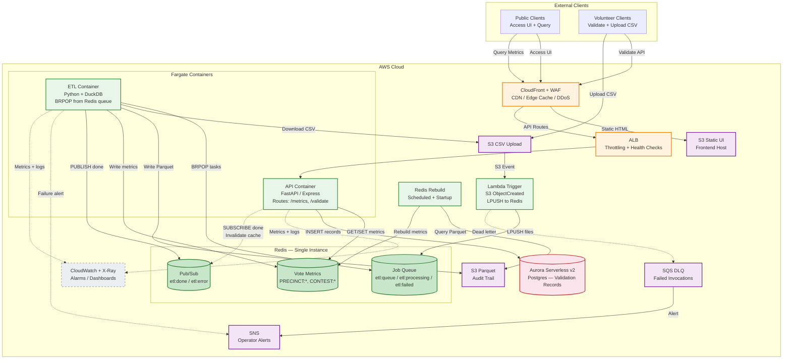
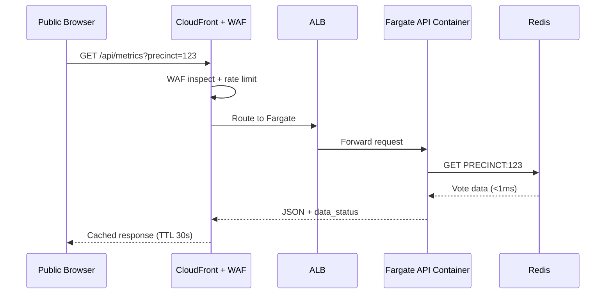
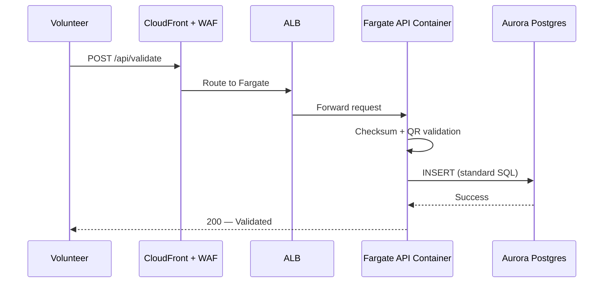
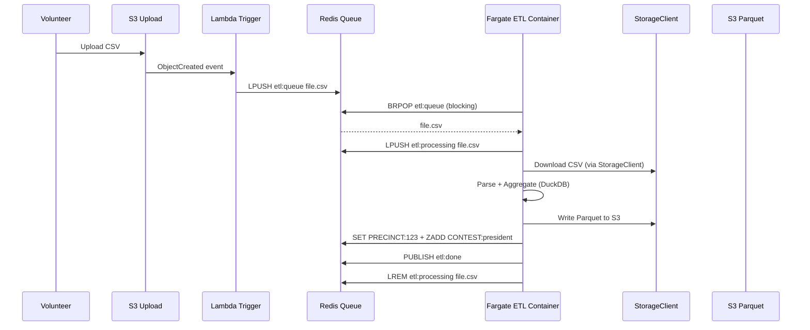
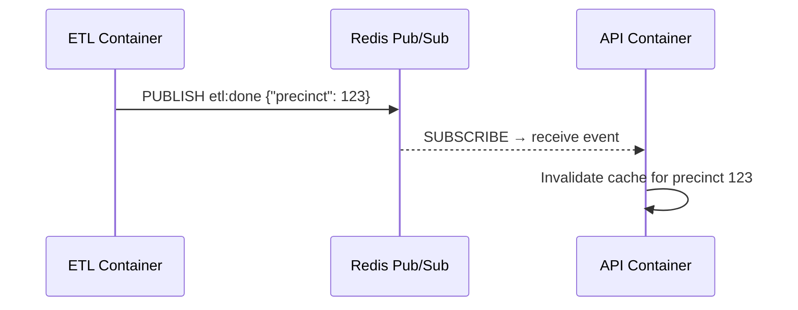
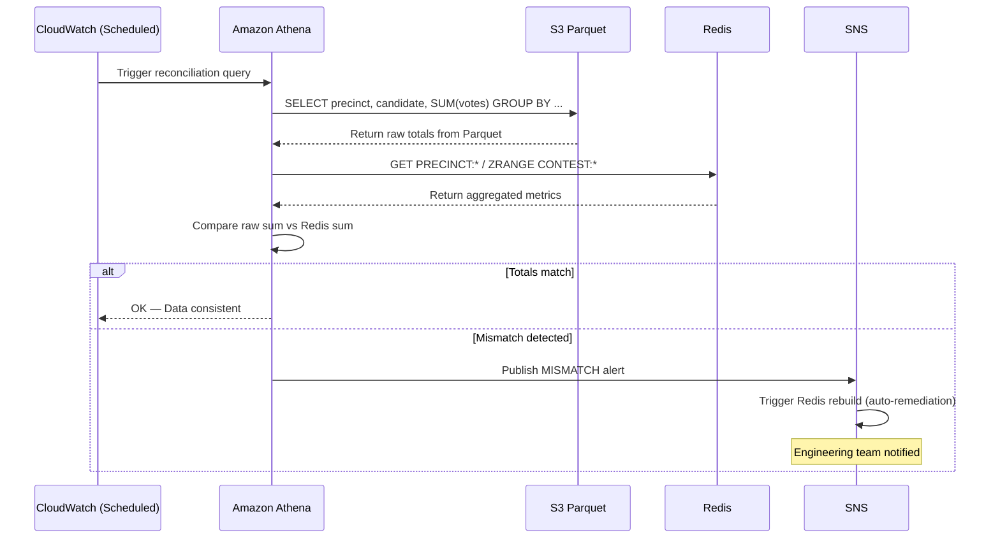

# PPCRV v3 — Cloud-Agnostic Election Monitoring Platform

A cloud-agnostic election monitoring platform for Philippine elections. Volunteers upload precinct CSV data, the system validates and processes it, and the public views aggregated vote results in real time. Built on **AWS Fargate containers** with a clear path to **GCP Cloud Run** and **Azure Container Apps**.

---

## Table of Contents

- [Project Overview](#project-overview)
- [Problem Statement](#problem-statement)
- [Architecture](#architecture)
- [Component Breakdown](#component-breakdown)
- [Data Storage Strategy](#data-storage-strategy)
- [ETL Pipeline — Redis Job Queue](#etl-pipeline--redis-job-queue)
- [Request Flows](#request-flows)
- [Data Accuracy & Integrity](#data-accuracy--integrity)
- [Redis Rebuild (Auto-Shutdown)](#redis-rebuild-auto-shutdown)
- [Cloud Portability](#cloud-portability)
- [Cost Comparison](#cost-comparison)
- [Tech Stack Summary](#tech-stack-summary)
- [Project Structure](#project-structure)
- [Infrastructure](#infrastructure)
- [Open Items](#open-items)
- [Change Log](#change-log)

---

## Project Overview

**PPCRV** (Parish Pastoral Council for Responsible Voting) is a citizen-volunteer election monitoring organization in the Philippines. This application supports the election process by:

1. **Parsing CSV election data** — Volunteers receive CSV files via physical drive and upload them to the cloud
2. **Grouping votes by hierarchy** — Total votes by precinct, candidate, region, and national level
3. **Public results web app** — Citizens view election results in real time
4. **Volunteer validation app** — Volunteers validate CSV integrity using checksums and cross-check QR codes of election returns per precinct

### CSV Input Format

| Column | Description |
|--------|-------------|
| `PRECINCT_CODE` | Unique precinct identifier |
| `CONTEST_CODE` | Election contest (e.g., President, Mayor) |
| `CANDIDATE_CODE` | Candidate identifier |
| `PARTY_CODE` | Party identifier |
| `VOTES_AMOUNT` | Votes received by candidate in precinct |
| `TOTALIZATION_ORDER` | Ordering for totalization |
| `NUMBER_VOTERS` | Number of registered voters in precinct |
| `UNDERVOTE` | Undervote count |
| `OVERVOTE` | Overvote count |
| `RECEPTION_DATE` | Date/time the return was received |

**Scale:** ~32 million rows per election cycle across multiple CSV uploads (up to 2GB per file). Public query load: up to 50 million requests over a 2-day election window.

---

## Problem Statement

PPCRV is a **greenfield project** with no existing deployed system. An initial architecture proposal used always-on EC2 instances, but this was too expensive for an application that is only heavily used during election periods and otherwise idle. The architecture has evolved through three iterations:

- **v1** — Fully serverless (Lambda, API Gateway, Glue, DynamoDB). **Fastest cold starts, but 10+ AWS-specific services.**
- **v2** — Fargate containers + DynamoDB + Aurora. **Portable compute, but still 8+ cloud-specific services.**
- **v3 (current)** — Fargate containers + Redis + Aurora SQL. **Only 5 services per cloud. Fewer interfaces. Lower cost.**

### Why Cloud-Agnostic?

The organization may need to run on **GCP** or **Azure** in the future. v3 chooses services with near-identical equivalents on all three clouds:

| Principle | Implementation |
|-----------|---------------|
| **Docker images run everywhere** | Same API and ETL containers on Fargate, Cloud Run, or Container Apps |
| **Standard protocols > cloud APIs** | Redis (`redis-py`) and Postgres (`psycopg2`) use standard protocols — no cloud-specific SDKs |
| **Minimal interfaces** | Only 2 per-cloud implementations (Storage, Messaging) instead of 4 in v2 |
| **One env var switches clouds** | `CLOUD_PROVIDER=aws|gcp|azure` |

---

## Architecture



---

## Component Breakdown

| Component | Service | Purpose |
|-----------|---------|---------|
| CDN + Edge Cache | CloudFront + WAF per cloud | Global edge cache, DDoS protection, SSL |
| Static UI Hosting | S3 / GCS / Blob Storage | React SPA, cached at edge |
| API Routing | ALB / Cloud LB / App Gateway | Throttling, health checks, route traffic to Fargate |
| API Compute | Fargate / Cloud Run / Container Apps | FastAPI/Express serving /metrics and /validate |
| ETL Compute | Fargate / Cloud Run Jobs / Container Apps Jobs | DuckDB CSV processing, BRPOP from Redis queue |
| Fast KV + Queue + Pub/Sub | Redis per cloud | Three workloads, one service |
| Relational DB | Aurora Serverless v2 / Cloud SQL / Azure Postgres | Validation records (standard SQL only) |
| Raw Data Storage | S3 / GCS / Blob | Source of truth, audit trail (Parquet) |
| S3 Upload Trigger | Lambda / Cloud Function / Azure Function | LPUSH file paths into Redis queue |
| Durable DLQ + Alerts | SNS+SQS / Pub/Sub / Service Bus | Operator notifications that survive Redis restarts |
| Observability | CloudWatch / Cloud Logging / Azure Monitor | Logging, metrics, tracing, alarms |

### What Changed from Earlier Versions

| v1/v2 Service | v3 Replacement | Why |
|---------------|---------------|-----|
| DynamoDB (Metrics + Status) | **Redis KV** | Faster (sub-ms), same protocol everywhere |
| Step Functions (ETL orchestration) | **Redis LPUSH/BRPOP** | No cloud orchestrator needed |
| SNS (real-time messaging) | **Redis pub/sub** | In-cluster events don't need durable messaging |
| Abstraction interfaces ×4 | **×2** | Redis and Postgres use standard protocols |

---

## Data Storage Strategy

The system uses a **three-tier storage** approach: Redis for fast metrics reads, Postgres for relational validation data, and S3 Parquet as the immutable source of truth.

### Redis — Vote Metrics + Job Queue + Pub/Sub

Redis replaces three v2 services (DynamoDB × 2 + Step Functions) and absorbs SNS real-time messaging. A single `cache.t3.small` instance handles all workloads.

**Vote Metrics (KV Store):**

```
PRECINCT:123          → JSON {"reported": 12450, "total_voters": 15000, ...}
CONTEST:president     → ZSET {"CandidateA": 5200000, "CandidateB": 4800000}
STATUS:precinct#123   → "processed"
ELECTION:2028         → JSON {"total_precincts": 95000, "reported": 87200}
```

**ETL Job Queue:**

```
etl:queue             → LPUSH by Lambda Trigger
etl:processing        → LPUSH by ETL worker on start
etl:failed            → LPUSH after 3 retries
```

**Pub/Sub Channels:**

```
etl:done              → API container invalidates cache
etl:error             → Monitoring/logging
```

**Throughput:** 100K+ GETs/sec on a single node. For 50M requests over 2 days (~290 req/s average, ~3,000 req/s peak), one instance is sufficient.

### Aurora Serverless v2 / Postgres — Validation Records

| Aspect | Detail |
|--------|--------|
| Purpose | Stores volunteer validation records (checksum, QR cross-check results) |
| Schema | One table: `validation_records` (precinct, checksum, QR status, validated_by, timestamp) |
| How accessed | Standard `psycopg2` SQL — no Aurora Data API |
| Why Aurora | Auto-scales 0.5–16 ACU, auto-shutdown compatible |
| Migration path | `pg_dump` → `pg_restore` into Cloud SQL or Azure Postgres |

> [!IMPORTANT]
> Only standard Postgres SQL is used. No Aurora Data API, no RDS extensions. This ensures the migration path to GCP Cloud SQL or Azure Database for PostgreSQL is a `pg_dump`/`pg_restore` + connection string change.

### S3 Parquet — Source of Truth

| Aspect | Detail |
|--------|--------|
| Purpose | Store raw, unmodified CSV data converted to Parquet |
| Format | Parquet (columnar, compressed, queryable via Athena) |
| Partitioning | `year/election_id/precinct_code/` |
| Use cases | Audit trails, ad-hoc analysis, Redis rebuild after restart |
| Retention | Permanent (election records must be preserved) |
| Queryable via | Athena (AWS) / BigQuery (GCP) / Synapse (Azure) |

### Why Redis is Not the Source of Truth

Redis is in-memory. Every metric write to Redis is also persisted in S3 Parquet. If Redis restarts:

1. The reconciliation job detects the gap
2. The Redis Rebuild script queries S3 Parquet (via Athena/BigQuery/Synapse)
3. Redis is rebuilt with fresh metrics (~5 minutes for 32M rows)
4. During rebuild, the UI shows "Results Loading"

---

## ETL Pipeline — Redis Job Queue

The ETL pipeline uses Redis `LPUSH`/`BRPOP` as a worker queue instead of a cloud-specific orchestrator.

### How It Works

```
Volunteer uploads CSV → S3 event → Lambda Trigger → LPUSH etl:queue file.csv
                                                         │
                                            ┌────────────┼────────────┐
                                            ▼            ▼            ▼
                                         ETL Task 1   ETL Task 2   ETL Task 3
                                            │            │            │
                                         BRPOP file   BRPOP file   BRPOP file
                                            │            │            │
                                         DuckDB       DuckDB       DuckDB
                                            │            │            │
                                         SET Redis    SET Redis    SET Redis
```

- **Atomic dequeue:** `BRPOP` ensures no two workers process the same file
- **Parallel fan-out:** Increase Fargate task count to add workers. Set to 10 for election day, 0 for idle
- **No orchestration service:** Redis is the coordination point

### ETL Stages

1. **Download** — Worker gets CSV from S3 via StorageClient interface
2. **Parse + Aggregate** — DuckDB processes in-memory: group by precinct, candidate, contest
3. **Persist** — Write Parquet to S3 (source of truth), write metrics to Redis (fast path)
4. **Notify** — `PUBLISH etl:done` → API container invalidates in-memory cache

### Failure Handling

| Scenario | Mechanism |
|----------|-----------|
| Worker crashes mid-process | Watchdog scans `etl:processing` for stale entries (>10 min) → re-queues |
| Permanent failure (3 retries) | Moved to `etl:failed` → durable alert via SNS |
| Redis restarts | Lambda Trigger re-scans S3 → re-queues. Reconciliation detects gap → triggers rebuild |
| Duplicate upload (idempotency) | `STATUS:{file_key}` check before processing → skip if already processed |

### Performance

| Scenario | Workers | Time |
|----------|---------|------|
| Single worker | 1 Fargate task | ~30-60 min |
| 10 workers | 10 Fargate tasks | ~3-6 min |
| 20 workers | 20 Fargate tasks | ~2-3 min |

---

## Request Flows

### Flow 1 — Query Vote Metrics (Public)



### Flow 2 — Validate Vote (Volunteer)



### Flow 3 — Upload CSV → ETL (Volunteer)



### Flow 4 — Cache Invalidation (Automated)



### Flow 5 — Reconciliation (Automated)



**Schedule:** Hourly during election week, daily during idle months. Reconciliation also runs on Redis startup after auto-shutdown.

---

## Data Accuracy & Integrity

For an election monitoring system, accuracy is non-negotiable.

### 1. Checksum Validation (Pre-ETL Gate)

Volunteer upload validation happens via the API container (same as v1/v2). Invalid data is rejected before entering the ETL pipeline.

### 2. Idempotent ETL Processing

- ETL worker checks `STATUS:{file_key}` in Redis before processing
- If already processed, skips — prevents double-counting
- Safe to re-upload the same CSV without inflating totals

### 3. Redis is Not Source of Truth

- Every metric write to Redis is also persisted in S3 Parquet
- Redis can be rebuilt from S3 Parquet at any time
- The `REBUILD:status` key tracks rebuild state

### 4. Reconciliation Job

- Scheduled comparison: `SUM(votes in S3 Parquet via Athena) == SUM(votes in Redis via GET/ZRANGE)`
- Mismatch triggers an SNS alert and automatic Redis rebuild

### 5. Public Transparency

- Frontend displays "X of Y precincts reported" using `ELECTION:*` key in Redis
- `data_status` field in API responses shows whether results are partial or complete

### 6. Audit Trail

- Raw CSV data preserved in S3 Parquet permanently
- Any disputed result can be re-verified via Athena queries on raw data
- Redis aggregates can be rebuilt from S3 at any time

---

## Redis Rebuild (Auto-Shutdown)

To achieve the lowest annual cost (~$883/year), Redis is shut down during idle months and rebuilt from S3 Parquet when needed.

### When Rebuilds Happen

| Trigger | When |
|---------|------|
| Redis startup | After auto-shutdown period ends |
| Scheduled safety net | Weekly |
| Reconciliation mismatch | Automatic, triggered by alert |

### Performance

| Data Volume | Athena Query | Redis Rebuild | Total | UI Impact |
|-------------|-------------|---------------|-------|-----------|
| Full election (32M rows) | ~30-60s | ~2-5 min | ~5 min | "Results Loading" |
| Between elections (minimal) | ~5-10s | ~1 min | ~1 min | Brief loading |

```python
# Simplified rebuild logic
def rebuild():
    redis = Redis(host=REDIS_HOST)
    rows = athena.query("SELECT precinct_code, candidate_code, SUM(votes) ...")

    pipe = redis.pipeline()
    for i, row in enumerate(rows):
        pipe.set(f"PRECINCT:{row.precinct}", json.dumps(row))
        if i % 1000 == 0:
            pipe.execute()
            pipe = redis.pipeline()
    pipe.execute()
    redis.set("REBUILD:status", "complete")
```

---

## Cloud Portability

### Service Migration Map

| Layer | AWS (now) | GCP (later) | Azure (later) | Migration Effort |
|-------|-----------|-------------|---------------|-----------------|
| Compute (API) | **Fargate** | Cloud Run | Container Apps | **None** — same Docker image |
| Compute (ETL) | **Fargate** | Cloud Run Jobs | Container Apps Jobs | **None** — same Docker image |
| API Routing | ALB | Cloud Load Balancing | Application Gateway | **Low** — Terraform resource swap |
| Fast KV, Queue, Pub/Sub | **ElastiCache Redis** | Memorystore Redis | Azure Cache for Redis | **None** — same `redis-py` client |
| Relational DB | **Aurora Serverless v2** | Cloud SQL Postgres | Azure Database Postgres | **Low** — `pg_dump` → `pg_restore` |
| Object Storage | S3 | GCS | Blob Storage | **Low** — StorageClient swap |
| Durable Messaging | SNS + SQS | Pub/Sub | Service Bus | **Low** — MessageQueue swap |
| Edge / CDN + WAF | CloudFront + WAF | Cloud CDN + Armor | Azure CDN + WAF | **Medium** — config rewrite |
| DNS | Route 53 | Cloud DNS | Azure DNS | **Low** — zone export/import |
| S3 Upload Trigger | Lambda | Cloud Function | Azure Function | **Low** — 10 lines per cloud |
| Observability | CloudWatch + X-Ray | Cloud Logging + Trace | Azure Monitor | **Medium** — instrumentation swap |

### Migration Steps

1. **Write target cloud implementations** for StorageClient and MessageQueue (the only two interfaces)
2. **Push Docker image** to target cloud registry
3. **Provision infrastructure** via Terraform (separate per-cloud module)
4. **Migrate data:** `pg_dump`/`pg_restore` for Postgres, `aws s3 sync`/`gsutil rsync`/`azcopy` for object storage
5. **Flip config:** `CLOUD_PROVIDER=gcp` env var
6. **Test:** Run reconciliation, validate API responses, check ETL pipeline

---

## Cost Comparison

> [!NOTE]
> This is a summary. Full per-service breakdown and annual projections in **[docs/cost-re-arch-v3.md](./docs/cost-re-arch-v3.md)**. v1/v2 figures in **[docs/cost-re-arch-v2.md](./docs/cost-re-arch-v2.md)** and **[docs/cost-arch-v1.md](./docs/cost-arch-v1.md)**.

### Per-Month Comparison (50M Peak Requests, ap-southeast-1)

| Category | v1 (Lambda + Glue) | v2 (Fargate + DDB) | v3 (Fargate + Redis) |
|----------|---------------------|---------------------|----------------------|
| Edge (CF Business + ALB) | $254 | $225 | $221 |
| Compute (API + ETL) | $46 | $45 | $44 |
| Database (KV + Relational) | $75 | $75 | **$36** |
| Storage + Registry | $5 | $6 | $6 |
| Messaging | $2 | $2 | $1 |
| Observability | $35 | $35 | $35 |
| Analytics | $2 | $2 | $2 |
| **Peak Month (Optimized)** | **~$402** | **~$390** | **~$345** |

### Annual Projection (1 Peak + 11 Idle)

| Scenario | v1 | v2 | v3 |
|----------|-----|-----|-----|
| Always-On | ~$1,117 | ~$1,171 | ~$1,159 |
| Auto-Shutdown (All DBs) | ~$1,117 | **~$951** | **~$883** |

**v3 is $883/year — the cheapest architecture yet.** $68 less than v2 and $234 less than v1.

### Key Insights

- **Redis consolidates 3 services into 1** — replaces DynamoDB (KV), Step Functions (orchestration), and SNS (real-time). $25/month for all three workloads.
- **Peak month is cheapest in v3** ($345) — Redis is cheaper than DynamoDB + Step Functions combined
- **Idle cost depends on auto-shutdown** — Redis always-on adds $25/month. With auto-shutdown + rebuild script, idle drops to ~$48/month
- **Fewer services to migrate** — 5 vs 8+ in v2. Less IaC, fewer interfaces, simpler migration
- **Per-cloud cost variance** — AWS is cheapest for managed services in Southeast Asia. GCP and Azure Redis may be 20-50% more expensive

---

## Tech Stack Summary

| Layer | Technology |
|-------|-----------|
| Frontend | React SPA (static build, hosted on object storage + CDN) |
| API Framework | FastAPI (Python) or Express (Node.js) — TBD |
| API Compute | AWS Fargate / GCP Cloud Run / Azure Container Apps |
| ETL Processing | DuckDB (Python, in-process columnar analytics) |
| ETL Compute | AWS Fargate / GCP Cloud Run Jobs / Azure Container Apps Jobs |
| Fast KV / Queue / Pub/Sub | Redis (ElastiCache / Memorystore / Azure Cache) |
| Relational DB | Aurora Serverless v2 / Cloud SQL / Azure Postgres (standard SQL only) |
| Object Storage | S3 / GCS / Blob Storage |
| CDN + Security | CloudFront + WAF / Cloud CDN + Armor / Azure CDN + WAF |
| DNS | Route 53 / Cloud DNS / Azure DNS |
| Durable Messaging | SNS + SQS / Pub/Sub / Service Bus |
| Observability | CloudWatch + X-Ray / Cloud Logging + Trace / Azure Monitor |
| Analytics | Athena / BigQuery / Synapse |
| IaC | Terraform (independent modules per cloud) |
| CI/CD | GitHub Actions (build → test → deploy containers + sync UI to CDN) |

### Abstraction Interfaces

| Interface | Methods | Purpose |
|-----------|---------|---------|
| `StorageClient` | `upload()`, `download()`, `list()`, `delete()` | Object storage — S3, GCS, or Blob |
| `MessageQueue` | `publish_alert()`, `push_dead_letter()` | Durable messaging — SNS+SQS, Pub/Sub, or Service Bus |

**Redis and Postgres use standard protocols** (`redis-py`, `psycopg2`) — no interfaces needed. Only the connection string changes between clouds.

---

## Project Structure

```
src/
├── config.py                     # CLOUD_PROVIDER switch + service factory
├── interfaces/
│   ├── storage_client.py         # upload / download / list / delete
│   └── message_queue.py          # publish_alert / push_dead_letter
├── aws/
│   ├── s3_storage_client.py
│   ├── sns_message_queue.py
│   └── athena_client.py
├── gcp/                          # (future)
│   ├── gcs_storage_client.py
│   ├── pubsub_message_queue.py
│   └── bigquery_client.py
├── azure/                        # (future)
│   ├── blob_storage_client.py
│   ├── servicebus_message_queue.py
│   └── synapse_client.py
├── api/
│   ├── main.py                   # FastAPI entry point
│   ├── routes/metrics.py         # GET /api/metrics
│   ├── routes/validation.py      # POST /api/validate
│   └── middleware/rate_limit.py  # Redis-backed rate limiter
├── etl/
│   ├── worker.py                 # BRPOP loop
│   ├── processor.py              # DuckDB parse + aggregate
│   └── watchdog.py               # Stale job recovery
├── rebuild/
│   └── rebuild_metrics.py        # Athena → Redis
├── trigger/
│   ├── handler.py                # Common logic
│   ├── aws_handler.py            # Lambda entry
│   ├── gcp_handler.py            # Cloud Function entry (future)
│   └── azure_handler.py          # Azure Function entry (future)
└── shared/
    ├── redis_keys.py             # Key naming conventions
    ├── models.py                 # Data classes
    └── logger.py                 # Structured logging

ui/                               # React front-end (static SPA)
├── src/
├── public/
└── package.json

infra/                            # Terraform per cloud
├── aws/                          # main.tf, ecs.tf, alb.tf, redis.tf, rds.tf, s3.tf, cloudfront.tf, ...
├── gcp/                          # Same structure, GCP resources (future)
└── azure/                        # Same structure, Azure resources (future)

docker/
├── Dockerfile.api
├── Dockerfile.etl
└── docker-compose.yml            # Local dev: API + ETL + Redis + Postgres
```

### Key Rules

| Rule | Enforcement |
|------|-------------|
| No cloud SDKs in `api/` or `etl/` | Code review — grep for `boto3`, `google-cloud`, `azure` |
| Redis uses `redis-py` only | Standard Redis protocol, no cloud-specific extensions |
| Postgres uses `psycopg2` only | Standard SQL, no Aurora Data API |
| Cloud SDKs isolated in `aws/`, `gcp/`, `azure/` | Interfaces in `interfaces/` define the contract |
| Terraform per cloud, no shared modules | `infra/aws/`, `infra/gcp/`, `infra/azure/` are independent |

---

## Infrastructure

Infrastructure is provisioned via **Terraform** with independent modules per cloud. See [docs/TERRAFORM.md](./docs/TERRAFORM.md) for the Terraform design and [docs/CLOUDFORMATION.md](./docs/CLOUDFORMATION.md) for a CloudFormation comparison.

| Aspect | Approach |
|--------|----------|
| **Modules per cloud** | `infra/aws/`, `infra/gcp/`, `infra/azure/` — independent, no shared modules |
| **State** | Remote S3/GCS/Azure Blob backend + locking |
| **Auth** | GitHub OIDC (short-lived JWT → AssumeRole) |
| **CI/CD** | Plan on PR → auto-apply on merge to `main` |
| **Environments** | `dev` → `staging` → `prod`, each fully isolated |
| **Dev cost** | ~$51/mo (Fargate, Redis `cache.t3.micro`, Aurora auto-shutdown, ALB) |

---

## Optimizations & Operational Details

### Multi-AZ Redis (High Availability)

v3 MVP uses a single Redis node. For production, add Multi-AZ ElastiCache (AWS) or equivalent:

| Option | Nodes | Monthly Cost | RTO |
|--------|-------|--------------|-----|
| **Single node** (MVP) | 1 | ~$25 | ~5 min (rebuild from S3) |
| **Multi-AZ** (recommended for prod) | 2 (primary + replica, different AZs) | ~$50 | ~30 sec (auto-failover) |
| **Redis Sentinel** (self-managed) | 3 Sentinel + 1 primary + 1 replica | ~$30 + ops burden | ~10 sec |

**Recommendation:** Start with single node (MVP). Upgrade to Multi-AZ after launch if Redis is a bottleneck. The ~5 min rebuild from S3 is acceptable for a greenfield project.

### CloudFront Edge-Caching for API Responses

CloudFront caches static assets. It can also cache API responses at the edge:

```yaml
# CloudFront Behavior for /api/metrics
Path: /api/metrics?*
Origin: ALB
Cache TTL: 30s
Query strings: Include (precinct parameter matters)
```

**Impact:** A precinct with 10K visitors gets 1 API call + 9,999 edge cache hits. API container load drops ~70-90% during peak.

**Trade-off:** 30-second stale data. Acceptable for election results (UI already shows "updated X seconds ago").

### Graceful ETL Shutdown

When Fargate scales down, tasks receive SIGTERM. The ETL container handles it cleanly:

```python
import signal
import sys

def handle_sigterm(signum, frame):
    # Finish current CSV, update Redis status, exit
    redis.set("ETL:shutdown_requested", "true")
    sys.exit(0)

signal.signal(signal.SIGTERM, handle_sigterm)
```

Without graceful shutdown, a killed task leaves the job in `etl:processing` until the watchdog catches it (10 min delay).

### Presigned S3 Upload URLs

Volunteers upload 2GB CSV files. Instead of proxying through the API container:

```
Volunteer Browser → API: GET /upload-url (filename)
              ← API: S3 presigned URL (15 min expiry)
Volunteer Browser → S3: PUT CSV directly (multipart upload)
              → S3: ObjectCreated event → Lambda Trigger → Redis queue
```

**Benefits:**
- No bandwidth through API container
- No memory pressure on API
- S3 handles multipart upload natively (resumable, parallel)
- 2GB file uploads don't affect API performance

### PgBouncer (Postgres Connection Pooling)

Each Fargate API task opens its own Postgres connection. At 20 tasks × 20 connections = 400 connections, approaching Aurora's ~500 max.

**Fix:** Add PgBouncer as a sidecar in the API task definition:
- Reduces connections from 400 → 20
- Reuses idle connections
- Standard tool, works on all clouds
- Cost: negligible (runs in same Fargate task, ~50MB memory)

### Redis RDB Snapshots

Redis supports periodic disk snapshots (RDB). This reduces rebuild time after restart:

| Strategy | RDB Enabled | Restart Time | Rebuild Needed |
|----------|-------------|--------------|----------------|
| No RDB | No | ~5 min | Full Athena rebuild |
| RDB every 15 min | Yes | ~30 sec | Only data changed since snapshot |
| RDB + AOF | Yes | ~10 sec | Near-zero data loss |

**Recommendation:** Enable RDB snapshots every 15 minutes during election week. Disable during idle (no writes). The rebuild script becomes a safety net, not the primary recovery path.

**Storage:** ElastiCache manages RDB snapshot storage automatically — no S3 bucket needed. Snapshot files (~25MB) are stored in ElastiCache's managed storage. To restore: create a new ElastiCache cluster from the snapshot via AWS Console or `aws elasticache create-cache-cluster --snapshot-name`.

### Redis Memory Sizing

The `cache.t3.small` (1.37 GB) instance is sized for the election workload:

| Data | Calculation | Memory |
|------|-------------|--------|
| Precinct metrics | 95,000 precincts × ~500 bytes/JSON | ~47.5 MB |
| Contest aggregates | ~50 contests × 20 candidates × 100 bytes | ~100 KB |
| Election metadata | ~10 keys × ~1 KB | ~10 KB |
| ETL queue/processing | ~500 entries × 200 bytes | ~100 KB |
| Redis overhead | ~20% for internal structures | ~10 MB |
| **Total** | | **~60 MB** |

**Headroom:** 1.37 GB ÷ 60 MB = **23x headroom**. The instance is oversized for safety. Can downsize to `cache.t3.micro` (0.5 GB, ~$12/mo) for dev or if cost is a concern.

### Redis Security

| Concern | Configuration |
|---------|---------------|
| **AUTH** | Enable Redis AUTH token (password). Store in SSM Parameter Store, inject via ECS task definition `secrets`. |
| **TLS** | Enable in-transit encryption (ElastiCache supports TLS). All Redis clients connect via `rediss://` (port 6380). |
| **VPC** | Deploy Redis in private subnets. Security group allows inbound 6380 only from Fargate task security group. |
| **Encryption at rest** | Enable ElastiCache at-rest encryption. RDB snapshots are encrypted. |
| **IAM auth** | ElastiCache supports IAM authentication (Redis 6.0+). Alternative to AUTH token — uses Sigv4 signing. |

**Minimum for production:** AUTH + TLS + VPC security group. Encryption at rest is a bonus.

### Redis Connection Management

With 20 Fargate tasks each opening a Redis connection:

| Concern | Solution |
|---------|----------|
| **Connection count** | 20 tasks × 1 connection = 20 connections. Redis handles 10K+ connections. No pooling needed. |
| **Connection timeout** | Set `socket_timeout=5s` and `socket_connect_timeout=2s`. Prevents hanging on Redis unavailability. |
| **Retry strategy** | Use `redis.retry_on_timeout=True`. Retry once on timeout, then fail fast. |
| **Connection health** | Use `redis.ping()` on startup to verify connectivity. Log connection errors to CloudWatch. |

**Code pattern:**
```python
import redis
import os

redis_client = redis.Redis(
    host=os.environ['REDIS_HOST'],
    port=6380,
    password=os.environ['REDIS_AUTH_TOKEN'],
    ssl=True,
    socket_timeout=5,
    socket_connect_timeout=2,
    retry_on_timeout=True,
    decode_responses=True
)
```

### Data Consistency Model

Every metric write to Redis is also persisted in S3 Parquet. The write order is:

```
1. Write to S3 Parquet (source of truth)  ← durable first
2. Write to Redis (fast path)             ← then cache
```

**Failure scenarios:**

| Scenario | Impact | Recovery |
|----------|--------|----------|
| S3 write succeeds, Redis write fails | Data is durable in S3, but not in Redis | Reconciliation job detects gap → rebuilds Redis |
| Redis write succeeds, S3 write fails | Data is in Redis but not durable | Next ETL job overwrites Redis; S3 write retries with idempotent upsert |
| Both fail | Data is lost | ETL job retries (3 attempts); permanent failure → SNS alert |

**Guarantee:** S3 Parquet is always the source of truth. Redis is a cache that can be rebuilt. The worst case is a 5-minute delay while Redis is rebuilt from S3.

### ETL Watchdog Detail

The watchdog monitors `etl:processing` for stale entries:

| Parameter | Value |
|-----------|-------|
| **Check frequency** | Every 60 seconds |
| **Stale timeout** | 10 minutes (configurable via `ETL_STALE_TIMEOUT_SEC`) |
| **Action** | Move stale entry from `etl:processing` back to `etl:queue` for retry |
| **Max retries** | 3 (tracked in `etl:retries:{file_key}`) |
| **Permanent failure** | After 3 retries, move to `etl:failed` → SNS alert |

**Implementation:**
```python
import time
import redis

def watchdog_loop():
    while True:
        stale_jobs = redis.lrange("etl:processing", 0, -1)
        for job in stale_jobs:
            job_data = json.loads(job)
            started_at = job_data.get("started_at", 0)
            if time.time() - started_at > ETL_STALE_TIMEOUT_SEC:
                retries = redis.incr(f"etl:retries:{job_data['file_key']}")
                redis.lrem("etl:processing", 1, job)
                if retries <= 3:
                    redis.lpush("etl:queue", job)  # Re-queue
                else:
                    redis.lpush("etl:failed", job)  # Permanent failure
                    publish_alert(f"ETL permanent failure: {job_data['file_key']}")
        time.sleep(60)
```

### Redis Pub/Sub Reliability Caveat

Redis pub/sub is **fire-and-forget**. If the API container is down when `etl:done` is published, it misses the cache invalidation event.

**Mitigations:**

| Layer | Mechanism |
|-------|-----------|
| **Real-time** | API container subscribes to `etl:done` on startup. Invalidates cache immediately. |
| **Safety net** | Reconciliation job runs hourly. Compares Redis metrics vs S3 Parquet. Catches any missed invalidations. |
| **Startup** | API container performs a full cache refresh on startup (queries S3 Parquet via Athena). |

**Trade-off accepted:** 99% of the time, pub/sub works. The 1% case (container restart during ETL) is caught by reconciliation within 1 hour. For an election system, this is acceptable because results are already "partial" until all precincts report.

### Redis Key TTL Strategy

| Key Pattern | TTL | Rationale |
|-------------|-----|-----------|
| `PRECINCT:*` | **None** | Election data — permanent until next election |
| `CONTEST:*` | **None** | Election data — permanent until next election |
| `ELECTION:*` | **None** | Election data — permanent until next election |
| `STATUS:*` | **None** | Precinct processing status — permanent for audit |
| `REBUILD:*` | **None** | Rebuild state — permanent for operational history |
| `etl:queue` | **None** | Pending jobs — must survive restarts |
| `etl:processing` | **None** | Active jobs — watchdog monitors for stale entries |
| `etl:failed` | **None** | Failed jobs — permanent for debugging |
| `etl:retries:*` | **24 hours** | Retry counters — reset daily |
| `ratelimit:*` | **60 seconds** | Rate limit windows — auto-expire |

### Redis Monitoring Metrics

Monitor these CloudWatch metrics for ElastiCache:

| Metric | Threshold | Action |
|--------|-----------|--------|
| `DatabaseMemoryUsagePercentage` | > 70% | Alert — consider upsizing |
| `CurrConnections` | > 100 | Investigate connection leaks |
| `CacheHitRate` | < 80% | Investigate cache invalidation frequency |
| `EngineCPUUtilization` | > 60% | Consider Multi-AZ or larger instance |
| `ReplicationLag` | > 1 second | (Multi-AZ only) Check replica health |
| `Evictions` | > 0 | Memory pressure — upsize or add TTLs |
| `NetworkBytesIn/Out` | Baseline | Track traffic patterns |

**Alarms to set:**
- `DatabaseMemoryUsagePercentage > 70%` for 5 minutes → SNS alert
- `EngineCPUUtilization > 60%` for 5 minutes → SNS alert
- `CurrConnections > 100` for 5 minutes → SNS alert

### ETL Scaling Strategy

| Parameter | Value |
|-----------|-------|
| **Scaling trigger** | Manual or Redis queue depth |
| **Scale-out command** | `aws ecs update-service --desired-count N` |
| **Max workers** | 20 (limited by Redis connection count and S3 request rate) |
| **Scale-down** | Workers exit when queue is empty for 5 minutes (`BRPOP` timeout) |

**Auto-scaling option (future):**
```python
# CloudWatch alarm on Redis queue depth
# etl:queue length > 10 for 2 minutes → scale ECS to 10
# etl:queue length > 50 for 2 minutes → scale ECS to 20
# etl:queue == 0 for 5 minutes → scale ECS to 0
```

**Recommendation:** Start with manual scaling for the first election. Implement auto-scaling after observing real queue behavior.

### API Rate Limiting (WAF + Redis)

| Layer | Mechanism | Granularity |
|-------|-----------|-------------|
| WAF | IP-based rate limit | Coarse — blocks IPs |
| ALB | Connection throttling | Coarse — connection count |
| API (Redis-backed) | Per-API-key sliding window | Fine-grained, configurable |

**Current:** WAF provides basic IP-based protection.
**Future:** Add Redis-backed rate limiter for per-user/per-session control:

```python
# Rate limit: 100 requests/minute per API key
def check_rate_limit(api_key):
    key = f"ratelimit:{api_key}"
    current = redis.incr(key)
    if current == 1:
        redis.expire(key, 60)
    return current <= 100
```

### CSV Schema Validation (Pre-Queue)

The Lambda Trigger validates CSV structure before queuing:

```python
def validate_csv(file_key):
    header = read_first_line(file_key)
    required = ["PRECINCT_CODE", "CONTEST_CODE", "CANDIDATE_CODE",
                "PARTY_CODE", "VOTES_AMOUNT"]
    if not all(col in header for col in required):
        return False  # Rejected — bad CSV never enters ETL
    return True
```

Prevents malformed CSVs from wasting ETL compute.

---

## Local Development

The repository includes a POC that runs entirely locally — no cloud services needed.

**Quick start:**

```bash
pnpm install                        # Install JS deps
pip install duckdb pytest            # Python ETL deps
python3 scripts/run_aggregation.py \
  sample-csv/results.csv \
  sample-csv/precincts.csv \
  output --sample 100000  # Generate Parquet data (omit --sample for full 24M rows)
pnpm dev                            # Start API (3001) + Web (3000)
```

| Component | Stack | Port |
|-----------|-------|------|
| **API** | NestJS 10 → DuckDB CLI | 3001 |
| **Web** | Next.js 14 + Tailwind CSS | 3000 |
| **ETL** | Python + DuckDB | — |

Full setup guide, project structure, and troubleshooting: **[docs/DEV-SETUP.md](./docs/DEV-SETUP.md)**.

---

## Open Items

| # | Item | Status |
|---|------|--------|
| 1 | Benchmark Redis `GET` throughput on `cache.t3.micro` for 50M requests | Open |
| 2 | Benchmark DuckDB ETL performance on 2GB CSV with 4 vCPU | Open |
| 3 | Implement Redis Rebuild Script + test with real S3 Parquet data | Open |
| 4 | Determine Redis auto-shutdown schedule + startup trigger mechanism | Open |
| 5 | Test Redis failure recovery: restart → rebuild → API picks up stale cache | Open |
| 6 | Choose API framework (FastAPI vs Express) | Open |
| 7 | Define Fargate container sizing (vCPU / memory) for API and ETL | Open |
| 8 | Design WAF rules per cloud (AWS WAF, GCP Armor, Azure WAF) | Open |
| 9 | Verify CloudFront Business plan month-to-month switching with AWS Support | Open |
| 10 | Benchmark Redis pub/sub latency for cache invalidation path | Open |
| 11 | Implement ETL watchdog for stale job recovery | Open |
| 12 | Evaluate Redis `cache.t3.micro` (0.5 GB) for dev vs `cache.t3.small` (1.37 GB) for prod | Open |
| 13 | Implement CloudFront edge-caching for `/api/metrics` responses | Open |
| 14 | Add graceful shutdown handler (SIGTERM) to ETL worker | Open |
| 15 | Implement presigned S3 upload URL endpoint | Open |
| 16 | Add PgBouncer sidecar for Postgres connection pooling | Open |
| 17 | Enable Redis RDB snapshots (15-min interval during election week) | Open |
| 18 | Add CSV schema validation to Lambda Trigger | Open |

---

## Change Log

All changes to this repository's documentation are tracked in **[docs/CHANGES.md](./docs/CHANGES.md)**.

### Architecture Versions

| Version | Document | Description |
|---------|---------|-------------|
| v1 | [docs/readme-arch-v1.md](./docs/readme-arch-v1.md) | Serverless (Lambda, API Gateway, Glue, DynamoDB) |
| v2 | [docs/readme-re-arch-v2.md](./docs/readme-re-arch-v2.md) | Fargate containers + DynamoDB + Aurora + Step Functions |
| **v3** | **This document** | **Fargate containers + Redis + Aurora SQL. 5 services per cloud.** |
