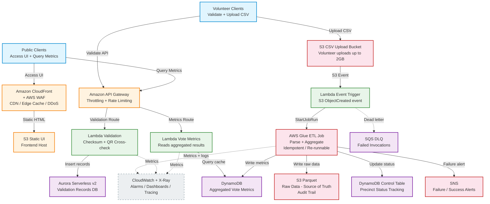
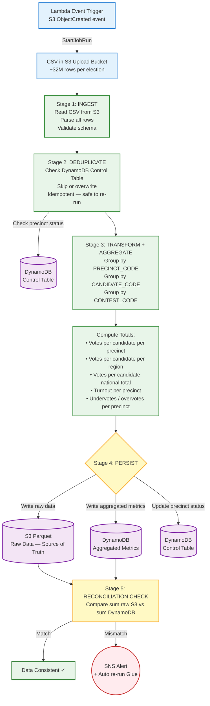
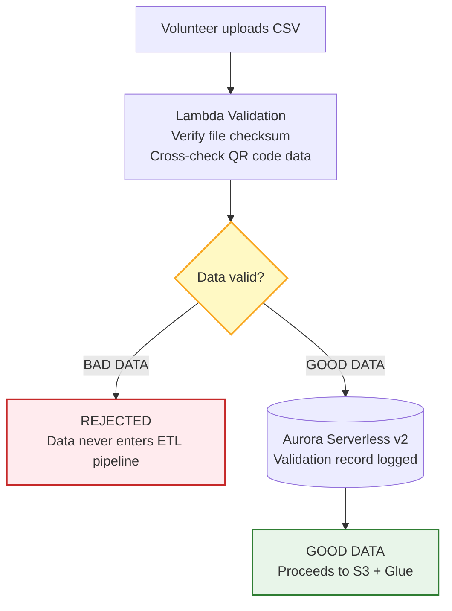
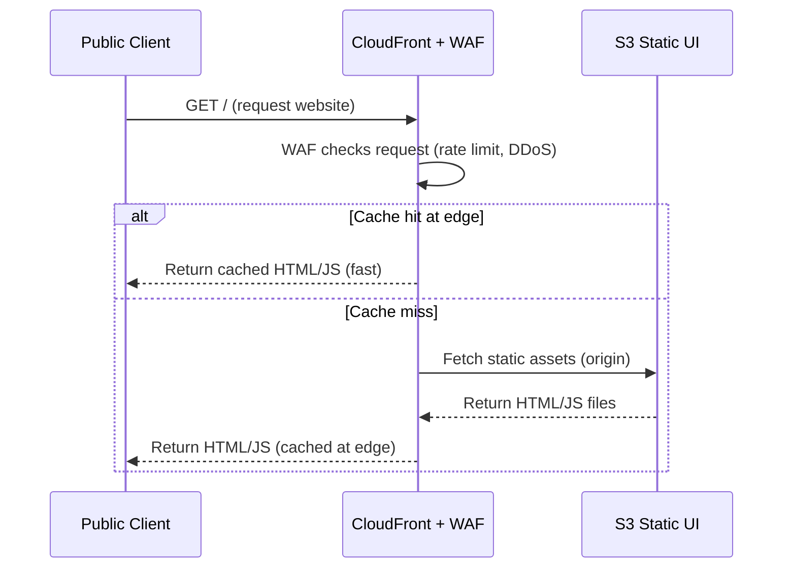
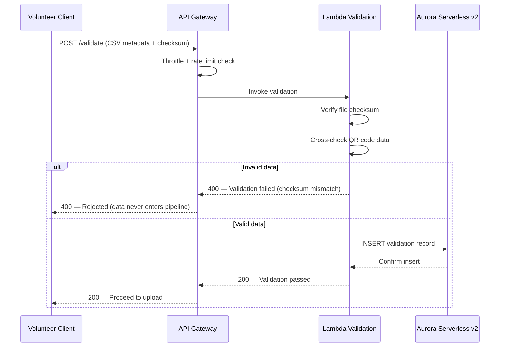
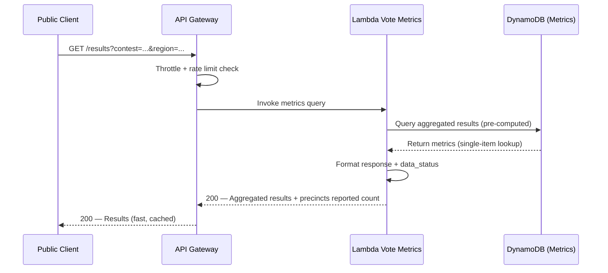
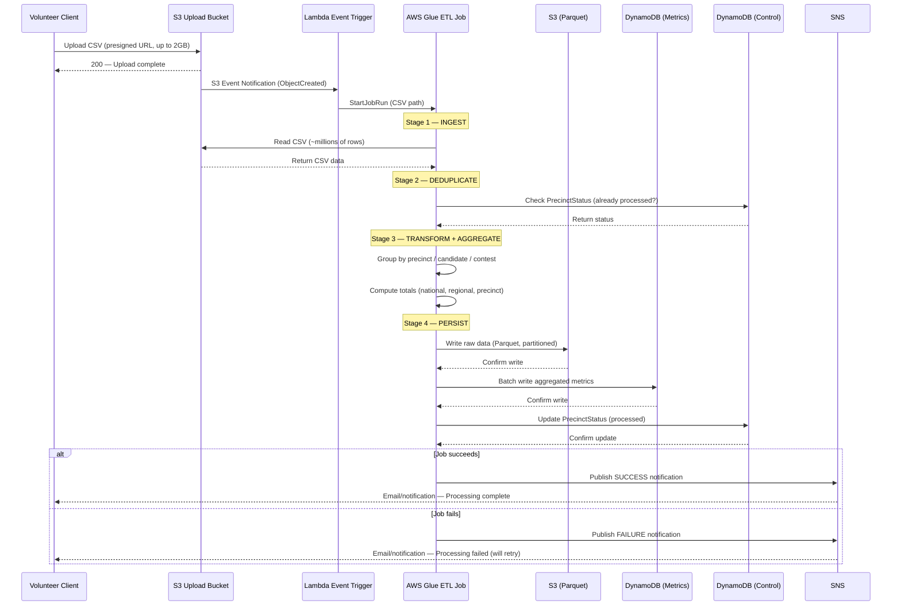
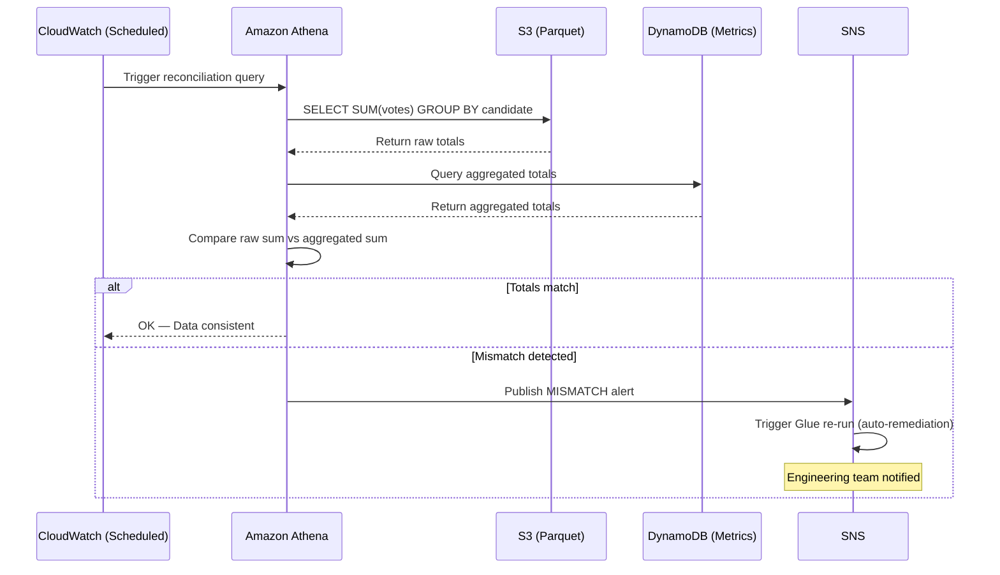

# PPCRV — Parish Pastoral Council for Responsible Voting

A serverless election monitoring platform for Philippine elections. Volunteers upload precinct CSV data, the system validates and processes it, and the public views aggregated vote results in real time.

---

## Table of Contents

- [Project Overview](#project-overview)
- [Problem Statement](#problem-statement)
- [Proposed Serverless Architecture](#proposed-serverless-architecture)
- [AWS Glue ETL Pipeline](#aws-glue-etl-pipeline)
- [Data Storage Strategy](#data-storage-strategy)
- [Data Accuracy & Integrity](#data-accuracy--integrity)
- [Request Flows](#request-flows)
- [Cost Comparison](#cost-comparison)
- [Open Action Items](#open-action-items)

---

## Project Overview

**PPCRV** (Parish Pastoral Council for Responsible Voting) is a citizen-volunteer election monitoring organization in the Philippines. This application supports the election process by:

1. **Parsing CSV election data** — Volunteers receive CSV files via physical drive and upload them to the cloud
2. **Grouping votes by hierarchy** — Total votes by precinct, candidate, region, and national level
3. **Public results web app** — Citizens view election results in real time
4. **Volunteer validation app** — Volunteers validate CSV integrity using checksums and cross-check QR codes of election returns per precinct

### CSV Input Format

| Column | Description |
|--------|-------------|
| `PRECINCT_CODE` | Unique precinct identifier |
| `CONTEST_CODE` | Election contest (e.g., President, Mayor) |
| `CANDIDATE_CODE` | Candidate identifier |
| `PARTY_CODE` | Party identifier |
| `VOTES_AMOUNT` | Votes received by candidate in precinct |
| `TOTALIZATION_ORDER` | Ordering for totalization |
| `NUMBER_VOTERS` | Number of registered voters in precinct |
| `UNDERVOTE` | Undervote count |
| `OVERVOTE` | Overvote count |
| `RECEPTION_DATE` | Date/time the return was received |

**Scale:** ~32 million rows per election cycle across multiple CSV uploads (up to 2GB per file).

---

## Problem Statement

PPCRV is a **greenfield project** with no existing deployed system. An initial architecture proposal used always-on EC2 instances, but this presents a cost and maintenance problem for an application that is only heavily used during election periods and otherwise idle.

### Initial Proposal (EC2-Based)

The first proposal relied on provisioned EC2 instances for every layer:

| Component | Initial Proposal | Drawback |
|-----------|-----------------|----------|
| Web Application | EC2 (m5.large) | Always running, even when idle |
| Validation Service | EC2 (m5.large, NodeJS) | Always running, even when idle |
| ETL Server | EC2 (c5.xlarge) | Manual batch processing, no auto-scaling |
| Load Balancers | ALB (app + data) | Over-provisioned |
| Static Web Server | EC2 | Unnecessary for static content |
| Relational DB | RDS (db.m5.large) | Always running |
| NoSQL Cache | Aerospike on EC2 (i3.xlarge) | Self-managed, expensive |
| Cache Cluster | i3.large EC2 | Self-managed, expensive |

**Estimated cost:** ~$714/month — paid even when the app is completely idle between elections.

### Why Serverless Instead

The initial proposal's main weakness is paying for idle capacity during the 99% of time the app is not in active use. A serverless approach is a better fit because:

- **Elections are bursty** — traffic spikes during election periods, then drops to near-zero
- **Cost scales with usage** — pay only when requests arrive or jobs run
- **No server maintenance** — no patching, scaling, or OS management
- **Automatic scaling** — handles traffic spikes without capacity planning

---

## Proposed Serverless Architecture

The revised proposal replaces the initial EC2-based design with fully serverless AWS services. The system scales to zero when idle and scales automatically during election traffic spikes.

### Architecture Diagram

### Component Breakdown

| Component | Service | Initial Proposal | Purpose |
|-----------|---------|----------|---------|
| CDN + Edge Cache | CloudFront + WAF | ALB + Static EC2 | Serves static UI, DDoS protection, rate limiting |
| Static UI Hosting | S3 | Static Web Server (EC2) | Hosts frontend application |
| API Layer | API Gateway | Application + Data ALBs | Routes requests to Lambda functions |
| Validation Compute | Lambda (Validation) | NodeJS Validation Service (m5.large) | Validates checksums, cross-checks QR codes |
| Metrics Compute | Lambda (Vote Metrics) | Web Application (m5.large) | Queries aggregated results from DynamoDB |
| ETL Compute | AWS Glue | ETL Server (c5.xlarge) | Parses + aggregates CSV data |
| Relational DB | Aurora Serverless v2 | RDS (db.m5.large) | Stores validation records |
| NoSQL Cache | DynamoDB | Aerospike + i3 Cache | Stores aggregated vote metrics |
| Raw Data Storage | S3 (Parquet) | EBS Volumes | Source of truth / audit trail |
| Event Trigger | Lambda (S3 Event) | N/A | Triggers Glue on CSV upload |
| Failure Alerts | SNS | N/A | Notifies on Glue/Lambda failures |
| Dead Letter Queue | SQS DLQ | N/A | Captures failed Lambda invocations |
| Observability | CloudWatch + X-Ray | N/A | Monitoring, alarms, tracing, dashboards |

---

## AWS Glue ETL Pipeline

The ETL pipeline is the core of the data processing flow. AWS Glue replaces the initial proposal's c5.xlarge ETL server with a fully managed, pay-per-use Spark-based processing engine.

### Pipeline Stages

### Why Glue Over Lambda for ETL?

| Factor | AWS Glue | Lambda |
|--------|---------|--------|
| Max execution time | Unlimited (managed Spark) | 15 minutes |
| Memory | Scales across cluster | 10GB max |
| 32M row processing | Native (Spark distributed) | Would require chunking/fan-out |
| Cost model | Per-DPU-second (pay for actual processing) | Per-request + duration |
| Best for | Large batch ETL | Small event-driven tasks |

Glue handles the 32M row batch natively. Lambda is kept for lightweight triggers (S3 event) and API routes (validation, metrics query).

### Glue Job Configuration (Recommended)

| Setting | Value | Rationale |
|---------|-------|-----------|
| Worker type | G.1X (1 DPU, 8GB) | Good balance of cost/performance |
| Worker count | 5-10 | Parallel processing for 32M rows |
| Glue version | 4.0 | Latest, supports Python/PySpark |
| Job bookmark | Enabled | Tracks processed files, supports incremental loads |
| Max retries | 3 | Auto-retry on transient failures |
| Timeout | 60 minutes | Safety limit |
| Notifications | SNS on FAIL/SUCCESS | Visibility into job status |

---

## Data Storage Strategy

The system uses a **dual-store** approach: raw data in S3 for auditability, aggregated metrics in DynamoDB for fast public reads.

### S3 (Parquet) — Source of Truth

| Aspect | Detail |
|--------|--------|
| Purpose | Store raw, unmodified CSV data converted to Parquet |
| Format | Parquet (columnar, compressed, queryable via Athena) |
| Partitioning | `year/election_id/precinct_code/` |
| Use cases | Audit trails, ad-hoc analysis, re-aggregation if needed |
| Retention | Permanent (election records must be preserved) |
| Queryable via | AWS Athena (SQL on S3, serverless, pay-per-query) |

### DynamoDB — Aggregated Metrics

| Table | Partition Key | Sort Key | Purpose |
|-------|--------------|----------|---------|
| `VoteMetrics` | `contest_code#candidate_code` | `granularity#region_code` | Aggregated vote totals (national, regional, precinct) |
| `PrecinctStatus` | `precinct_code` | — | Tracks which precincts have been processed |
| `ElectionMetadata` | `election_id` | — | Election-level status (total precincts, reported count) |

**Why aggregated, not raw?**

| | Raw (32M items) | Aggregated (~thousands) |
|---|---|---|
| DynamoDB write cost | Very high | Low |
| Query latency | Slow (scan + sum) | Fast (single-item lookup) |
| Storage | Large | Small |
| Public UX | Must compute on-the-fly | Results ready instantly |

### Aurora Serverless v2 — Validation Records

| Aspect | Detail |
|--------|--------|
| Purpose | Stores volunteer validation records (checksum, QR cross-check results) |
| Why Aurora | Relational schema, complex queries on validation history |
| Why Serverless v2 | Scales to 0.5 ACU when idle, no full cold start (unlike v1) |
| Min capacity | 0.5 ACU |
| Max capacity | 16 ACU (auto-scales) |

---

## Data Accuracy & Integrity

For an election monitoring system, accuracy is non-negotiable. The following measures ensure data integrity end-to-end:

### 1. Checksum Validation (Pre-ETL Gate)

### 2. Idempotent Glue Job

- Glue checks the `PrecinctStatus` DynamoDB table before processing
- If a precinct was already processed, Glue **overwrites** (not adds) — preventing double-counting
- Safe to re-run the same CSV upload without inflating totals

### 3. Atomic Batch Updates

- Glue writes to a **S3 staging area** first
- Only after all aggregation is complete, a single batch update writes to DynamoDB
- A `data_status` field tracks "partial" vs "complete" state

### 4. Reconciliation Job

- Periodic check: `sum(raw votes in S3 Parquet) == sum(aggregated totals in DynamoDB)`
- Mismatch triggers an **SNS alert** and automatic Glue re-run
- Uses Athena to query S3 Parquet in seconds

### 5. Public Transparency

- Frontend displays "X of Y precincts reported" using `ElectionMetadata` table
- Results shown as "processing" until all expected precincts are in
- Citizens see data status, not just numbers

### 6. Audit Trail

- Raw CSV data preserved in S3 (Parquet) permanently
- Any disputed result can be re-verified via Athena queries on raw data
- Glue job is re-runnable from S3 at any time — DynamoDB aggregates can be rebuilt from scratch

---

## Request Flows

The following UML sequence diagrams detail the end-to-end request flows for each use case. Diagrams use [Mermaid](https://mermaid.js.org/) syntax and render natively on GitHub, GitLab, and most markdown viewers.

### Flow 1 — Load Website (Public)

Citizens access the public election results website. CloudFront serves cached static assets from the S3 origin.

### Flow 2 — Validate Vote (Volunteer)

Volunteers validate the integrity of uploaded CSV data using checksums and QR code cross-checks before the data enters the ETL pipeline.

### Flow 3 — Query Vote Metrics (Public)

Citizens query aggregated election results. Data is pre-computed and stored in DynamoDB for fast reads.

### Flow 4 — Upload Precinct CSV (Volunteer)

Volunteers upload large CSV files (up to 2GB). The upload triggers an event-driven ETL pipeline that parses, deduplicates, aggregates, and persists the data.

### Flow 5 — Reconciliation (Automated)

A periodic automated job verifies data integrity by comparing raw source data against aggregated totals.

---

## Cost Comparison

| Component | Initial Proposal (EC2) | Est. Cost/mo | Serverless Proposal | Idle/mo | Peak/mo |
|-----------|------------------------|-------------|---------------------|---------|---------|
| Web Application | EC2 (m5.large) | $70 | Lambda + API Gateway | $0 | $30 |
| NoSQL Database | Aerospike (i3.xlarge) | $227 | DynamoDB | $0 | $50 |
| Relational DB | RDS (db.m5.large) | $130 | Aurora Serverless v2 | $0 | $40 |
| File Processing | EC2 (c5.xlarge) | $124 | AWS Glue | $0 | $20 |
| Caching | i3.large EC2 | $113 | DynamoDB (consolidated) | $0 | $15 |
| Static UI + CDN | N/A | $0 | S3 + CloudFront | $5 | $50 |
| Raw Data Storage | EBS Volumes | $50 | S3 (Parquet) | $10 | $15 |
| **Total** | | **$714** | | **$15** | **$220** |

**Savings:** ~70% at peak, ~98% when idle. The serverless proposal costs almost nothing between election cycles.

---

## Open Action Items

Items from the architecture draft that require further investigation:

| # | Item | Status |
|---|------|--------|
| 1 | Verify Aurora Serverless max storage capacity for validation records | TODO |
| 2 | Benchmark AppSync vs API Gateway for processing time | TODO |
| 3 | API Gateway 29-second timeout — identify any long-running operations | TODO |
| 4 | Evaluate AI/ML models for anomaly detection in vote data | TODO |
| 5 | Estimate AI model costs if anomaly detection is added | TODO |
| 6 | Finalize AWS Glue job design (worker count, partitioning strategy) | TODO |
| 7 | Configure rate limiting + WAF rules for public-facing endpoints | TODO |
| 8 | Define DynamoDB schema for aggregated metrics (partition/sort keys) | TODO |
| 9 | Build reconciliation job + SNS alerting | TODO |
| 10 | Set up CloudWatch dashboards for election-day monitoring | TODO |

---

## Tech Stack Summary

| Layer | Technology |
|-------|-----------|
| Frontend | Static HTML/JS (React or similar) hosted on S3 + CloudFront |
| API | Amazon API Gateway (REST) |
| Validation Compute | AWS Lambda (Node.js or Python) |
| Metrics Compute | AWS Lambda (Node.js or Python) |
| ETL | AWS Glue (PySpark) |
| Relational DB | Amazon Aurora Serverless v2 (PostgreSQL) |
| NoSQL DB | Amazon DynamoDB |
| Object Storage | Amazon S3 (Parquet for raw, HTML for UI) |
| CDN / Security | CloudFront + AWS WAF |
| Notifications | Amazon SNS |
| Queue / DLQ | Amazon SQS |
| Observability | CloudWatch + X-Ray |
| Ad-hoc Queries | Amazon Athena (SQL on S3 Parquet) |
| IaC | AWS CDK / SAM / Terraform (TBD) |
