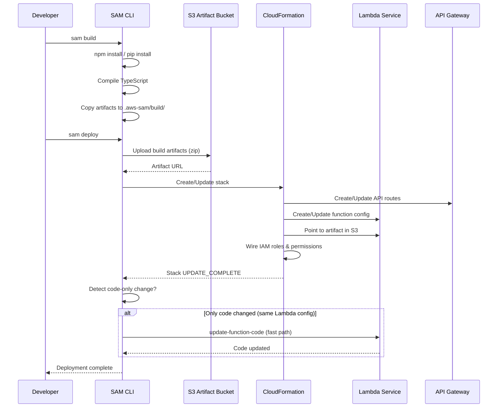
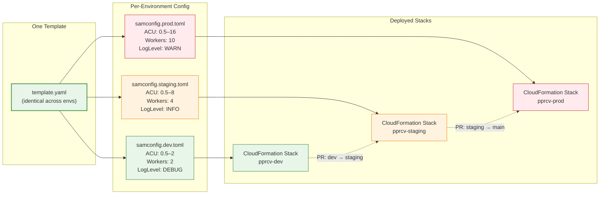
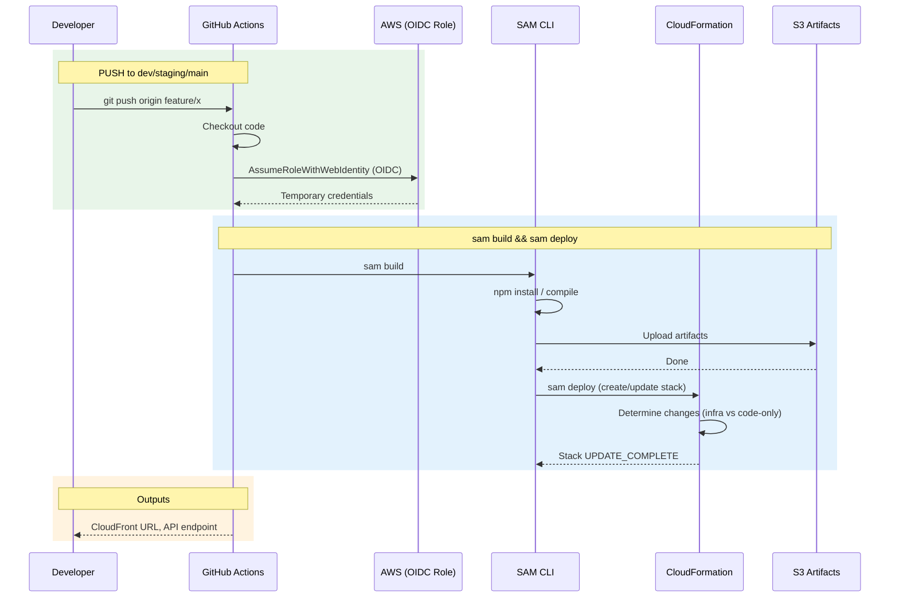
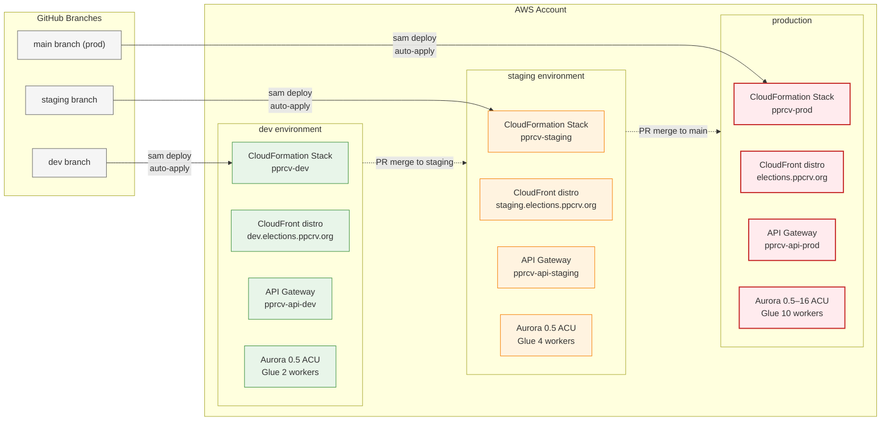
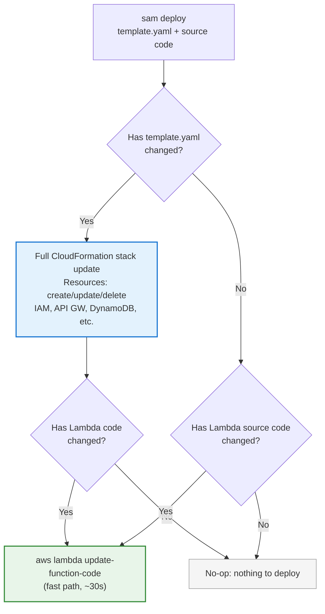

# PPCRV — CloudFormation & SAM Infrastructure Strategy

An exploration of what the PPCRV serverless platform would look like using **AWS CloudFormation** with **AWS SAM** (Serverless Application Model) instead of Terraform. This document covers template architecture, the unified CI/CD pipeline, migration considerations, and trade-offs specific to this project.

---

## Cost

**CloudFormation and SAM are free** — AWS charges nothing for creating, updating, or deleting stacks. The only infrastructure costs come from the **resources** they provision (Lambda, DynamoDB, etc.).

| Item | CloudFormation/SAM | Terraform |
|------|-------------------|-----------|
| Service itself | **$0** | **$0** (OSS) |
| State storage | **$0** (managed by AWS) | ~$0.11/mo (S3 + DynamoDB) |
| Artifact storage (S3) | ~$0.01/mo (SAM uploads zip files) | $0 (no artifacts needed) |
| CI/CD runner | GitHub Actions free tier | Same |
| **Total IaC cost** | **~$0.01/mo** | **~$0.12/mo** |

> The difference is negligible (~$0.11/mo). **IaC tool choice should be decided on workflow and feature fit, not cost.** Whether you pick SAM or Terraform, the IaC overhead rounds to zero in a budget of ~$29–1,117/month for the actual AWS resources.

---

## Table of Contents

- [Why Consider CloudFormation/SAM](#why-consider-cloudformationsam)
- [How SAM Works](#how-sam-works)
- [Template Architecture](#template-architecture)
- [CI/CD Pipeline — Single `sam deploy`](#cicd-pipeline--single-sam-deploy)
- [Multi-Environment Strategy](#multi-environment-strategy)
- [Code + Infra Together](#code--infra-together)
- [Greenfield Choice: No Migration Needed](#greenfield-choice-no-migration-needed)
- [Comparison: Terraform vs SAM](#comparison-terraform-vs-sam)
- [Recommendation](#recommendation)

---

## Why Consider CloudFormation/SAM

The main argument for SAM over Terraform for this project:

| Advantage | Why It Matters Here |
|-----------|-------------------|
| **Unified pipeline** | One `sam deploy` builds code + updates infra. No separate CI jobs for TF apply and code deploy. |
| **Managed state** | CloudFormation manages state automatically — no S3 bucket, DynamoDB lock table, or state file to lose. |
| **Local Lambda testing** | `sam local invoke` and `sam local start-api` let you test Lambda + API Gateway locally without deploying. |
| **Native rollback** | If a deployment fails, CloudFormation auto-rolls back to the last known good state. |
| **Simpler CI/CD** | One `sam deploy` command, one IAM role, no OIDC complexity if using the `aws/actions/configure-aws-credentials` GitHub Action. |
| **Drift detection** | Native CloudFormation drift detection — no need to run `terraform plan` to check for out-of-band changes. |

The trade-off is **AWS lock-in** — but this project is already pure AWS serverless, so that's a non-issue.

---

## How SAM Works

SAM is an extension of CloudFormation that adds **serverless shorthand** resources. A `template.yaml` file defines everything:

```yaml
# template.yaml
AWSTemplateFormatVersion: '2010-09-09'
Transform: AWS::Serverless-2016-10-31

Globals:
  Function:
    Runtime: nodejs20.x
    MemorySize: 256
    Timeout: 30
    Environment:
      Variables:
        TABLE_NAME: !Ref VoteMetricsTable
```

The deployment flow:



SAM automatically:
1. Creates the Lambda function, IAM role, API Gateway routes, and permissions
2. Packages your source code and uploads it to S3
3. Points the Lambda function to the new code
4. Updates the CloudFormation stack in the correct order (with rollback on failure)

---

## Template Architecture

The 7 Terraform modules would map to a **single `template.yaml`** organized by resource type. SAM handles most of the boilerplate.

```mermaid
graph TB
    classDef sam fill:#e8f5e9,stroke:#388e3c,stroke-width:2px
    classDef cf fill:#e3f2fd,stroke:#1976d2,stroke-width:2px
    classDef aws fill:#fff3e0,stroke:#f57c00,stroke-width:2px

    Template["template.yaml<br/><b>Single SAM Template</b>"]:::sam

    subgraph SAM_Shorthand["SAM Shorthand Resources"]
        MetricsFunc["AWS::Serverless::Function<br/>Vote Metrics Lambda"]:::sam
        ValidFunc["AWS::Serverless::Function<br/>Validation Lambda"]:::sam
        TriggerFunc["AWS::Serverless::Function<br/>S3 Event Trigger"]:::sam
        SAMApi["AWS::Serverless::Api<br/>HTTP API Gateway"]:::sam
    end

    subgraph CF_Resources["Raw CloudFormation Resources"]
        CFDist["AWS::CloudFront::Distribution<br/>CDN + Edge Caching"]:::cf
        WAF["AWS::WAFv2::WebACL<br/>DDoS + Rate Limiting"]:::cf
        R53["AWS::Route53::RecordSet<br/>DNS Records"]:::cf
        DDB["AWS::DynamoDB::Table<br/>Vote Metrics + Control"]:::cf
        Aurora["AWS::RDS::DBCluster<br/>Aurora Serverless v2"]:::cf
        S3UI["AWS::S3::Bucket<br/>Static UI Hosting"]:::cf
        S3CSV["AWS::S3::Bucket<br/>CSV Uploads"]:::cf
        S3PQ["AWS::S3::Bucket<br/>Parquet Raw Data"]:::cf
        Glue["AWS::Glue::Job<br/>ETL Pipeline"]:::cf
        Athena["AWS::Athena::WorkGroup<br/>Ad-hoc Queries"]:::cf
        SNS["AWS::SNS::Topic<br/>Failure Alerts"]:::cf
        SQS["AWS::SQS::Queue<br/>Dead Letter Queue"]:::cf
        CW["AWS::Logs::LogGroup<br/>AWS::CloudWatch::Dashboard<br/>Observability"]:::cf
    end

    subgraph AutoIAM["Auto-Generated IAM"]
        IAM_Policies["Lambda Execution Roles<br/>DynamoDB read/write policies<br/>API Gateway invoke permissions"]:::sam
    end

    Template --> SAM_Shorthand
    Template --> CF_Resources
    Template --> AutoIAM

    MetricsFunc --> DDB
    ValidFunc --> Aurora
    ValidFunc --> DDB
    TriggerFunc --> Glue
    TriggerFunc --> S3CSV
    SAMApi --> MetricsFunc
    SAMApi --> ValidFunc
    S3CSV --> TriggerFunc
    Glue --> S3PQ
    Glue --> DDB
```



### Module → Resource Mapping

| Terraform Module (proposed) | SAM / CloudFormation Resource | Shorthand? |
|-----------------|------------------------------|-----------|
| `network/` — CloudFront + WAF + Route 53 | `AWS::CloudFront::Distribution` + `AWS::WAFv2::WebACL` + `AWS::Route53::RecordSet` | ❌ Raw CF |
| `compute/` — Lambda + API Gateway | `AWS::Serverless::Function` + `AWS::Serverless::Api` | ✅ SAM |
| `storage/` — S3 + DynamoDB + Aurora | `AWS::S3::Bucket` + `AWS::DynamoDB::Table` + `AWS::RDS::DBCluster` | ❌ Raw CF |
| `etl/` — Glue + Athena | `AWS::Glue::Job` + `AWS::Athena::WorkGroup` | ❌ Raw CF |
| `messaging/` — SNS + SQS | `AWS::SNS::Topic` + `AWS::SQS::Queue` | ❌ Raw CF |
| `observability/` — CloudWatch + X-Ray | `AWS::Logs::LogGroup` + `AWS::XRay::Group` + `AWS::CloudWatch::Dashboard` | ❌ Raw CF |
| `iam/` — Roles + Policies | Auto-generated by SAM for Lambda; manual for Glue/Aurora | ✅ SAM |

### Template Structure

```yaml
# template.yaml — single file for ALL environments
# Difference between dev/staging/prod is controlled by Parameters only.
AWSTemplateFormatVersion: '2010-09-09'
Transform: AWS::Serverless-2016-10-31

Parameters:
  Environment:
    Type: String
    AllowedValues: [dev, staging, prod]

  # ── Sizing parameters (varies per environment) ──
  AuroraMinACU:
    Type: Number
    Default: 0.5
  AuroraMaxACU:
    Type: Number
  GlueWorkers:
    Type: Number
  LogLevel:
    Type: String
    Default: INFO
  DomainName:
    Type: String

  # ── Dev-only: auto-shutdown schedule ──
  DevAutoShutdown:
    Type: String
    Default: "false"
    AllowedValues: ["true", "false"]

Globals:
  Function:
    Runtime: nodejs20.x
    Timeout: 30
    Environment:
      Variables:
        ENVIRONMENT: !Ref Environment
        LOG_LEVEL: !Ref LogLevel

Resources:
  # ── Compute ──
  VoteMetricsFunction:
    Type: AWS::Serverless::Function
    Properties:
      CodeUri: src/metrics/
      Handler: index.handler
      MemorySize: 256
      Policies:
        - DynamoDBReadPolicy:
            TableName: !Ref VoteMetricsTable
      Events:
        GetMetrics:
          Type: Api
          Properties:
            Path: /metrics
            Method: GET

  ValidationFunction:
    Type: AWS::Serverless::Function
    Properties:
      CodeUri: src/validation/
      Handler: index.handler
      MemorySize: 512
      Policies:
        - DynamoDBWritePolicy:
            TableName: !Ref VoteMetricsTable
        - RDSWritePolicy:
            DBClusterArn: !Ref ValidationDBCluster
      Events:
        ValidateData:
          Type: Api
          Properties:
            Path: /validate
            Method: POST

  S3TriggerFunction:
    Type: AWS::Serverless::Function
    Properties:
      CodeUri: src/trigger/
      Handler: index.handler
      Policies:
        - GlueJobPolicy:
            JobName: !Ref GlueETLJob
      Events:
        S3Upload:
          Type: S3
          Properties:
            Bucket: !Ref UploadBucket
            Events: s3:ObjectCreated:*

  # ── Database ──
  VoteMetricsTable:
    Type: AWS::DynamoDB::Table
    Properties:
      BillingMode: PAY_PER_REQUEST
      AttributeDefinitions:
        - AttributeName: pk
          AttributeType: S
        - AttributeName: sk
          AttributeType: S
      KeySchema:
        - AttributeName: pk
          KeyType: HASH
        - AttributeName: sk
          KeyType: RANGE

  ValidationDBCluster:
    Type: AWS::RDS::DBCluster
    Properties:
      Engine: aurora-postgresql
      ServerlessV2ScalingConfiguration:
        MinCapacity: !Ref AuroraMinACU
        MaxCapacity: !Ref AuroraMaxACU

  # ── Edge (no SAM shorthand, raw CF) ──
  CloudFrontDistribution:
    Type: AWS::CloudFront::Distribution
    Properties:
      # ... standard CloudFront config using !Ref DomainName

  # ── ETL ──
  GlueETLJob:
    Type: AWS::Glue::Job
    Properties:
      Command:
        Name: pythonshell
        ScriptLocation: !Sub s3://pprcv-glue-scripts-${Environment}/etl.py
      WorkerType: G.1X
      NumberOfWorkers: !Ref GlueWorkers

  # ── Observability ──
  Dashboard:
    Type: AWS::CloudWatch::Dashboard
    Properties:
      DashboardName: !Sub pprcv-${Environment}
      DashboardBody: !Sub
        - '{ "widgets": [...] }'
        - {}
```

### Reusable Template — One File, Three Environments

The same `template.yaml` deploys to dev, staging, and prod. Only the **parameters** change:

| Parameter | Dev | Staging | Prod |
|-----------|-----|---------|------|
| `AuroraMinACU` | 0.5 | 0.5 | 0.5 |
| `AuroraMaxACU` | 2 | 8 | 16 |
| `GlueWorkers` | 2 | 4 | 10 |
| `LogLevel` | DEBUG | INFO | WARN |
| `DevAutoShutdown` | true | false | false |

Each environment gets its own `samconfig.toml` that supplies these values — the template stays identical. This means a dev-approved change (e.g., adding a DynamoDB index) flows through staging to prod with no template modification.



**File size estimate:** A single `template.yaml` for this project would be roughly **400–700 lines** — comparable to the combined Terraform HCL modules (which are split across 7+ files). SAM's shorthand eliminates much of the boilerplate that Terraform requires for IAM roles and API Gateway-Lambda integrations.

---

## CI/CD Pipeline — Single `sam deploy`

Terraform requires **two separate CI jobs** (one for infra, one for code). SAM handles both in one.



### GitHub Actions Workflow

```yaml
# .github/workflows/deploy.yml
name: SAM Deploy

on:
  push:
    branches: [dev, staging, main]
    paths:
      - 'template.yaml'
      - 'src/**'
      - 'samconfig.toml'

jobs:
  deploy:
    runs-on: ubuntu-latest
    steps:
      - uses: actions/checkout@v4

      - name: Configure AWS credentials
        uses: aws-actions/configure-aws-credentials@v4
        with:
          role-to-assume: arn:aws:iam::${{ secrets.AWS_ACCOUNT_ID }}:role/pprcv-sam-deploy-${{ github.ref_name }}
          aws-region: ap-southeast-1

      - name: Setup SAM
        uses: aws-actions/setup-sam@v2

      - name: SAM build
        run: sam build --config-file samconfig.${{ github.ref_name }}.toml

      - name: SAM deploy
        run: sam deploy --no-fail-on-empty-changeset --config-file samconfig.${{ github.ref_name }}.toml
```

**That's it.** The same workflow runs for all three environments — the only difference is the `samconfig` file and the IAM role.

### What `sam deploy` Does

```
1. sam build
   ├── npm install for each Lambda
   ├── TypeScript compile (if applicable)
   └── Copy artifacts to .aws-sam/build/

2. sam deploy
   ├── Upload build artifacts to S3 (sam package)
   ├── Create/update CloudFormation stack
   │   ├── Create/update Lambda functions, API GW, DynamoDB, etc.
   │   ├── Upload new code to each Lambda
   │   └── Wire up permissions, routes, events
   ├── Wait for stack CREATE_COMPLETE / UPDATE_COMPLETE
   └── Output API Gateway URL, CloudFront URL
```

**Total time:** ~3–5 minutes for a dev deploy (vs Terraform's ~2 min TF apply + ~30 sec code deploy in separate jobs).

### PR Review Workflow

```yaml
name: SAM Plan
on:
  pull_request:
    paths: ['template.yaml', 'src/**']

jobs:
  plan:
    runs-on: ubuntu-latest
    steps:
      - uses: actions/checkout@v4
      - uses: aws-actions/configure-aws-credentials@v4
        with:
          role-to-assume: arn:aws:iam::xxx:role/pprcv-sam-plan
          aws-region: ap-southeast-1
      - uses: aws-actions/setup-sam@v2

      - name: SAM build
        run: sam build

      - name: SAM sync (dry run)
        run: sam sync --stack-name pprcv-dev --watch false --dry-run > plan-output.txt

      - name: Post plan as PR comment
        uses: actions/github-script@v7
        with:
          script: |
            const fs = require('fs');
            const plan = fs.readFileSync('plan-output.txt', 'utf8');
            github.rest.issues.createComment({
              ...context.repo,
              issue_number: context.issue.number,
              body: `## SAM Deployment Plan\n\`\`\`\n${plan}\n\`\`\``
            });
```

> [!NOTE]
> `sam sync --dry-run` shows what would change, similar to `terraform plan`. It's less granular than TF plan (no line-by-line resource diff) but sufficient for PR review.

---

## Multi-Environment Strategy

SAM uses **parameter files** or **`samconfig.toml`** per environment, plus **stack naming** for isolation.

### samconfig.toml (per environment)

```toml
# samconfig.dev.toml
version = 0.1

[dev]
[dev.deploy]
[dev.deploy.parameters]
stack_name = "pprcv-dev"
s3_bucket = "pprcv-sam-artifacts-dev"
s3_prefix = "pprcv-dev"
region = "ap-southeast-1"
capabilities = "CAPABILITY_IAM"
parameter_overrides = """
  Environment=dev
  DomainName=dev.elections.ppcrv.org
  MinACU=0.5
  MaxACU=2
  GlueWorkers=2
  LogLevel=DEBUG
"""
```

```toml
# samconfig.prod.toml
version = 0.1

[prod]
[prod.deploy]
[prod.deploy.parameters]
stack_name = "pprcv-prod"
s3_bucket = "pprcv-sam-artifacts-prod"
s3_prefix = "pprcv-prod"
region = "ap-southeast-1"
capabilities = "CAPABILITY_IAM"
parameter_overrides = """
  Environment=prod
  DomainName=elections.ppcrv.org
  MinACU=0.5
  MaxACU=16
  GlueWorkers=10
  LogLevel=INFO
"""
```



### Stack Isolation

| Environment | Stack Name | Branch | Devs Can Touch? |
|-------------|-----------|--------|-----------------|
| `dev` | `pprcv-dev` | `dev` | ✅ Yes — safe |
| `staging` | `pprcv-staging` | `staging` | ❌ PR only |
| `prod` | `pprcv-prod` | `main` | ❌ PR only |

Each stack is fully isolated — you can delete `pprcv-dev` without affecting prod. This is identical to Terraform's workspace isolation.

---

## Code + Infra Together

The key difference from Terraform is how SAM handles **code deploys**:

### Terraform (current)

```yaml
# CI job 1: Terraform apply (infra only — creates Lambda resource)
- run: terraform apply

# CI job 2: Code deploy (separate job, different tool)
- run: pip install -r requirements.txt -t build/
- run: zip -r build/deployment-package.zip build/
- run: aws lambda update-function-code --function-name pprcv-validator --zip-file fileb://build/deployment-package.zip
```

If you change a Lambda handler name, you need **both** jobs to run in sequence. If you change just code (same handler), you only need job 2.

### SAM

```yaml
# One job, one command
- run: sam build && sam deploy
```



SAM detects:
- **Infra changes** (new Lambda, changed timeout, added route) → updates CloudFormation stack
- **Code changes only** (same Lambda config, different source code) → uploads new code via Lambda API
- **Both** → updates stack + uploads code in the right order

`sam deploy` is smart about this — it doesn't re-run the full CloudFormation update if only code changed. It uses `aws lambda update-function-code` under the hood for pure code changes, making code-only deploys as fast as a direct CLI call.

---

## Greenfield Choice: No Migration Needed

> [!IMPORTANT]
> This project is **greenfield** — no Terraform code has been written yet. Both options are equally viable from scratch. The comparison below helps you choose which to start with.

## Comparison: Terraform vs SAM

| Aspect | Terraform | SAM / CloudFormation |
|--------|-----------|---------------------|
| **Pipeline complexity** | 2 CI jobs (TF apply + code deploy) | 1 CI job (`sam deploy`) |
| **Deploy time (code change)** | ~30s (just `update-function-code`) | ~3-5 min (full `sam deploy`) |
| **Deploy time (infra change)** | ~2 min (`terraform apply`) | ~3-5 min (CloudFormation update) |
| **State management** | Self-managed (S3 + DynamoDB) | Managed by AWS |
| **Local testing** | Manual (`aws-lambda-rie`) | `sam local invoke` / `sam local start-api` |
| **Rollback on failure** | Manual (restore previous state + re-apply) | **Automatic** (CloudFormation rolls back) |
| **PR review output** | Clear `terraform plan` diff | `sam sync --dry-run` (less granular) |
| **Multi-provider** | ✅ Any provider | ❌ AWS only |
| **Learning curve** | Moderate (HCL) | Low (YAML) for SAM serverless; moderate for raw CF |
| **Module ecosystem** | 2,000+ community modules | N/A — you write everything |
| **Non-serverless resources** | Consistent HCL syntax | YAML — verbose for non-serverless (CloudFront, WAF, Glue) |

### Key Differences in Practice

**What SAM does better:**
- **Code + infra in one pipeline** — simpler CI/CD, fewer moving parts
- **Local testing** — `sam local invoke` without deploying to AWS
- **Managed state** — no S3 bucket or DynamoDB table to maintain
- **Auto-rollback** — a failed deploy reverts to the last working state

**What Terraform does better:**
- **Plan clarity** — `terraform plan` is the gold standard for infrastructure review
- **Non-serverless resources** — CloudFront, WAF, Glue, Route 53 are verbose in raw CF YAML but concise in HCL
- **Flexibility** — `for_each`, `count`, dynamic blocks handle complex logic cleanly
- **Established workflows** — the PR plan → review → apply pattern is battle-tested

---

## Recommendation

**For this project, SAM/CloudFormation is the better starting point.** Here's why, given this is greenfield:

| Factor | Verdict |
|--------|---------|
| **Pure AWS serverless** — no multi-provider need | ✅ SAM is purpose-built for this |
| **Unified code+infra pipeline** — one `sam deploy` instead of two CI jobs | ✅ Simplifies CI/CD from day one |
| **Local Lambda testing** — `sam local invoke` without deploying to AWS | ✅ Faster dev cycle |
| **Managed state** — no S3/DynamoDB state backend to set up and maintain | ✅ Less boilerplate |
| **Auto-rollback** — failed deploys revert automatically | ✅ Safety net for election infra |
| **Plan reviewability** — `terraform plan` is more readable than SAM's dry-run | ❌ SAM is weaker here |
| **Non-serverless resources** — CloudFront/WAF/Glue YAML is verbose | ❌ Raw CF YAML is wordy |

**The tiebreaker:** SAM's managed state and unified pipeline mean less boilerplate to set up — no S3 state backend, no separate CI jobs for code vs infra. For a small team building a pure-AWS serverless app, SAM removes more friction than Terraform adds.

### If You Prefer Terraform

Terraform is still a strong choice if:
- You value `terraform plan` clarity for PR review (important for election infrastructure where mistakes are high-stakes)
- You want the flexibility to add non-AWS providers later
- Your team already knows HCL
- You prefer Terraform's module ecosystem for reusable patterns

The comparison is close enough that **either choice is fine** — what matters more is sticking with it and building.

---

## Reference

| Resource | Link |
|----------|------|
| AWS SAM Developer Guide | https://docs.aws.amazon.com/serverless-application-model/latest/developerguide/ |
| SAM CLI Command Reference | https://docs.aws.amazon.com/serverless-application-model/latest/developerguide/sam-cli-command-reference.html |
| CloudFormation Resource Types | https://docs.aws.amazon.com/AWSCloudFormation/latest/UserGuide/aws-template-resource-type-ref.html |
| Terraform AWS Provider | https://registry.terraform.io/providers/hashicorp/aws/latest/docs |
| Terraform proposal | [docs/TERRAFORM.md](./TERRAFORM.md) |
| Production cost estimate | [cost-arch-v1.md](cost-arch-v1.md) |
| Dev cost estimate | [docs/COSTS-DEV.md](./COSTS-DEV.md) |
