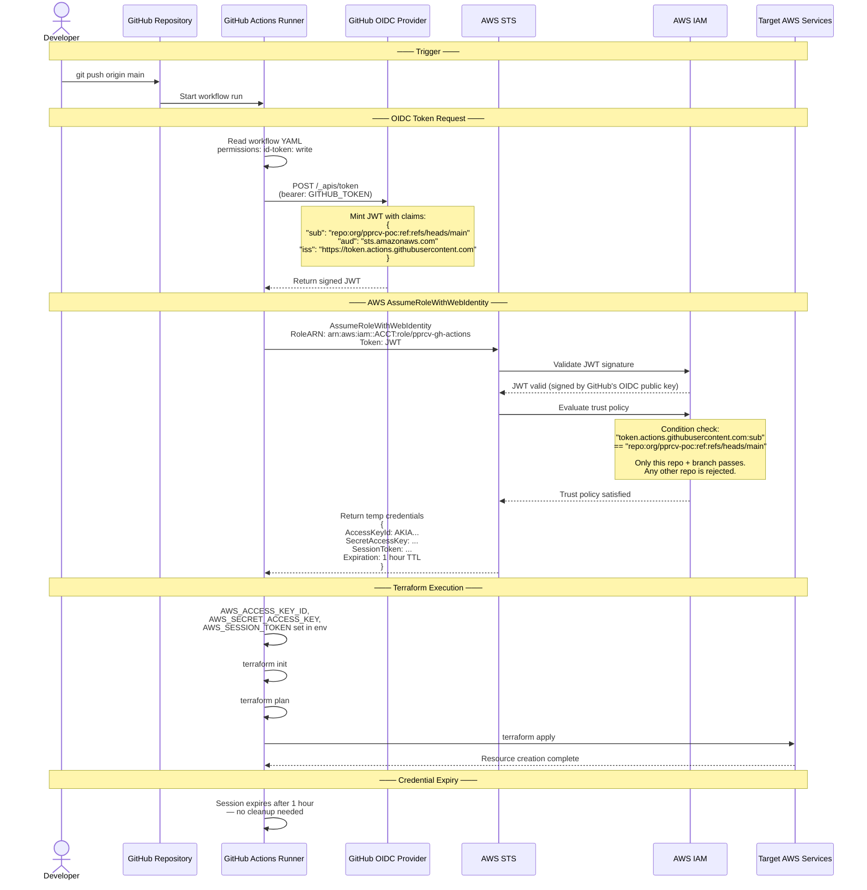
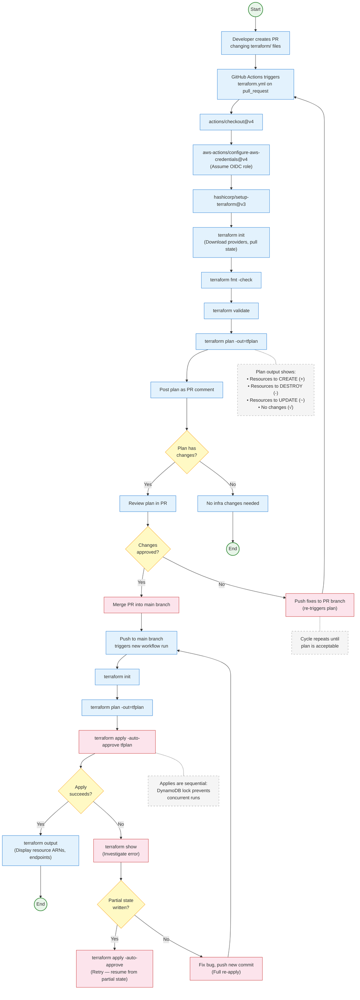
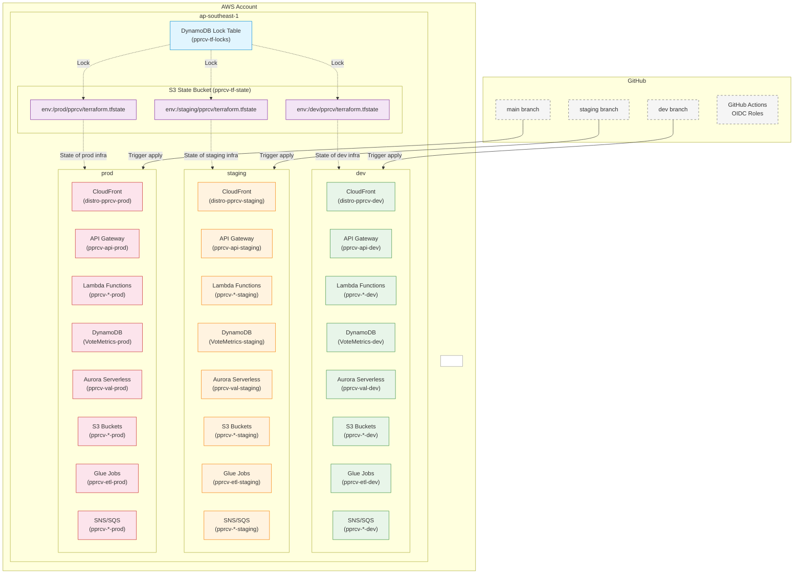
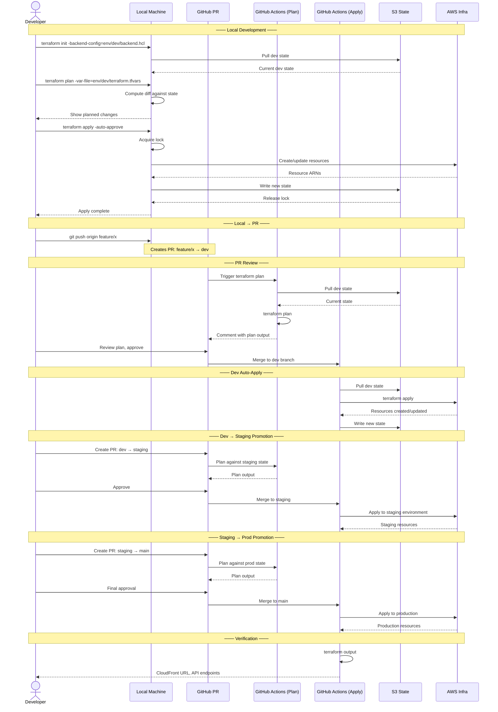
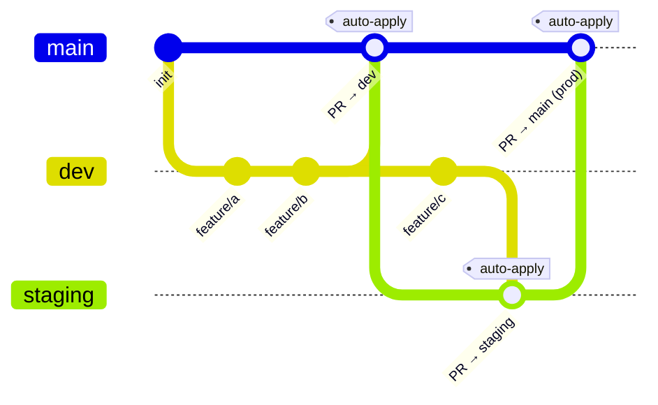

# PPCRV — Terraform Infrastructure Strategy

Proposed Infrastructure-as-Code approach for the PPCRV serverless election monitoring platform on AWS, using **Terraform** with **GitHub Actions** CI/CD and **OIDC** authentication.

> [!NOTE]
> This is a **proposal** — no Terraform code has been written yet. The IaC choice is still open. See [CLOUDFORMATION.md](./CLOUDFORMATION.md) for the SAM/CloudFormation alternative and a side-by-side comparison.

---

## Table of Contents

- [Why Terraform](#why-terraform)
- [Module Architecture](#module-architecture)
- [State Management](#state-management)
- [Authentication & Authorization](#authentication--authorization)
- [CI/CD Pipeline](#cicd-pipeline)
- [Environment Strategy](#environment-strategy)
- [Development Workflow](#development-workflow)
- [Cost Strategy](#cost-strategy)
- [Getting Started](#getting-started)

---

## Why Terraform

| Criteria | Terraform | AWS CDK | AWS SAM |
|----------|-----------|---------|---------|
| Language | HCL (declarative) | TypeScript/Python (imperative) | YAML |
| State tracking | Native (S3 + DynamoDB) | CloudFormation (behind CDK) | CloudFormation |
| Plan output | `terraform plan` shows diff | `cdk diff` (less granular) | `sam deploy --dry-run` |
| Multi-region | Native | Via StackSets | Manual |
| CI/CD fit | Excellent (plan as PR comment) | Good | Good |
| Learning curve | Moderate | Moderate-high | Low |
| Community modules | 2,000+ | Limited | N/A |

**Decision:** Terraform for this project because:

- **Declarative planning** — `terraform plan` is human-readable and PR-reviewable; crucial for election infrastructure where mistakes are high-stakes
- **State isolation** — each environment has its own state file; no accidental prod changes from a dev run
- **Provider maturity** — the AWS provider is HashiCorp-maintained, covers every service in the architecture, and is battle-tested
- **CI/CD native** — plan-on-PR / apply-on-merge pattern maps naturally to GitHub Actions
- **No CloudFormation dependency** — avoids AWS's deployment service lock-in

---

## Module Architecture

### Component Diagram

The Terraform codebase is organized into modules that mirror the architecture's service boundaries. Each module manages a single concern and exposes clear output values for inter-module wiring.

```mermaid
graph TB
    classDef module fill:#e8f5e9,stroke:#388e3c,stroke-width:2px
    classDef awsService fill:#e3f2fd,stroke:#1976d2,stroke-width:2px
    classDef person fill:#fff3e0,stroke:#f57c00,stroke-width:2px
    classDef boundary fill:#f5f5f5,stroke:#9e9e9e,stroke-width:1px,stroke-dasharray: 5 5

    Dev["Developer"]:::person

    subgraph TF["Terraform Codebase"]
        subgraph Modules[" "]
            State["State Backend (backend.tf)<br/><b>S3 + DynamoDB</b><br/>Remote state storage with locking & versioning"]:::module
            Net["Network Module (modules/network/)<br/><b>CloudFront + WAF + Route53</b><br/>CDN, edge caching, DDoS, DNS"]:::module
            Comp["Compute Module (modules/compute/)<br/><b>Lambda + API Gateway</b><br/>Serverless API layer"]:::module
            Stor["Storage Module (modules/storage/)<br/><b>S3 + DynamoDB + Aurora</b><br/>Data persistence"]:::module
            ETL["ETL Module (modules/etl/)<br/><b>Glue + Athena</b><br/>CSV processing pipeline"]:::module
            Msg["Messaging Module (modules/messaging/)<br/><b>SNS + SQS</b><br/>Alerting, dead-letter queues"]:::module
            Obs["Observability Module (modules/observability/)<br/><b>CloudWatch + X-Ray</b><br/>Logs, metrics, dashboards"]:::module
            IAMMod["IAM Module (modules/iam/)<br/><b>IAM Roles + Policies</b><br/>Service-to-service permissions"]:::module
            Boot["Bootstrap (bootstrap/)<br/><b>One-time setup</b><br/>State backend + OIDC provider"]:::module
        end
    end

    subgraph AWS["AWS Account (ap-southeast-1)"]
        CF["CloudFront<br/><b>CDN</b><br/>Edge caching, WAF, DDoS"]:::awsService
        APIGW["API Gateway<br/><b>REST API</b><br/>Rate limiting, routing"]:::awsService
        LVal["Lambda: Validation<br/><b>Node.js</b><br/>Checksum + QR validation"]:::awsService
        LMet["Lambda: Metrics<br/><b>Node.js</b><br/>Vote metrics queries"]:::awsService
        LTrig["Lambda: Trigger<br/><b>Python</b><br/>S3 event → Glue trigger"]:::awsService
        Glue["AWS Glue<br/><b>PySpark</b><br/>CSV ETL pipeline"]:::awsService
        DDBMet["DynamoDB: Metrics<br/><b>NoSQL</b><br/>Aggregated vote results"]:::awsService
        DDBCtrl["DynamoDB: Control<br/><b>NoSQL</b><br/>Precinct status tracking"]:::awsService
        S3Up["S3: Upload Bucket<br/><b>Object Storage</b><br/>Volunteer CSV uploads"]:::awsService
        S3Par["S3: Parquet<br/><b>Object Storage</b><br/>Raw data audit trail"]:::awsService
        S3UI["S3: Static UI<br/><b>Object Storage</b><br/>Frontend hosting"]:::awsService
        Aurora["Aurora Serverless v2<br/><b>PostgreSQL</b><br/>Validation records"]:::awsService
        SNS["SNS<br/><b>Pub/Sub</b><br/>Failure/success alerts"]:::awsService
        SQS["SQS DLQ<br/><b>Queue</b><br/>Dead-letter queue"]:::awsService
        CW["CloudWatch<br/><b>Monitoring</b><br/>Logs, metrics, alarms"]:::awsService
        Athena["Athena<br/><b>Serverless SQL</b><br/>Ad-hoc queries on Parquet"]:::awsService
    end

    Dev -->|terraform init| State
    State -->|Read state| IAMMod

    Net -->|Manages| CF
    Net -->|DNS + WAF| APIGW
    Comp -->|Manages| APIGW
    Comp -->|Deploys| LVal
    Comp -->|Deploys| LMet
    Comp -->|Deploys| LTrig
    ETL -->|Manages| Glue
    ETL -->|Manages| Athena
    Stor -->|Manages| DDBMet
    Stor -->|Manages| DDBCtrl
    Stor -->|Manages| S3Up
    Stor -->|Manages| S3Par
    Stor -->|Manages| S3UI
    Stor -->|Manages| Aurora
    Msg -->|Manages| SNS
    Msg -->|Manages| SQS
    Obs -->|Manages| CW
    IAMMod -->|Attaches role| LVal
    IAMMod -->|Attaches role| LMet
    IAMMod -->|Attaches role| LTrig
    IAMMod -->|Attaches role| Glue
```



### Directory Structure

```
terraform/
├── backend.tf              # Remote state config (S3 + DynamoDB)
├── providers.tf            # AWS provider configuration
├── main.tf                 # Root module — orchestrates sub-modules
├── variables.tf            # Global input variables
├── outputs.tf              # Global output values
├── locals.tf               # Local computed values (tags, naming)
│
├── environments/           # Environment-specific configurations
│   ├── dev/
│   │   ├── terraform.tfvars
│   │   └── region.tfvars
│   ├── staging/
│   │   ├── terraform.tfvars
│   │   └── region.tfvars
│   └── prod/
│       ├── terraform.tfvars
│       └── region.tfvars
│
├── modules/
│   ├── network/            # CloudFront, WAF, Route53
│   │   ├── main.tf
│   │   ├── variables.tf
│   │   └── outputs.tf
│   ├── compute/            # Lambda functions, API Gateway
│   │   ├── main.tf
│   │   ├── variables.tf
│   │   └── outputs.tf
│   ├── storage/            # S3, DynamoDB, Aurora Serverless
│   │   ├── main.tf
│   │   ├── variables.tf
│   │   └── outputs.tf
│   ├── etl/                # Glue jobs, Athena
│   │   ├── main.tf
│   │   ├── variables.tf
│   │   └── outputs.tf
│   ├── messaging/          # SNS, SQS
│   │   ├── main.tf
│   │   ├── variables.tf
│   │   └── outputs.tf
│   ├── observability/      # CloudWatch, X-Ray
│   │   ├── main.tf
│   │   ├── variables.tf
│   │   └── outputs.tf
│   └── iam/                # IAM roles, policies, OIDC
│       ├── main.tf
│       ├── variables.tf
│       └── outputs.tf
│
├── bootstrap/              # One-time setup (run from local machine)
│   ├── backend.tf
│   ├── main.tf             # S3 bucket + DynamoDB table for state
│   └── oidc.tf             # GitHub OIDC provider + IAM role
│
└── templates/              # Lambda source code (deployed via archive)
    ├── validation/
    │   └── index.js
    ├── metrics/
    │   └── index.js
    └── trigger/
        └── index.py
```

---

## State Management

Terraform's state is stored remotely in S3 with DynamoDB locking — enabling safe concurrent access from CI/CD runners and local machines.

```
┌──────────────────────────────────────────────────────────┐
│                    Terraform State                        │
├──────────────────────────────────────────────────────────┤
│                                                          │
│  ┌─────────────────────┐    ┌─────────────────────────┐  │
│  │     S3 Bucket        │    │    DynamoDB Table        │  │
│  │  (pprcv-tf-state)    │    │  (pprcv-tf-locks)        │  │
│  │                      │    │                          │  │
│  │  dev/terraform.tfstate│    │  LockID (partition key)  │  │
│  │  staging/terraform...│    │  Lock records for         │  │
│  │  prod/terraform.tf...│    │  concurrent run prevention│  │
│  │                      │    │                          │  │
│  │  Versioning: ON      │    │  Pay-per-request: ON    │  │
│  │  Encryption: AES-256 │    │  Cost: ~$0.01/month     │  │
│  └─────────────────────┘    └─────────────────────────┘  │
│                                                          │
│  Benefits:                                                │
│  • Versioned state — roll back if corruption occurs       │
│  • Locked applies — no concurrent overwrites              │
│  • Shared access — CI/CD + team members use same state    │
│  • Encryption at rest — state may contain sensitive ARNs  │
│                                                          │
└──────────────────────────────────────────────────────────┘
```

### State Isolation by Environment

Each environment has its own state file path, preventing cross-environment contamination:

| Environment | State Key | Locking |
|-------------|-----------|---------|
| `dev` | `env:/dev/pprcv/terraform.tfstate` | Shared DynamoDB |
| `staging` | `env:/staging/pprcv/terraform.tfstate` | Shared DynamoDB |
| `prod` | `env:/prod/pprcv/terraform.tfstate` | Shared DynamoDB |

A workspace-per-environment approach (via `terraform workspace`) is avoided because:

- Workspace state can be accidentally destroyed with `terraform workspace delete`
- State file paths are less explicit for auditing
- Separate state keys in S3 are more transparent and recoverable

---

## Authentication & Authorization

### OIDC Flow — GitHub Actions to AWS

No static AWS access keys are ever stored. GitHub Actions authenticates to AWS using **OpenID Connect (OIDC)**, a federated identity protocol that exchanges a GitHub-signed JWT for temporary AWS credentials.



### IAM Trust Policy — The Security Gate

The trust policy on the IAM role is the **sole security boundary** for the pipeline. It specifies **exactly** which GitHub repository and branch can assume the role:

```json
{
  "Effect": "Allow",
  "Principal": {
    "Federated": "arn:aws:iam::ACCOUNT:oidc-provider/token.actions.githubusercontent.com"
  },
  "Action": "sts:AssumeRoleWithWebIdentity",
  "Condition": {
    "StringEquals": {
      "token.actions.githubusercontent.com:aud": "sts.amazonaws.com"
    },
    "StringLike": {
      "token.actions.githubusercontent.com:sub": [
        "repo:ppcrv/pprcv-poc:ref:refs/heads/main",
        "repo:ppcrv/pprcv-poc:ref:refs/heads/staging",
        "repo:ppcrv/pprcv-poc:ref:refs/heads/dev"
      ]
    }
  }
}
```

This means: **Even if a malicious workflow runs in a different repository, it can never assume this role** — the JWT's `sub` claim is signed by GitHub and cannot be forged.

---

## CI/CD Pipeline

### Activity Diagram — Pull Request & Merge Workflow

The pipeline enforces a **plan-on-PR, apply-on-merge** gate. Infrastructure changes are reviewed as `terraform plan` output before any resource is created or modified.



### Workflow Definition

```yaml
# .github/workflows/terraform.yml
name: 'Terraform'

on:
  push:
    branches: [main, staging, dev]
    paths: ['terraform/**']
  pull_request:
    paths: ['terraform/**']

permissions:
  id-token: write   # OIDC token issuance
  contents: read    # Repository checkout
  pull-requests: write  # Post plan as PR comment

jobs:
  terraform:
    name: Terraform ${{ github.event_name == 'pull_request' && 'Plan' || 'Apply' }}
    runs-on: ubuntu-latest
    environment: ${{ github.ref_name }}

    defaults:
      run:
        working-directory: ./terraform
        shell: bash

    steps:
      - name: Checkout
        uses: actions/checkout@v4

      - name: Configure AWS Credentials (OIDC)
        uses: aws-actions/configure-aws-credentials@v4
        with:
          role-to-assume: arn:aws:iam::${{ secrets.AWS_ACCOUNT_ID }}:role/pprcv-gh-actions-${{ github.ref_name }}
          aws-region: ap-southeast-1

      - name: Setup Terraform
        uses: hashicorp/setup-terraform@v3
        with:
          terraform_version: 1.9.5

      - name: Terraform Init
        run: |
          terraform init -backend-config="environments/${{ github.ref_name }}/backend.hcl"

      - name: Terraform Format
        run: terraform fmt -check -recursive

      - name: Terraform Validate
        run: terraform validate

      - name: Terraform Plan
        id: plan
        run: |
          terraform plan \
            -var-file="environments/${{ github.ref_name }}/terraform.tfvars" \
            -out=tfplan \
            -no-color 2>&1 | tee plan_output.txt
          echo "plan_output=$(cat plan_output.txt)" >> $GITHUB_OUTPUT

      # On PRs: post plan as a comment
      - name: Post Plan to PR
        if: github.event_name == 'pull_request'
        uses: actions/github-script@v7
        with:
          script: |
            const output = `## Terraform Plan (\`${{ github.ref_name }}\`)
            \`\`\`
            ${{ steps.plan.outputs.plan_output }}
            \`\`\`
            `;
            github.rest.issues.createComment({
              issue_number: context.issue.number,
              owner: context.repo.owner,
              repo: context.repo.repo,
              body: output
            });

      # On push to main/staging/dev: apply
      - name: Terraform Apply
        if: github.event_name == 'push' && github.ref_type == 'branch'
        run: terraform apply -auto-approve tfplan
```

---

## Environment Strategy

### Deployment Diagram — Multi-Environment Topology

Each environment is fully isolated with its own state file, AWS resources, and variable configuration. The topology mirrors production for all environments to catch issues early.



### Environment Matrix

| Aspect | `dev` | `staging` | `prod` |
|--------|-------|-----------|--------|
| **Branch** | `dev` | `staging` | `main` |
| **Trigger** | Push to dev | Push to staging | Push to main |
| **Aurora min ACU** | 0.5 (scales to 0) | 0.5 | 2.0 |
| **DynamoDB capacity** | On-demand | On-demand | On-demand |
| **CloudFront price class** | US/Europe only | All edge locations | All edge locations |
| **WAF enabled** | No | Yes | Yes |
| **Route53 DNS** | Subdomain (dev.) | Subdomain (staging.) | Main domain |
| **Cost target** | ~$5-10/mo | ~$20-30/mo | ~$65 idle / $402 peak |

---

## Development Workflow

### Sequence Diagram — Full Lifecycle



### Branch Strategy



1. **Feature branches** branch from `dev`
2. **PR to `dev`** — CI runs `terraform plan`, posts as PR comment
3. **Merge to `dev`** — CI runs `terraform apply` to dev environment
4. **PR from `dev` → `staging`** — Plan against staging, merge → apply
5. **PR from `staging` → `main`** — Plan against prod, merge → apply (requires approval gate)

---

## Cost Strategy

Terraform itself costs nothing (open source). The supporting infrastructure costs are negligible:

| Component | Service | Cost/Month | Notes |
|-----------|---------|-----------|-------|
| State storage | S3 Standard | ~$0.10 | Minimal data, versioning enabled |
| State locking | DynamoDB on-demand | ~$0.01 | Pay-per-request |
| CI/CD minutes | GitHub Actions (public repo) | **$0.00** | 2,000 min/mo free tier |
| CI/CD storage | GitHub Actions (public repo) | **$0.00** | 500 MB free tier |
| OIDC auth | AWS STS | **$0.00** | No charge for web identity tokens |
| **Total recurring** | | **~$0.11/mo** | |

For the **AWS resources** themselves, see [COSTS.md](./COSTS.md) for the full breakdown.

---

## Getting Started

### Prerequisites

- AWS account with AdministratorAccess (for bootstrap only)
- Terraform CLI ≥ 1.9.x installed locally
- GitHub repository with Actions enabled

### Bootstrap (One-Time)

These steps are performed **once** from a local machine with AWS credentials configured:

```bash
# 1. Create the S3 state bucket + DynamoDB lock table
cd terraform/bootstrap
terraform init
terraform apply -auto-approve

# 2. Create the OIDC provider + IAM role for GitHub Actions
terraform apply -auto-approve

# 3. Note the outputs
terraform output github_actions_role_arn
# → arn:aws:iam::123456789012:role/pprcv-gh-actions-dev
```

### Add as GitHub Secret

Store the AWS Account ID as a GitHub Actions secret:

| Secret Name | Value |
|-------------|-------|
| `AWS_ACCOUNT_ID` | `123456789012` |

No access keys or secret keys are stored — authentication uses OIDC.

### First Full Deploy

```bash
# From the terraform/ root
terraform init -backend-config="environments/dev/backend.hcl"
terraform plan -var-file="environments/dev/terraform.tfvars"
terraform apply -auto-approve
```

After the first deploy, all subsequent changes go through the **PR → plan → merge → apply** pipeline.

---

## Architecture Diagram (Full System)

For the complete system architecture including all AWS services and request flows, see [readme-arch-v1.md](readme-arch-v1.md).

This document covers the **infrastructure provisioning layer only** — the Terraform modules that define, deploy, and manage every resource in the PPCRV architecture.

---

## References

| Resource | Link |
|----------|------|
| Terraform AWS Provider | https://registry.terraform.io/providers/hashicorp/aws/latest |
| hashicorp/setup-terraform | https://github.com/hashicorp/setup-terraform |
| aws-actions/configure-aws-credentials | https://github.com/aws-actions/configure-aws-credentials |
| GitHub OIDC with AWS | https://docs.github.com/en/actions/security-hardening-your-deployments/configuring-openid-connect-in-amazon-web-services |
| Terraform S3 Backend | https://developer.hashicorp.com/terraform/language/settings/backends/s3 |
| Full cost analysis | [COSTS.md](./COSTS.md) |
| Architecture overview | [readme-arch-v1.md](readme-arch-v1.md) |
| Change history | [CHANGES.md](./CHANGES.md) |
