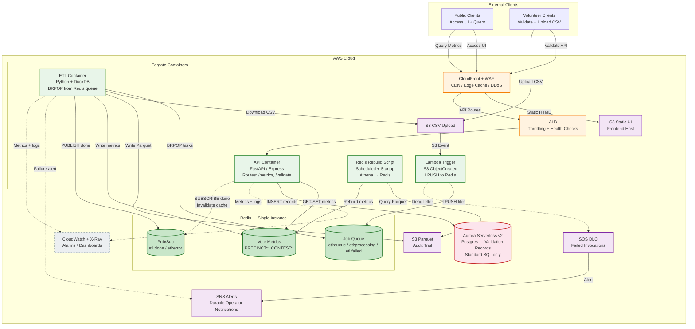
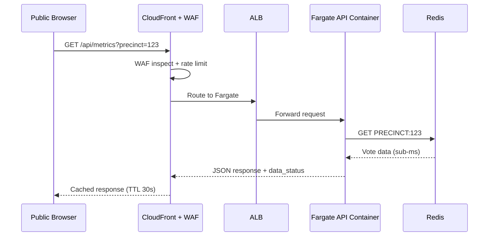
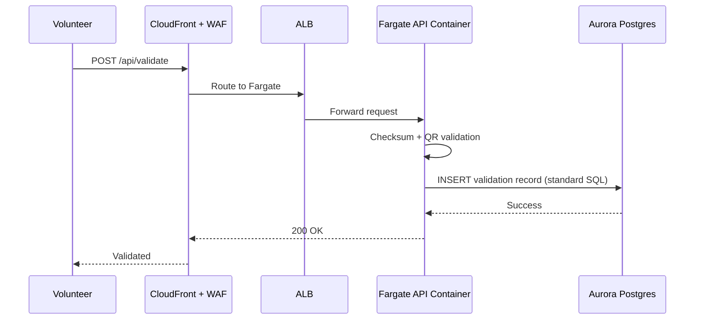
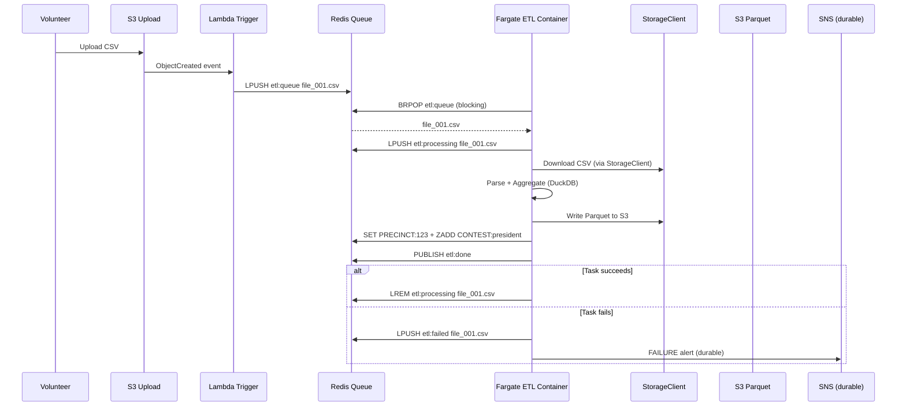
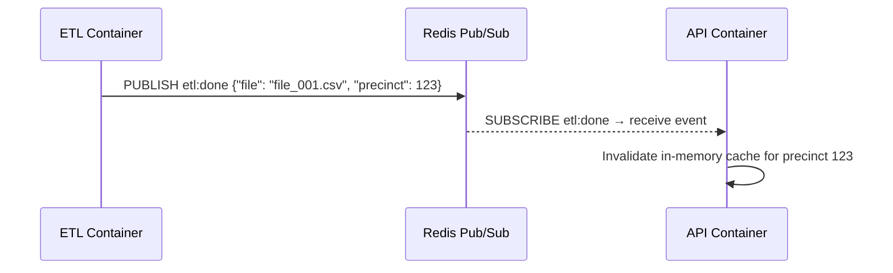
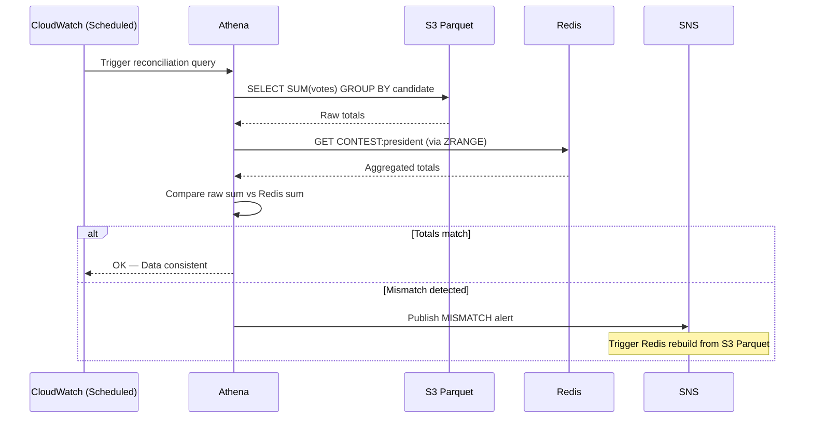

# PPCRV Re-Architecture v3 — Cloud-Agnostic (Delta)

This document describes the **v3 architecture** — a simpler, more portable design that reduces the service count from v2 while remaining cloud-agnostic. The goal: fewer services to reimplement when switching clouds, with faster performance and lower cost.

> [!NOTE]
> This is a **delta document** — it only describes what changes from v2 (see [readme-re-arch-v2.md](readme-re-arch-v2.md)). Reader cross-references [readme-arch-v1.md](readme-arch-v1.md) and [cost-arch-v1.md](cost-arch-v1.md) for unchanged services
>
> Cost impact for this architecture is documented in [cost-re-arch-v3.md](cost-re-arch-v3.md).

---

## Table of Contents

- [Why v3?](#why-v3)
- [Architecture Delta](#architecture-delta)
- [Architecture Diagram](#architecture-diagram)
- [Service Migration Map](#service-migration-map)
- [Redis Data Model](#redis-data-model)
- [ETL Container — Redis Job Queue](#etl-container--redis-job-queue)
- [Request Flows](#request-flows)
- [Abstraction Patterns for Portability](#abstraction-patterns-for-portability)
- [Portability Reference](#portability-reference)
- [Redis Rebuild (Auto-Shutdown)](#redis-rebuild-auto-shutdown)
- [Project Structure](#project-structure)
- [Open Items](#open-items)

---

## Why v3?

v2 reduced the AWS lock-in by replacing Lambda with Fargate. But it still had **8+ cloud-specific services** to reimplement per cloud: DynamoDB, Aurora, API Gateway, Step Functions, SNS, SQS, CloudFront, and Lambda triggers.

v3 cuts that to **5 services** by consolidating three of them into Redis:

| v2 Service | v3 Replacement | Rationale |
|---|---|---|
| DynamoDB (Metrics + Status) | **Redis** | Same KV protocol everywhere, sub-ms reads, doubles as job queue + pub/sub |
| Step Functions (ETL orchestration) | **Redis job queue** (LPUSH/BRPOP) | No cloud orchestrator needed. Redis is already there. |
| SNS (real-time notifications) | **Redis pub/sub** | In-cluster events don't need durable messaging |
| Aurora with Aurora-specific features | **Aurora Serverless v2 via standard Postgres SQL only** | `pg_dump`/`pg_restore` is the only migration path needed |

**Result:** 5 services to reimplement per cloud (CDN, ALB, Postgres, Redis, Messaging) instead of 8+. Half the abstraction interfaces (2 instead of 4). Lower cost at both peak and idle.

---

## Architecture Delta

### What's Removed from v2

| Removed | Why |
|---------|-----|
| DynamoDB (Metrics + Status tables) | Redis handles faster KV reads + job queue + pub/sub |
| Step Functions | Redis LPUSH/BRPOP replaces orchestration |
| SNS (real-time path) | Redis pub/sub for in-cluster events |
| Abstraction interfaces ×4 | Only 2 needed (Storage, Messaging) — Redis and Postgres use standard protocols |

### What's Added

| Added | Purpose |
|-------|---------|
| **Redis** | Vote metrics cache, ETL job queue, real-time pub/sub — three use cases, one service |
| **RDS Postgres (Aurora with standard SQL)** | Validation records. Standard Postgres — no Aurora-specific APIs |
| **Redis Rebuild Script** | Rebuilds Redis from S3 Parquet after idle-period shutdown |
| **ETL Watchdog** | Recovers stale jobs from the `etl:processing` queue on container restart |

### What's Unchanged from v2

| Kept | Portability Strategy |
|------|----------------------|
| Fargate API container | Same Docker image on all clouds |
| Fargate ETL container | Same Docker image on all clouds |
| S3 (static UI + data storage) | StorageClient interface — swap impl per cloud |
| CloudFront / CDN + WAF | Edge layer — swap per cloud (config only, no container code) |
| Route 53 / Cloud DNS / Azure DNS | DNS — zone export/import |
| ALB / Cloud LB / App Gateway | API routing — Terraform resource swap |
| CloudWatch / Cloud Logging / Azure Monitor | Observability — per-cloud instrumentation |
| SQS / Pub/Sub DLQ / Service Bus | Durable dead letter queue — MessageQueue interface |
| SNS / Pub/Sub / Service Bus | Operator alerts — same MessageQueue interface |
| Lambda Trigger / Cloud Function / Azure Function | S3 upload watcher — ~10 lines per cloud |
| Athena / BigQuery / Synapse | Ad-hoc analytics + Redis rebuild queries |

---

## Architecture Diagram



---

## Service Migration Map

| Layer | AWS (now) | GCP (later) | Azure (later) | Migration Effort |
|-------|-----------|-------------|---------------|-----------------|
| Compute (API) | **Fargate** | Cloud Run | Container Apps | **None** — same Docker image |
| Compute (ETL) | **Fargate** | Cloud Run Jobs | Container Apps Jobs | **None** — same Docker image |
| API Routing | ALB | Cloud Load Balancing | Application Gateway | **Low** — Terraform resource swap |
| Fast KV (metrics, queue, pub/sub) | **ElastiCache Redis** | Memorystore Redis | Azure Cache for Redis | **None** — same `redis-py` client, connection string change |
| Relational DB | **Aurora Serverless v2** (standard SQL only) | Cloud SQL Postgres | Azure Database Postgres | **Low** — `pg_dump` → `pg_restore`, connection string change |
| Object Storage | S3 | GCS | Blob Storage | **Low** — StorageClient interface swap |
| Durable Messaging (DLQ + alerts) | SNS + SQS | Pub/Sub | Service Bus | **Low** — MessageQueue interface swap |
| Edge / CDN + WAF | CloudFront + WAF | Cloud CDN + Armor | Azure CDN + WAF | **Medium** — config rewrite per cloud |
| DNS | Route 53 | Cloud DNS | Azure DNS | **Low** — zone export/import |
| S3 Upload Trigger | Lambda | Cloud Function | Azure Function | **Low** — ~10 lines per cloud |
| Observability | CloudWatch + X-Ray | Cloud Logging + Trace | Azure Monitor | **Medium** — instrumentation swap per cloud |
| IaC | Terraform | Terraform (add GCP provider) | Terraform (add Azure provider) | **Low** — HCL modular, independent per cloud |

---

## Redis Data Model

Redis replaces **three v2 services** (DynamoDB Metrics, DynamoDB Status, Step Functions) and **absorbs real-time pub/sub** (previously SNS).

### Vote Metrics (KV Store)

```
# Per-precinct metrics — replaces DynamoDB VoteMetrics table
PRECINCT:123          → JSON {"reported": 12450, "total_voters": 15000, ...}

# Per-contest leaderboard — sorted set for ranking
CONTEST:president     → ZADD {"CandidateA": 5200000, "CandidateB": 4800000}

# Processing status — replaces DynamoDB PrecinctStatus table
STATUS:precinct#123   → "processed"
STATUS:file_001.csv   → "queued" | "processing" | "processed" | "failed"

# Election metadata — overall progress
ELECTION:2028         → JSON {"total_precincts": 95000, "reported": 87200}
```

### ETL Job Queue

```
# Replaces Step Functions orchestration
etl:queue             → List ["file_001.csv", "file_002.csv", ...]     # LPUSH by trigger
etl:processing        → List ["file_001.csv"]                            # LPUSH by worker
etl:failed            → List ["file_003.csv"]                            # After 3 retries
```

**Worker pseudocode:**
```python
while True:
    _, file = redis.brpop("etl:queue", timeout=30)
    redis.lpush("etl:processing", file)
    try:
        process(file)                              # DuckDB parse + aggregate
        redis.set(f"PRECINCT:{precinct}", metrics)
        redis.lrem("etl:processing", 0, file)
        redis.publish("etl:done", json.dumps({"file": file}))
    except Exception as e:
        redis.lpush("etl:failed", file)
        redis.publish("etl:error", json.dumps({"file": file, "error": str(e)}))
        message_queue.publish_alert("etl-failures", ...)  # Durable alert via SNS
```

### Pub/Sub (Real-time Events)

```
# Replaces SNS for in-cluster notifications
etl:done              → API container subscribes → invalidates cache
etl:error             → Monitoring subscribes → logs error

# Key insight: Redis pub/sub is fire-and-forget.
# If no subscriber is listening, the message is lost.
# That's fine for cache invalidation and in-cluster events.
# Durable alerts (operator must receive them) still go through SNS.
```

### Why One Redis Instance Works

| Workload | Pattern | Throughput | Load |
|----------|---------|------------|------|
| Vote Metrics reads | `GET` single key | 100K+ ops/sec | Dominant |
| Vote Metrics writes | `SET` + `PUBLISH` | 50K+ ops/sec | Light |
| ETL Job Queue | `LPUSH` / `BRPOP` | 500 jobs peak day | Negligible |
| Pub/Sub events | `PUBLISH` / `SUBSCRIBE` | 1 per file processed | Negligible |

A single `cache.t3.small` (1.37 GB) handles the entire workload. The dominating traffic is public metric reads (50M requests over 2 days = ~290 req/s average, ~3,000 req/s peak). A single Redis node handles 100K+ GETs/sec — no clustering needed.

---

## ETL Container — Redis Job Queue

### How It Replaces Step Functions

v2 used Step Functions to fan out parallel Fargate tasks. v3 replaces this with Redis `LPUSH`/`BRPOP` — a classic worker queue pattern.

```
           Lambda Trigger
                │
        LPUSH etl:queue file_001, file_002, ... file_500
                │
    ┌───────────┼───────────┐
    ▼           ▼           ▼
 ETL Task 1   ETL Task 2   ETL Task 3  ... (up to N Fargate tasks)
    │           │           │
 BRPOP pulls  BRPOP pulls  BRPOP pulls
 file_001     file_002     file_003
    │           │           │
    ▼           ▼           ▼
  DuckDB      DuckDB      DuckDB
    │           │           │
    ▼           ▼           ▼
 Redis SET   Redis SET   Redis SET
```

- `BRPOP` is atomic — no two workers process the same file
- Scale up: increase Fargate desired task count. New workers automatically join the pool
- Scale down: set desired count to 1. Remaining workers pick up the slack
- No orchestration service to provision, configure, or migrate

### Failure Handling

| Scenario | Mechanism |
|----------|-----------|
| Worker crashes mid-process | File stays in `etl:processing`. **Watchdog** (separate thread in container) scans for stale entries (>10 min) → re-queues to `etl:queue` |
| Permanent failure (3 retries) | Counter in Redis → after 3 attempts, moved to `etl:failed` → durable alert via SNS/PubSub/ServiceBus |
| Redis restarts | All queue state lost. **Lambda trigger** re-scans S3 for unprocessed files → re-queues. **Reconciliation job** detects missing metrics → triggers Redis rebuild |
| File already processed (idempotency) | `STATUS:{file_key}` check in Redis before processing. Skip if already "processed" |

### Scale: 32M Rows / 500 Files

| Scenario | Workers | Time |
|----------|---------|------|
| Single worker, serial | 1 Fargate task | ~30-60 min (DuckDB on 1 vCPU) |
| 10 workers, parallel | 10 Fargate tasks | ~3-6 min |
| 20 workers, parallel | 20 Fargate tasks | ~2-3 min |

Set desired count = 10 for election day, scale to 0 for idle.

---

## Request Flows

### Flow 1 — Query Vote Metrics (Public)



**Delta from v2:** DynamoDB → Redis. Single `GET` instead of DynamoDB GetItem. Sub-millisecond vs 5-10ms.

### Flow 2 — Validate Vote (Volunteer)



**Delta from v2:** Unchanged in logic. Aurora accessed via standard `psycopg2` SQL — no Aurora Data API.

### Flow 3 — Upload CSV → ETL (Volunteer)



**Delta from v2:** Step Functions orchestration → Redis LPUSH/BRPOP. SNS real-time → Redis PUBLISH. SNS failure alerts remain for durability.

### Flow 4 — Cache Invalidation (Automated)



**New in v3.** When the ETL finishes processing a precinct, the API container clears its cache so next public query returns fresh data. No polling, no SNS, no Lambda — just Redis pub/sub within the cluster.

### Flow 5 — Reconciliation (Automated)



**Delta from v2:** DynamoDB → Redis. Same logic — compare S3 Parquet (source of truth) against Redis (fast path).

---

## Abstraction Patterns for Portability

v3 reduces the interface count from 4 (v2) to 2.

### Two Interfaces

| Interface | Methods | AWS Impl | GCP Impl | Azure Impl |
|-----------|---------|----------|----------|------------|
| `StorageClient` | `upload()`, `download()`, `list()`, `delete()` | S3 (boto3) | GCS (google-cloud-storage) | Blob (azure-storage-blob) |
| `MessageQueue` | `publish_alert()`, `push_dead_letter()` | SNS + SQS (boto3) | Pub/Sub (google-cloud-pubsub) | Service Bus (azure-servicebus) |

### What Does NOT Need an Interface

| Service | Why No Interface |
|---------|-----------------|
| **Redis** | `redis-py` works on all clouds. Same `GET/SET/LPUSH/BRPOP/PUBLISH`. Only connection string changes. |
| **Postgres** | `psycopg2` with standard SQL. Same queries everywhere. Only connection string changes. |
| **CDN / ALB / DNS / WAF** | Never called from container code. Exists only in Terraform. |
| **Lambda Trigger** | 10 lines per cloud. Interface overhead > implementation. `extract_file_key()` conditional is sufficient. |

### Configuration Selection

```python
# config.py — one env var flips the whole backend
import os

CLOUD = os.environ.get("CLOUD_PROVIDER", "aws")

# StorageClient — needs per-cloud implementation
if CLOUD == "aws":
    from .aws import S3StorageClient as Storage
elif CLOUD == "gcp":
    from .gcp import GCSStorageClient as Storage
elif CLOUD == "azure":
    from .azure import BlobStorageClient as Storage

# MessageQueue — needs per-cloud implementation
if CLOUD == "aws":
    from .aws import SNSMessageQueue as Queue
elif CLOUD == "gcp":
    from .gcp import PubSubMessageQueue as Queue
elif CLOUD == "azure":
    from .azure import ServiceBusMessageQueue as Queue

# Redis and Postgres — same library everywhere.
# Only connection strings change, not code.
REDIS_HOST = os.environ.get("REDIS_HOST", "localhost")
PG_CONN_STRING = os.environ.get("PG_CONN_STRING", "postgresql://...")
```

### Rules for the Team

1. **No cloud SDKs in `api/` or `etl/`.** All SDK calls live in `src/aws/`, `src/gcp/`, `src/azure/`.
2. **Redis uses `redis-py` only.** No ElastiCache APIs, no Memorystore APIs. Standard Redis protocol everywhere.
3. **Postgres uses `psycopg2` with standard SQL.** No Aurora Data API, no cloud-specific extensions.
4. **Only two interfaces to implement per cloud** — StorageClient and MessageQueue.

---

## Portability Reference

### Compute — Fargate → GCP Cloud Run / Azure Container Apps

The same Docker image runs on all three clouds:

| Cloud | Service | Deploy Command |
|-------|---------|---------------|
| **AWS** | Fargate | `ecs run-task --task-definition pprcv-api` |
| **GCP** | Cloud Run | `gcloud run deploy --image gcr.io/ppcrv/api` |
| **Azure** | Container Apps | `az containerapp create --image ppcrv.azurecr.io/api` |

### Redis — Same Protocol Everywhere

| Cloud | Service | Client Code |
|-------|---------|-------------|
| **AWS** | ElastiCache Redis | `redis.Redis(host=ELASTICACHE_ENDPOINT)` |
| **GCP** | Memorystore Redis | `redis.Redis(host=MEMORYSTORE_ENDPOINT)` |
| **Azure** | Azure Cache for Redis | `redis.Redis(host=AZURE_REDIS_ENDPOINT, ssl=True)` |

Identical `redis-py` code. Only the host changes.

### Postgres — Standard SQL Migration

| Cloud | Service | Migration |
|-------|---------|-----------|
| **AWS** | Aurora Serverless v2 | — |
| **GCP** | Cloud SQL Postgres | `pg_dump` Aurora → `pg_restore` Cloud SQL |
| **Azure** | Azure Database Postgres | `pg_dump` Aurora → `pg_restore` Azure Postgres |

The application uses standard Postgres SQL — no Aurora Data API, no cloud-specific extensions. Migrating is a `pg_dump`/`pg_restore` + connection string change.

> [!NOTE]
> Aurora Serverless v2 auto-scaling (0.5–16 ACU) is AWS-specific. On GCP/Azure, you'd run a fixed-size Postgres instance (~$27-40/mo). This raises idle cost on other clouds but is an ops decision at migration time, not a code change.

### Object Storage — StorageClient Swap

| Cloud | Service | Implementation |
|-------|---------|---------------|
| **AWS** | S3 | `S3StorageClient` (boto3) |
| **GCP** | GCS | `GCSStorageClient` (google-cloud-storage) |
| **Azure** | Blob Storage | `BlobStorageClient` (azure-storage-blob) |

### Durable Messaging — MessageQueue Swap

| Cloud | Service | Implementation |
|-------|---------|---------------|
| **AWS** | SNS + SQS | `SNSMessageQueue` (boto3) |
| **GCP** | Pub/Sub | `PubSubMessageQueue` (google-cloud-pubsub) |
| **Azure** | Service Bus | `ServiceBusMessageQueue` (azure-servicebus) |

---

## Redis Rebuild (Auto-Shutdown)

To achieve the lowest annual cost (~$790/year), Redis is shut down during idle months and rebuilt from S3 Parquet when needed.

### When Rebuild Runs

| Trigger | When |
|---------|------|
| Redis startup | After auto-shutdown period ends, Redis comes back up → rebuild runs once |
| Scheduled (safety net) | Weekly via CloudWatch/Cloud Scheduler event |
| Manual | Operator-triggered after data fixes |

### Rebuild Performance

| Data Volume | Athena Query | Redis Rebuild | Total |
|-------------|-------------|---------------|-------|
| 32M rows (full election) | ~30-60s | ~2-5 min (batch writes) | **~5 min** |
| Idle period (no new data) | ~5-10s | ~1 min | **~1 min** |

During the 5-minute rebuild, the public UI shows "Results Loading" — acceptable for an idle-period restart.

### Rebuild Pseudocode

```python
# Rebuild Redis from S3 Parquet via Athena
def rebuild():
    redis = Redis(host=REDIS_HOST)
    redis.set("REBUILD:status", "in_progress")

    rows = athena.query("""
        SELECT precinct_code, candidate_code,
               SUM(votes_amount) as total_votes
        FROM pprcv_metrics GROUP BY 1, 2
    """)

    pipe = redis.pipeline()
    for i, row in enumerate(rows):
        pipe.set(f"PRECINCT:{row.precinct}", json.dumps(row))
        pipe.zincrby(f"CONTEST:{row.contest}", row.total_votes, row.candidate)
        if i % 1000 == 0:
            pipe.execute()
            pipe = redis.pipeline()
    pipe.execute()

    redis.set("REBUILD:status", "complete")
```

### Per-Cloud Analytics Client

| Cloud | Service | Rebuild Script |
|-------|---------|---------------|
| AWS | Athena | `athena_client.py` → boto3 |
| GCP | BigQuery | `bigquery_client.py` → google-cloud-bigquery |
| Azure | Synapse | `synapse_client.py` → azure-synapse |

One file per cloud — same SQL, different client library.

---

## Project Structure

```
src/
├── config.py                     # CLOUD_PROVIDER switch
├── interfaces/
│   ├── storage_client.py         # upload / download / list / delete
│   └── message_queue.py          # publish_alert / push_dead_letter
├── aws/
│   ├── s3_storage_client.py
│   ├── sns_message_queue.py
│   └── athena_client.py
├── gcp/
│   ├── gcs_storage_client.py
│   ├── pubsub_message_queue.py
│   └── bigquery_client.py
├── azure/
│   ├── blob_storage_client.py
│   ├── servicebus_message_queue.py
│   └── synapse_client.py
├── api/
│   ├── main.py                   # FastAPI entry point
│   └── routes/
│       ├── metrics.py            # GET /api/metrics
│       └── validation.py         # POST /api/validate
├── etl/
│   ├── worker.py                 # BRPOP loop
│   ├── processor.py              # DuckDB parse + aggregate
│   └── watchdog.py               # Stale job recovery
├── rebuild/
│   └── rebuild_metrics.py        # Athena → Redis
├── trigger/
│   ├── handler.py                # Common logic
│   ├── aws_handler.py            # Lambda entry
│   ├── gcp_handler.py            # Cloud Function entry
│   └── azure_handler.py          # Azure Function entry
└── shared/
    ├── redis_keys.py             # Key naming conventions
    ├── models.py                 # Data classes
    └── logger.py                 # Structured logging
```

---

## Optimizations (Post-Design)

The following optimizations were identified during the design review:

| # | Optimization | Impact | Effort | When |
|---|-------------|--------|--------|------|
| 1 | **CloudFront edge-cache API responses** (`/api/metrics`, 30s TTL) | Cuts API load 70-90% | Low | MVP |
| 2 | **Graceful ETL shutdown** (SIGTERM handler) | Prevents 10-min stale job recovery | Low | MVP |
| 3 | **Presigned S3 upload URLs** | Removes 2GB bandwidth from API container | Low | MVP |
| 4 | **PgBouncer sidecar** (Postgres connection pooling) | Prevents 400+ connection exhaustion | Medium | MVP |
| 5 | **Redis RDB snapshots** (15-min during election week) | Restart time: 5 min → 30 sec | Low | MVP |
| 6 | **CSV schema validation** (Lambda Trigger pre-queue gate) | Prevents bad CSVs wasting ETL compute | Low | MVP |
| 7 | **Multi-AZ Redis** (primary + replica) | RTO: 5 min → 30 sec, auto-failover | ~$25/mo extra | Post-MVP |
| 8 | **Redis-backed rate limiting** (per-API-key, 100 req/min) | Fine-grained abuse control | Medium | Post-MVP |

---

## Open Items

| # | Item | Status |
|---|------|--------|
| 1 | Benchmark Redis `GET` throughput for 50M requests on `cache.t3.small` | Open |
| 2 | Benchmark DuckDB ETL performance on 2GB CSV with 4 vCPU | Open |
| 3 | Implement Redis rebuild script + test with real S3 Parquet data | Open |
| 4 | Determine Redis auto-shutdown schedule + startup trigger mechanism | Open |
| 5 | Test Redis failure recovery: restart → rebuild → API container picks up stale cache | Open |
| 6 | Choose API framework (FastAPI vs Express) | Open |
| 7 | Define Fargate container sizing (vCPU / memory) for API and ETL | Open |
| 8 | Design WAF rules per cloud (AWS WAF, GCP Armor, Azure WAF) | Open |
| 9 | Verify CloudFront Business plan month-to-month switching with AWS Support | Open |
| 10 | Benchmark Redis pub/sub latency for cache invalidation path | Open |
| 11 | Implement CloudFront edge-caching for `/api/metrics` | Open |
| 12 | Add graceful shutdown handler (SIGTERM) to ETL worker | Open |
| 13 | Implement presigned S3 upload URL endpoint | Open |
| 14 | Add PgBouncer sidecar for Postgres connection pooling | Open |
| 15 | Enable Redis RDB snapshots (15-min interval during election week) | Open |
| 16 | Add CSV schema validation to Lambda Trigger | Open |

---

## Change Log

All changes to this repository's documentation are tracked in **[docs/CHANGES.md](docs/CHANGES.md)**.
