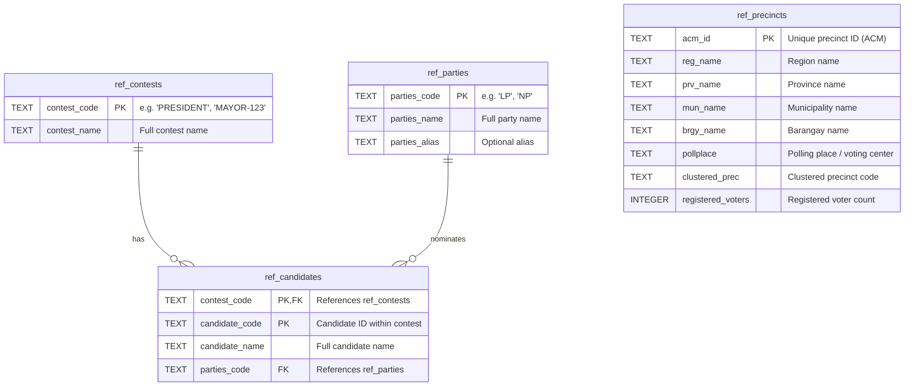
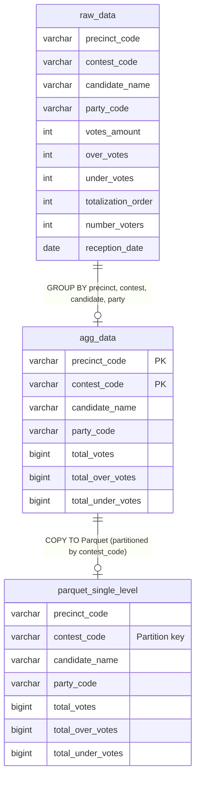
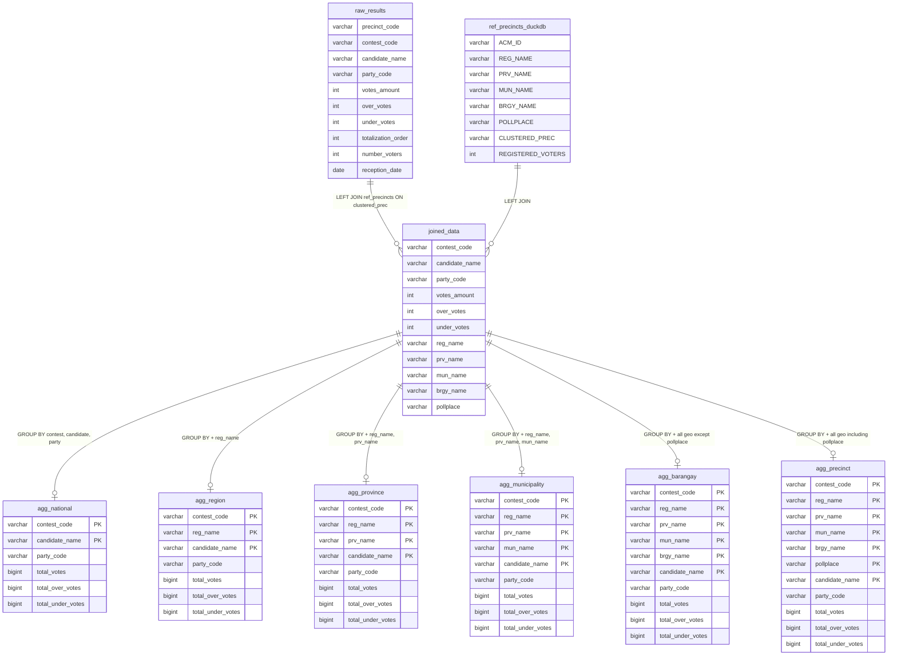
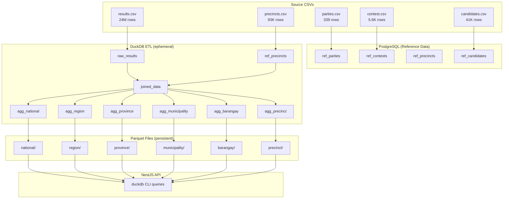

# Database ERD — PPRCV-POC

This project uses **two database engines** for different purposes:

| Engine | Role | Persistence |
|--------|------|-------------|
| **PostgreSQL** | Reference data warehouse | Persistent (tables survive) |
| **DuckDB** | Analytics ETL + API query engine | Ephemeral (in-memory tables during ETL; results written to Parquet) |

---

## 1. PostgreSQL Schema — Reference Data

Four tables storing political reference data (parties, contests, precincts, candidates). These are the **source of truth** for entity names and hierarchies.

### Entity Relationship Diagram



### Table Details

| Table | Rows | Source CSV | Load Script |
|-------|------|------------|-------------|
| `ref_parties` | ~339 | `sample-csv/parties.csv` | `apps/etl/scripts/load_ref_data.py` |
| `ref_contests` | ~5,645 | `sample-csv/contest.csv` | `apps/etl/scripts/load_ref_data.py` |
| `ref_precincts` | ~93,629 | `sample-csv/precincts.csv` | `apps/etl/scripts/load_ref_data.py` |
| `ref_candidates` | ~41,647 | `sample-csv/candidates.csv` | `apps/etl/scripts/load_ref_data.py` |

### Relationships

- **`ref_candidates.contest_code` → `ref_contests.contest_code`**: Each candidate belongs to exactly one contest. A contest has many candidates.
- **`ref_candidates.parties_code` → `ref_parties.parties_code`**: Each candidate is nominated by one party (nullable for independent/party-list candidates). A party can nominate many candidates.

---

## 2. DuckDB ETL Pipeline — Analytics Processing

DuckDB is used in two phases:

1. **ETL phase** — Python `duckdb` library creates in-memory tables, joins, aggregates, and writes Parquet files
2. **API phase** — NestJS shells out to `duckdb` CLI to query Parquet files on-read

### 2A. Simple Aggregation (`apps/etl/src/etl/processor.py`)



### 2B. Multi-Level Aggregation (`apps/etl/src/etl/aggregator.py`)

This is the **primary pipeline**. It joins raw results with precinct reference data, then produces 6 hierarchical aggregation levels.



### 2C. Parquet Output Structure

All 6 aggregation levels are written as **Hive-partitioned Parquet** files:

```
apps/etl/output/multi-level/
├── national/           # contest_code=XXX/*.parquet
├── region/             # contest_code=XXX/*.parquet
├── province/           # contest_code=XXX/*.parquet
├── municipality/       # contest_code=XXX/*.parquet
├── barangay/           # contest_code=XXX/*.parquet
└── precinct/           # contest_code=XXX/*.parquet
```

Each Parquet file contains all columns for that level (see above). Partitioned by `contest_code` for efficient predicate pushdown.

---

## 3. API Query Layer — DuckDB CLI on Parquet

The NestJS API (`results.service.ts`) queries Parquet files by glob pattern:

```mermaid
flowchart LR
    A[Client Request] --> B[NestJS API]
    B --> C[duckdb CLI]
    C --> D["'{parquetBase}/{level}/**/*.parquet'"]
    D --> C
    C --> B
    B --> E[JSON Response]

    subgraph Queries
        F[SELECT candidate_name, party_code,\nSUM(total_votes) as votes\nFROM glob\nWHERE filters\nGROUP BY candidate, party\nORDER BY votes DESC]
        G[SELECT DISTINCT column\nFROM glob\nWHERE parent_filter\nORDER BY column]
    end
```

### Query Patterns

| Query | File | Purpose |
|-------|------|---------|
| Results | `results.service.ts:78-103` | Aggregated votes by candidate with filters |
| Distinct values | `results.service.ts:65-76` | Cascading dropdown values for geography |
| Contest listing | `results.service.ts:58-63` | All distinct contest codes from national level |

---

## 4. End-to-End Data Flow



---

## 5. Key Design Decisions

| Decision | Rationale |
|----------|-----------|
| **DuckDB over Postgres for analytics** | DuckDB is optimized for OLAP/aggregation workloads. Postgres is used only for reference data lookups. |
| **Parquet as interchange format** | Columnar format enables efficient predicate pushdown, compression, and schema evolution. DuckDB can query Parquet files directly (zero-copy). |
| **Hive partitioning by `contest_code`** | Most queries filter by contest. Partition pruning eliminates scanning irrelevant files. |
| **6 pre-computed aggregation levels** | Avoids expensive GROUP BY at query time. Each level is a trade-off between storage and query speed. |
| **No ORM** | Direct SQL gives full control over DuckDB-specific features (Parquet glob queries, Hive partitioning). |
| **CLI subprocess (not DuckDB node lib)** | Avoids native module compilation issues. DuckDB CLI is a single binary with no dependencies. |
