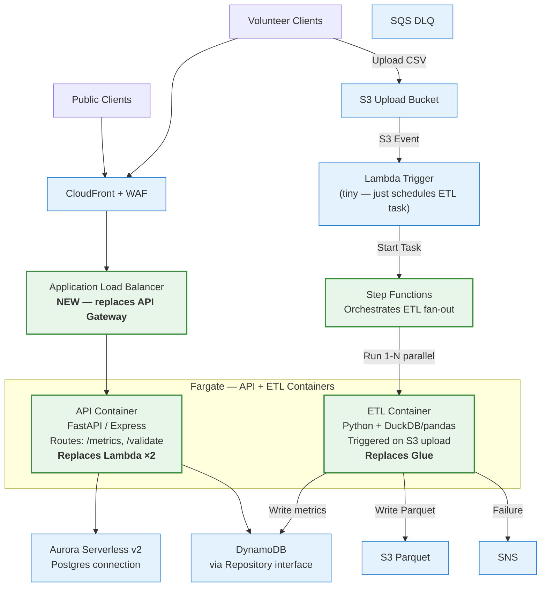
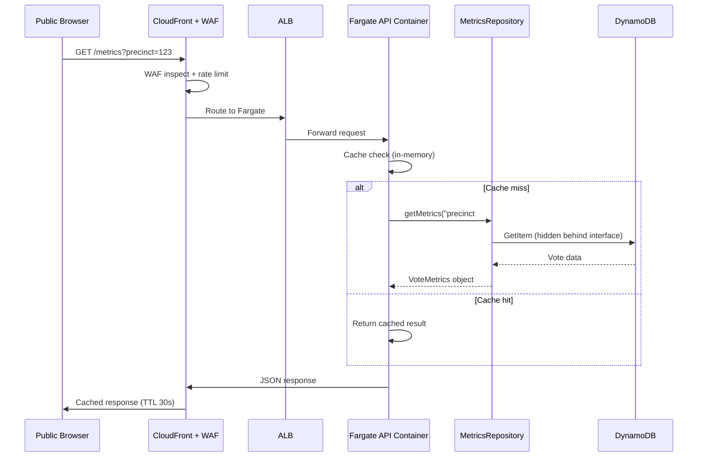
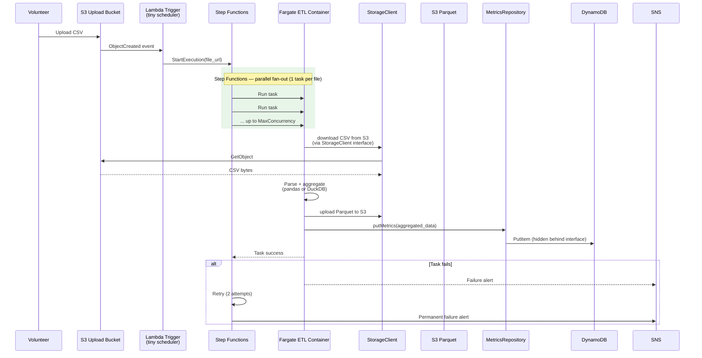
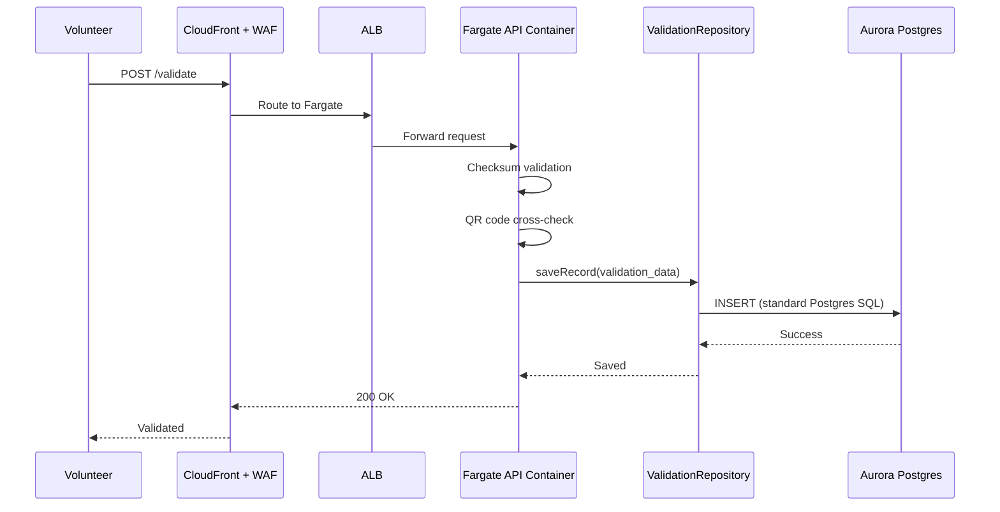

# PPCRV Re-Architecture — Cloud-Portable Architecture (Delta)

This document describes the **changes** from the original serverless architecture (see [README.md](README.md)) to a cloud-portable design using **AWS Fargate containers**. The goal: build on AWS now, but choose services that have equivalents on GCP and Azure so switching later is feasible with minimal changes.

> [!NOTE]
> This is a **delta document** — it only describes what changes from the original architecture. Reader cross-references [README.md](README.md) and [docs/COSTS.md](docs/COSTS.md) for unchanged services and full context.
>
> Cost impact for this architecture is documented in [cost-re-arch.md](cost-re-arch.md).

---

## Table of Contents

- [Why Re-Architecture?](#why-re-architecture)
- [Architecture Delta](#architecture-delta)
- [Service Migration Map](#service-migration-map)
- [Abstraction Patterns for Portability](#abstraction-patterns-for-portability)
- [Operations & Security](#operations--security)
- [Request Flows (Changed)](#request-flows-changed)
- [Portability Reference](#portability-reference)
- [Migration Path to GCP or Azure](#migration-path-to-gcp-or-azure)

---

## Why Re-Architecture?

The original architecture uses AWS-native serverless services (Lambda, Glue, API Gateway). These are excellent for the workflow but **AWS-locked**:

- **Lambda** functions only run on AWS
- **Glue** jobs use AWS-managed Spark clusters with no equivalent API elsewhere
- **API Gateway** has its own request/response model and AWS-specific integrations

The **Re-Architecture** replaces these with **Fargate containers**:

- The same Docker image runs on **AWS Fargate**, **GCP Cloud Run**, and **Azure Container Apps**
- Compute logic lives in the container, not in a cloud function — ports with a config change
- The ETL logic (Python + DuckDB/pandas) runs in a container instead of a Spark cluster

**Trade-off accepted:** Fargate containers have slower cold starts than Lambda (~10-30s vs ~100-500ms) and the ALB costs ~$18/mo even when idle. This is the **cost of portability**.

---

## Architecture Delta

### New Architecture (v2 — Re-Architecture)



### What's Removed

| Removed | Why |
|---------|-----|
| API Gateway (HTTP API) | ALB in front of Fargate handles routing + throttling |
| Lambda Vote Metrics | Fargate API container serves the same routes |
| Lambda Validation | Same Fargate API container — different route |
| AWS Glue (Spark) | Fargate ETL container with Python + DuckDB/pandas |

### What's Added

| Added | Purpose |
|-------|---------|
| **Fargate API** | Long-running container serving HTTP requests via ALB |
| **Fargate ETL** | On-demand container for CSV processing, triggered by Step Functions |
| **ALB** | Routes HTTP traffic to Fargate, health checks, autoscaling trigger |
| **Step Functions** | Orchestrates parallel ETL task fan-out (one task per CSV file) |
| **ECR** | Container registry for Docker images |

### What's Unchanged

| Kept | Portability Strategy |
|------|----------------------|
| Aurora Serverless v2 | Accessed via standard Postgres connection (no Aurora APIs) |
| DynamoDB | Wrapped in Repository interface (swap impl when moving clouds) |
| S3 | Storage abstraction (swap impl to GCS / Blob later) |
| SNS + SQS | Messaging abstraction (swap impl to Pub/Sub / Service Bus later) |
| CloudFront + WAF | Edge layer — swap to Cloud CDN / Azure CDN later |
| Route 53 | DNS — swap to Cloud DNS / Azure DNS later |
| CloudWatch + X-Ray | Observability — swap to Cloud Logging / Azure Monitor later |
| Athena | Ad-hoc analytics — swap to BigQuery / Azure Synapse later |
| **Reconciliation flow** | CloudWatch Scheduled → Athena → S3 Parquet vs DynamoDB → SNS. Unchanged — Athena queries S3 Parquet directly, independent of ETL runtime. See [Flow 5 in README.md](README.md#flow-5--reconciliation-automated). |

---

## Service Migration Map

| Layer | AWS (now) | GCP (later) | Azure (later) | Migration Effort |
|-------|-----------|-------------|---------------|-----------------|
| Compute (API) | **Fargate** | Cloud Run | Container Apps | **None** — same Docker image |
| Compute (ETL) | **Fargate + Step Functions** | Cloud Run Jobs + Workflows | Container Apps Jobs | **Minimal** — image stays, orchestrator rewritten |
| API Routing | ALB | Cloud Load Balancing | Application Gateway | **Low** — Terraform resource swap |
| Relational DB | Aurora Serverless v2 | Cloud SQL (Postgres) | Azure Database (Postgres) | **Low** — data dump + restore, connection string change |
| NoSQL | DynamoDB | Firestore | Cosmos DB | **Medium** — repository impl swap + data migration (~4 days) |
| Object Storage | S3 | GCS | Blob Storage | **Low** — storage client impl swap |
| Messaging | SNS + SQS | Pub/Sub | Service Bus | **Low** — queue impl swap |
| Edge / CDN | CloudFront + WAF | Cloud CDN + Armor | Azure CDN + WAF | **Medium** — config rewrite |
| DNS | Route 53 | Cloud DNS | Azure DNS | **Low** — zone export/import |
| Observability | CloudWatch + X-Ray | Cloud Logging + Trace | Azure Monitor | **Medium** — instrumentation swap |
| IaC | Terraform | Same (add GCP provider) | Same (add Azure provider) | **Low** — HCL modules already portable |

---

## Abstraction Patterns for Portability

The Fargate containers don't call AWS SDKs directly. Every cloud-specific service sits behind an interface so swapping clouds means writing a new implementation, not touching the container code.

```mermaid
graph TB
    classDef container fill:#e8f5e9,stroke:#388e3c,stroke-width:2px
    classDef interface fill:#fff3e0,stroke:#f57c00,stroke-width:2px
    classDef aws fill:#e3f2fd,stroke:#1976d2,stroke-width:1px
    classDef gcp fill:#fce4ec,stroke:#c62828,stroke-width:1px,stroke-dasharray: 5 5
    classDef azure fill:#ede7f6,stroke:#5e35b1,stroke-width:1px,stroke-dasharray: 5 5

    subgraph Container["Fargate Container (cloud-agnostic)"]
        App[Application Code]:::container
    end

    subgraph Interfaces["Interface Layer (interfaces only, no SDK calls)"]
        MetricsRepo["MetricsRepository<br/>getMetrics() / putMetrics()"]:::interface
        ValidationRepo["ValidationRepository<br/>saveRecord() / getRecord()"]:::interface
        Storage["StorageClient<br/>upload() / download() / list()"]:::interface
        Queue["MessageQueue<br/>publish() / subscribe()"]:::interface
    end

    App --> MetricsRepo
    App --> ValidationRepo
    App --> Storage
    App --> Queue

    subgraph AWS["AWS Implementations (today)"]
        DDBImpl["DynamoDBMetricsRepository"]:::aws
        PgImpl["PostgresValidationRepository<br/>(Aurora)"]:::aws
        S3Impl["S3StorageClient"]:::aws
        SNSImpl["SNSMessageQueue"]:::aws
    end

    subgraph GCP["GCP Implementations (future)"]
        FSImpl["FirestoreMetricsRepository"]:::gcp
        PgGCP["PostgresValidationRepository<br/>(Cloud SQL)"]:::gcp
        GCSImpl["GCSStorageClient"]:::gcp
        PSImpl["PubSubMessageQueue"]:::gcp
    end

    subgraph Azure["Azure Implementations (future)"]
        CosImpl["CosmosMetricsRepository"]:::azure
        PgAz["PostgresValidationRepository<br/>(Azure Postgres)"]:::azure
        BlobImpl["BlobStorageClient"]:::azure
        SBImpl["ServiceBusMessageQueue"]:::azure
    end

    MetricsRepo -.-> DDBImpl
    MetricsRepo -.-> FSImpl
    MetricsRepo -.-> CosImpl
    ValidationRepo -.-> PgImpl
    ValidationRepo -.-> PgGCP
    ValidationRepo -.-> PgAz
    Storage -.-> S3Impl
    Storage -.-> GCSImpl
    Storage -.-> BlobImpl
    Queue -.-> SNSImpl
    Queue -.-> PSImpl
    Queue -.-> SBImpl
```



### Four Interfaces to Implement

| Interface | Methods | AWS Impl (now) | GCP Impl (later) | Azure Impl (later) |
|-----------|---------|----------------|------------------|---------------------|
| `MetricsRepository` | `getMetrics(pk)`, `putMetrics(pk, data)` | DynamoDB | Firestore | Cosmos DB |
| `ValidationRepository` | `saveRecord()`, `getRecord()` | Aurora (Postgres) | Cloud SQL (Postgres) | Azure Database (Postgres) |
| `StorageClient` | `upload()`, `download()`, `list()` | S3 | GCS | Blob Storage |
| `MessageQueue` | `publish()`, `subscribe()` | SNS + SQS | Pub/Sub | Service Bus |

### Rules for the Team

1. **Never import `boto3` / AWS SDK inside the container app code.** All AWS calls live inside the `*Impl` classes only.
2. **Each interface has one implementation per cloud.** Swapping clouds = writing new impls + a config flag that selects which.
3. **Postgres stays vanilla.** No Aurora Data API, no RDS-specific extensions — just standard SQL via a Postgres driver (`pg`, `psycopg2`).
4. **DynamoDB access is via the Repository only.** No `GetItemCommand` outside `DynamoDBMetricsRepository`.

### Configuration Selection

```python
# config.py — one env var flips the whole backend
import os

CLOUD = os.environ.get('CLOUD_PROVIDER', 'aws')

if CLOUD == 'aws':
    from .aws import DynamoDBMetricsRepository, S3StorageClient
    metrics_repo = DynamoDBMetricsRepository()
    storage = S3StorageClient()
elif CLOUD == 'gcp':
    from .gcp import FirestoreMetricsRepository, GCSStorageClient
    metrics_repo = FirestoreMetricsRepository()
    storage = GCSStorageClient()
```

Docker image stays identical — only the runtime config changes.

---

## Operations & Security

Moving from Lambda (isolated, ephemeral) to long-running Fargate containers introduces operational and security considerations.

### Container Image Security

| Concern | Mitigation |
|---------|------------|
| **Vulnerability scanning** | Enable ECR image scanning on push (basic or enhanced). Fail CI/CD pipeline on critical/high CVEs. |
| **Base image updates** | Pin base images to specific digests (not `latest`). Subscribe to security advisories for `python:3.12-slim`. Rebuild images monthly to pick up OS patches. |
| **Image signing** | Consider ECR image signing (AWS Signer) or Cosign for supply chain integrity. |
| **Least privilege** | Separate ECS task execution role (pulls images, writes logs) from task role (app permissions). Task role should only have access to DynamoDB, S3, Aurora — not ECR. |
| **Secrets injection** | Never bake secrets into images. Use ECS task definition `secrets` to pull from SSM Parameter Store or Secrets Manager at container start. |
| **Log driver** | Use `awslogs` log driver to send container stdout/stderr to CloudWatch Logs. Configure log groups with retention policies. |

### Cold Start Mitigation

Fargate containers have ~10-30s cold start (image pull + container init). Strategies to minimize impact:

| Strategy | Trade-off |
|----------|-----------|
| **Keep `min_tasks = 1` during election period** | Eliminates cold start for API container. ~$43/month for always-on base task. Recommended for election day. |
| **Scheduled warming** | CloudWatch Event → `ecs:RunTask` every 5 min. Keeps a task warm but adds ~$10/month. Alternative to min_tasks=1. |
| **ALB slow start mode** | Set deregistration delay to 30s, slow start to 120s. New tasks ramp up traffic gradually instead of receiving full load immediately. |
| **Pre-provision before election** | Scale to 3-5 tasks 1 hour before polls close. Use CloudWatch Event or manual script. |

**Recommendation:** Keep `min_tasks = 1` during election week (cost: ~$43/month). Scale to `min_tasks = 0` during idle months.

### Auto-Scaling Configuration

| Parameter | API Container | ETL Container |
|-----------|--------------|---------------|
| **Min tasks** | 0 (idle) / 1 (election) | 0 (always) |
| **Max tasks** | 10 | 20 (parallel ETL jobs) |
| **Scale-out metric** | ALB request count > 1000/target | Step Functions triggers task directly |
| **Scale-out cooldown** | 60s | N/A (on-demand) |
| **Scale-in cooldown** | 300s (avoid thrashing) | Task completes → auto-stops |
| **Target tracking** | `RequestCountPerTarget` or `CPUUtilization` > 60% | N/A |

**Election day scaling:** Set `min_tasks = 3` and `max_tasks = 20` for the API container. Pre-provision 1 hour before polls close.

### Multi-AZ & Networking

| Concern | Configuration |
|---------|---------------|
| **VPC** | Deploy Fargate tasks in private subnets across 2+ AZs |
| **Security groups** | ALB SG: allow 80/443 from 0.0.0.0/0. Fargate SG: allow from ALB SG only. Aurora SG: allow from Fargate SG only. |
| **Task networking** | Use `awsvpc` networking mode (required for Fargate). Each task gets its own ENI. |
| **ALB target group** | Health check path: `/health`. Interval: 15s. Healthy threshold: 2. Unhealthy threshold: 3. Deregistration delay: 30s. |
| **NAT Gateway** | Required for Fargate tasks to pull images from ECR and access AWS APIs. Place in one AZ to minimize cost (~$32/month) or one per AZ for HA (~$64/month). |

### CI/CD Pipeline for Containers

The Terraform CI/CD pipeline (see [TERRAFORM.md](docs/TERRAFORM.md)) needs a container build stage:

```
PR opened → Build Docker image → Run tests → Push to ECR (tagged with SHA)
         → Terraform plan (references new image tag)
Merge to main → Terraform apply → ECS rolling update (zero-downtime)
```

| Stage | Tool | Action |
|-------|------|--------|
| **Build** | GitHub Actions | `docker build -t pprcv-api:$SHA .` |
| **Test** | GitHub Actions | Run unit/integration tests inside container |
| **Scan** | ECR / Trivy | Scan image for CVEs. Fail on critical. |
| **Push** | GitHub Actions | `docker push ECR_REPO:$SHA` and `:latest` |
| **Deploy** | Terraform | Update ECS task definition with new image tag. ECS rolling deploy (200% max, 100% min). |

**Image tagging:** Use Git SHA for traceability. Never deploy `:latest` to production.

### Rollback Strategy

If the Fargate migration has issues on election day:

| Scenario | Action |
|----------|--------|
| **Container crash loop** | ECS auto-restarts tasks. If persistent, rollback to previous task definition (previous SHA tag). |
| **Bad deployment** | `aws ecs update-service --task-definition pprcv-api:PREVIOUS_REVISION`. ECS rolls back in ~2 min. |
| **Fargate outage** | Keep Lambda + API Gateway deployable as hot standby for the first election cycle. Maintain Lambda code in a separate directory, deployable via `sam deploy`. |
| **ALB failure** | ALB is a managed service with built-in HA. If regional issue, Route 53 failover to a secondary region (future consideration). |

**Recommendation:** For the first election cycle, keep the Lambda + API Gateway deployment as a hot standby. Decommission after one successful election on Fargate.

### ETL Memory Sizing

The ETL container is spec'd at **1 vCPU + 4 GB**. Concern: pandas loads entire DataFrames into memory.

| Scenario | Estimated Memory | Risk |
|----------|-----------------|------|
| 1 GB CSV (pandas) | ~3-4 GB (DataFrame + processing overhead) | ⚠️ Borderline at 4 GB |
| 2 GB CSV (pandas) | ~6-8 GB | ❌ Will OOM at 4 GB |
| 1 GB CSV (DuckDB) | ~1-2 GB (streaming, memory-mapped) | ✅ Safe |
| 2 GB CSV (DuckDB) | ~2-3 GB | ✅ Safe |

**Recommendations:**
- **Use DuckDB, not pandas**, for ETL processing. DuckDB is memory-efficient and handles larger-than-memory datasets.
- If pandas is required, process CSVs in chunks (`pd.read_csv(chunksize=100_000)`).
- Bump ETL container to **1 vCPU + 8 GB** as a safety margin (~$0.009/GB-h more).
- Profile with real CSV data before production: run the 2 GB worst-case file in a test Fargate task and monitor memory via CloudWatch Container Insights.

### Local Development Experience

Developers need to run the containerized app locally without AWS:

| Approach | Setup |
|----------|-------|
| **Docker Compose** | Provide `docker-compose.yml` with local Postgres + localstack (for S3/DynamoDB emulation). |
| **Config switching** | Set `CLOUD_PROVIDER=local` in `.env`. Implement `LocalStorageClient` (writes to local filesystem), `LocalMetricsRepository` (in-memory or local DynamoDB). |
| **Local Postgres** | `docker run -p 5432:5432 postgres:15`. Use `ValidationRepository` with local connection string. |
| **Test data** | Provide sample CSV files (1000 rows) in `tests/fixtures/`. |

```bash
# Recommended local dev workflow
docker-compose up -d          # Start local Postgres + localstack
export CLOUD_PROVIDER=local   # Use local implementations
python -m uvicorn app.main    # Run API container locally
```

---

## Request Flows (Changed)

### Flow 1: Public Query → Metrics (Changed)



**Delta from v1:** Lambda → Fargate container, API Gateway → ALB. The `MetricsRepository` interface means the container code never touches the DynamoDB SDK directly.

### Flow 2: CSV Upload → ETL Pipeline (Changed)



**Delta from v1:** Glue (Spark cluster) → Fargate (Python container + Step Functions orchestration). No Spark dependencies — the container uses pandas or DuckDB for in-process aggregation. Each CSV file gets its own Fargate task, running in parallel up to a configured max.

### Flow 3: Validation (Same Logic, New Infra)



**Delta from v1:** Lambda → Fargate. The validation logic (checksum + QR cross-check) is identical — only the runtime changes. `ValidationRepository` uses standard Postgres SQL, so no Aurora-specific APIs leak into the container code.

---

## Portability Reference

### Compute — Fargate → GCP Cloud Run / Azure Container Apps

The same Docker image runs on all three clouds:

| Cloud | Service | How to Deploy |
|-------|---------|---------------|
| **AWS** | Fargate | `ecs run-task --task-definition pprcv-api` |
| **GCP** | Cloud Run | `gcloud run deploy --image gcr.io/ppcrv/api` |
| **Azure** | Container Apps | `az containerapp create --image ppcrv.azurecr.io/api` |

The Dockerfile doesn't change. The container registry changes (ECR → Artifact Registry → ACR), and the IaC wiring changes (Terraform `aws_ecs_task_definition` → `google_cloud_run_service` → `azurerm_container_app`).

### ETL Orchestration

| Cloud | Orchestrator | Migration |
|-------|-------------|-----------|
| **AWS** | Step Functions | — |
| **GCP** | Cloud Workflows | Rewrite orchestration (container image stays the same) |
| **Azure** | Logic Apps | Rewrite orchestration (container image stays the same) |

Step Functions → Workflows / Logic Apps is a config rewrite, not a code rewrite. The Fargate/Cloud Run/Container Apps ETL container doesn't change.

**Step Functions Standard vs Express:**

| Type | Price | Use Case | Trade-off |
|------|-------|----------|-----------|
| **Standard** | $0.025/1K transitions | Long-running workflows, need execution history | 1-year execution history, exactly-once, max 25K executions |
| **Express** | $1.00/M transitions | High-volume, fire-and-forget ETL | 25x cheaper, 5-min max duration, at-least-once |

**Recommendation:** Use **Standard Workflows** for the initial deployment. The cost difference is negligible (~$0.06 vs ~$0.003 for 500 executions). Standard provides better observability (execution history in CloudWatch) and exactly-once semantics for ETL jobs. Switch to Express if ETL volume exceeds 10K executions/month.

### Aurora Serverless v2 (Standard Postgres Connection)

Aurora Serverless v2's auto-scaling (0.5–16 ACU) is AWS-specific. When moving clouds:

| Cloud | Service | Scaling Behavior |
|-------|---------|-----------------|
| **AWS** | Aurora Serverless v2 | Auto-scales 0.5–16 ACU based on load |
| **GCP** | Cloud SQL (Postgres) | Manual instance sizing, no auto-scale-to-near-zero |
| **Azure** | Azure Database (Postgres) | Manual tier selection (General Purpose, Memory Optimized) |

**Migration path:** `pg_dump` Aurora → `pg_restore` into the target Postgres. Connection string change in the container config. The app continues using vanilla Postgres SQL — no code changes.

The **trade-off**: On GCP/Azure, you'd run a fixed-size Postgres instance instead of Aurora's scale-to-near-zero. This means the idle cost on GCP/Azure would be higher (full instance price, ~$25–40/mo vs Aurora's ~$8/mo with 0.5 ACU auto-shutdown).

### DynamoDB (Repository Swap)

Access patterns in this project are simple (single-item lookups + writes). Migration:

```python
# AWS implementation (today)
class DynamoDBMetricsRepository:
    def get_metrics(self, precinct: str) -> dict:
        response = self.table.get_item(Key={'pk': f'precinct#{precinct}'})
        return response.get('Item', {})

# GCP implementation (future)
class FirestoreMetricsRepository:
    def get_metrics(self, precinct: str) -> dict:
        doc = self.db.collection('metrics').document(f'precinct#{precinct}').get()
        return doc.to_dict() or {}
```

Both implement the same `MetricsRepository` interface. The container code that calls `repo.get_metrics(precinct)` doesn't know or care which cloud it's running on.

**Migration effort:** ~4 days (implement Firestore impl + data migration script + testing).

---

## Migration Path to GCP or Azure

### Step 1: Verify Abstractions (before any move)

Audit all container code for direct AWS SDK usage. Every `boto3` / `aws-sdk` import must live inside an `*Impl` class, nowhere else.

### Step 2: Write Target Cloud Implementations

Implement the four interfaces for the target cloud:
- `FirestoreMetricsRepository` (or `CosmosMetricsRepository`)
- `PostgresValidationRepository` (unchanged — vanilla Postgres)
- `GCSStorageClient` (or `BlobStorageClient`)
- `PubSubMessageQueue` (or `ServiceBusMessageQueue`)

### Step 3: Deploy Container Images

```bash
# Push the existing Docker image to the target cloud registry
docker tag pprcv-api:latest gcr.io/ppcrv/api:latest   # GCP
docker tag pprcv-api:latest ppcrv.azurecr.io/api:latest  # Azure
docker push gcr.io/ppcrv/api:latest

# Deploy to target compute service
gcloud run deploy pprcv-api --image gcr.io/ppcrv/api:latest --region asia-southeast1
```

### Step 4: Provision Infrastructure (Terraform)

```hcl
# Add GCP provider to existing Terraform code
provider "google" {
  project = "ppcrv-prod"
  region  = "asia-southeast1"
}

# Same logical resources, different provider resources
resource "google_cloud_run_service" "api" { ... }
resource "google_sql_database_instance" "postgres" { ... }
resource "google_storage_bucket" "data" { ... }
```

### Step 5: Migrate Data

| Data Source | Migration Method |
|------------|-----------------|
| Aurora (Postgres) | `pg_dump` → `pg_restore` into Cloud SQL / Azure Postgres |
| DynamoDB | Export to JSON → import into Firestore / Cosmos DB (or use AWS DataSync) |
| S3 | `gsutil` / `azcopy` for bulk transfer |

### Step 6: Flip Config + Test

```bash
# Change one environment variable
CLOUD_PROVIDER=gcp  # was: aws

# Restart containers — they pick up new implementations
aws ecs update-service --cluster pprcv --service pprcv-api --force-new-deployment  # AWS
# or
kubectl rollout restart deployment/ppcrv-api  # if using EKS
```

---

## Open Items

| # | Item | Status |
|---|------|--------|
| 1 | Decide: keep ALB always-on during idle or destroy/recreate | **Decided** — keep ALB always-on (see [cost-re-arch.md](cost-re-arch.md#alb-decision-always-on-vs-destroy)) |
| 2 | Choose Docker base image (python:3.12-slim vs node:20-slim) | Open — depends on language choice |
| 3 | Choose web framework for API container (FastAPI / Express / Go) | Open |
| 4 | Choose ETL processing library (pandas vs DuckDB vs both) | **Decided** — use DuckDB (see [ETL Memory Sizing](#etl-memory-sizing)) |
| 5 | Implement Step Functions state machine for ETL fan-out | Open |
| 6 | Define container resource sizing (vCPU / memory per task) | **Decided** — API: 1 vCPU / 2 GB, ETL: 1 vCPU / 8 GB (see [Auto-Scaling Configuration](#auto-scaling-configuration)) |
| 7 | Decide: Aurora auto-shutdown schedule in dev (see cost-re-arch.md) | Open |

---

## Change Log

All changes to this repository's documentation are tracked in **[docs/CHANGES.md](docs/CHANGES.md)**.